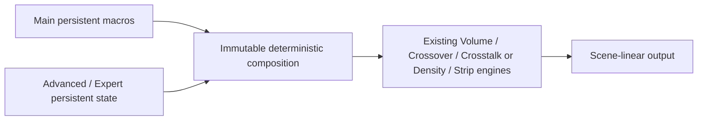

# Rendition 0.31 — restored controls and recipe gate

Status: **control-restoration candidate; artist-control freeze / recipe gate not yet accepted**. Existing Main panels and all historical engines remain. No Base, Primaries, Density, Strip or historical operator equations were changed. Palette/Material model choice index 0 retains the original 0.3 mapping. Index 1 explicitly selects **v2 restored controls**; default remains index 0. New persistent parameters append after historical controls; existing IDs/defaults/order and choice index 0 remain intact.

## What changed

Nuke's original Tone Expert disclosure was observed to expand without revealing its encoding selector. Scene/Tone/Crossover/Crosstalk now receive linked Expert/Advanced tabs as a host presentation fix. A fresh interactive Tone creation showed all six encoding choices in Expert, and a keyboard selection changed ACEScct to LogC4. Their native parameters and equations are unchanged.

Full six-family Volume controls, original Crossover hue/channel trajectories, full constrained Crosstalk matrix and detailed Density/Strip parameters now exist as native OFX state inside Palette/Material. Python Nuke tabs link to those same parameters; no duplicate grade state. Families use original source coordinates inside the Volume stage. Channel mode explicitly selects the historical Crossover alternative; it does not silently run alongside hue trajectories.

Nuke presentation uses Main, Advanced, Families, Trajectory, Channel Trajectory, Crosstalk Matrix, Density, Strip, Expert and Input where applicable. Main remains 13/9/8 controls. This first restoration has a tall Families page with family-qualified labels rather than a custom wheel or a family proxy editor. Native matrix entries retain underlying stored names and use M11…M33 labels. New IDs are namespaced `Volume_`, `Crossover_`, `Crosstalk_`, `Density_`, `Strip_`; original deep nodes retain their original IDs.

## Transparent composition contract

For **model index 1 only**:

- Selectors (hue/width/chroma/exposure ranges, softness, neutral protection) and choices are authored **absolute Expert values**. Crossover Expert width defaults to 360° to retain the existing Palette-wide trajectory at neutral Expert settings.
- Family/trajectory hue and ordinary scalar changes are **macro base + expert − expert default**. Global Palette Trajectory strength also scales Expert hue/channel displacements.
- Chroma controls are **macro chroma × Expert chroma**.
- Strip Separation combines by **1−(1−macro separation)(1−Expert separation)**.
- Matrices use authored entries plus the existing Main interaction deltas; historical constraint mode is applied afterwards. Mix, row-sum and domain remain explicit.
- No Main edit writes or erases Expert state. Snapshots compute the effective state at render time. `artist_stages` exports effective underlying values for inspection.
- If the composed state leaves an underlying parameter's supported range, rendering fails explicitly. No hidden clamp, gain reduction or override rewrite. This means an Expert delta near its limit can require reducing a Main macro before increasing it further.
- Model index 0 ignores default neutral new state and rejects nondefault restored controls with an explicit opt-in error. Historical projects do not silently acquire a new look.

A concrete restoration defect was found and fixed before delivery: treating selectors as additive deltas over the Main 360° width made a narrow authored width ineffective. Selectors now override absolutely. This fix affects only the new explicit model. Existing 0.3 behavior stays unchanged.

## Audit evidence and limits

Machine mapping contains **346 parameters** including configuration, and **30 Main controls**. All **303 creative parameters** produce a measured response in activated fixtures; the remaining fields are interpretation/model configuration. All Main controls have measured responses on activated structured fixtures and A/B sample sheets. Fixtures include neutral ramps, eight saturated/skin/olive families across exposure, signed/HDR colours and exact alpha comparisons. Positive/negative strengths are exercised where supported. Default identity is tested separately; contact sheets use explicitly activated dependencies and are not presented as untouched default nodes.

Approved portrait and saturated-interior fixtures are explicitly Rec.2020; quantitative measurements are pre-DRT. PNGs use the external Flawed Emulsion 2/sRGB view. Symmetric difference images are explicitly normalized display diagnostics, not graded source RGB. Detailed Advanced/Expert sheets and 303 small sampled, independently scaled scene-RGB difference diagnostics are included. Some composed extreme values correctly produce an explicit range error; these are recorded rather than repaired.

**Plumbing passes are not artist acceptance.** The numerical fixtures do not establish perceptual direction, full parameter continuity, redundancy, control predictability or reference-board usefulness for every control. Main contamination is subtle in the tested portrait under this view; no gain was increased to make it conspicuous. Protection, range, pivot, coupling and anchors are conditional by design. Inactive fixtures requiring further targeted coverage: none after adding explicit signed-opponent chroma/neutral boundary stimuli. These statuses remain visible in the table and machine report, not falsely marked useful.

Native Nuke report contains **33 checks**: direct link write-through, explicit model choice, animation, node rename, copy/paste, save/reload, original 0.3 graph remaining v1, and 24 historical operator/domain response cases with domain-choice animation/reload. CPU suites pass separately. Interactive Nuke menu creation and UI inspection verified Palette Families/Trajectory/Channel Trajectory/Crosstalk Matrix, Material Density/Strip, and Base Advanced/Dodge-Burn. Material Strip and Palette matrix screenshots were viewed in this conversation. The temporary Untitled graph was discarded; no user project was altered. Standalone screenshot files have not been exported, so the requested packaged screenshot evidence remains incomplete.

## Processing domains

External scene-linear in/out and working primaries do not change. Base remains XYZ/residual plus signed-magnitude stop coordinates; no camera-log RGB switch was added. Volume/hue Crossover retain signed opponent coordinates. Density/Strip retain compact spectral-derived representations; Full Spectral and HK experiments remain offline research.

All six historical encodings remain selectable where connected: pure stops, ACEScct (default), LogC4, DaVinci Intermediate, unclamped AgX-style stops and LookLog candidate. Round-trip, middle gray, toe-junction secants, local parameter sensitivity and operator response records are in `domains.json`; existing independent encoding tests include signed/near-zero/HDR ranges. Pure stops and AgX-style stops are **positive-only** and explicitly reject unsupported inputs. No choices are silently aliased. Pure stops and unclamped AgX stops may have related normalized behavior by design; the latter is not a complete AgX display transform.

Tone shapes selected look coordinates. Scene selects linear versus look-coordinate SOP/saturation. Crosstalk selects linear versus look-coordinate matrix action; a luminance constraint in encoded coordinates must not be described as scene-Y preservation. Channel Crossover uses the selected encoding; hue mode does not. Full derivative continuity and response/sensitivity certification for every combined domain setting remain pending beyond these numerical checks. No historical choice was removed or reordered.

## Known unsupported combinations and visual concerns

Pure stops and AgX-style stops reject zero/negative samples; their errors in the signed sweep are expected domain failures, not a silently repaired grade. Extreme Crossover pivot sweeps can reverse dark/bright ordering and are rejected by the existing engine; keep dark position below bright position. These cases are recorded in the machine sweep.

A targeted narrow Material hue/depth example can emphasize skin texture and produce locally uneven brown/bronze development under the selected view. This is an artist-coherence concern to review before promoting a preset, not evidence for replacing Density equations. Cyan-only trajectory settings barely affect the approved portrait/interior where their membership is small: synthetic/exposure-family trajectories are needed to evaluate them honestly. No arbitrary gain increase was applied.

## Capabilities intentionally kept outside Main

Scene daylight/CAT calibration and SOP, linked/per-channel Tone, literal Primaries black offset and historical nonmonotone Primaries tone remain separate Advanced tools. Base Black/White remain exposure-style tonal controls, not floors/caps. Base retains its monotonic construction. HK experiments, Neugebauer and runtime spectral alternatives were not exposed. Yellow/gold protection is available through authored family deformation/selection relationships, not a new dedicated Main yellow anchor. No new node, film stock, spatial segmentation or Pigment processing was added.

## Visual engineering review

The Main overview sheets were inspected under Flawed Emulsion 2. Exposure, Contrast, Black, Saturation, Warmth/Tint, Material Density and Strip separation produce clearly visible changes. Palette protection, chroma coupling and leakage depend strongly on the activated underlying deformation. Palette Contamination and positive Warm/Cool Bias are subtle in this portrait; Material Contamination is much more pronounced, because these coordinate different operators. They are not interchangeable controls.

Very large positive Exposure values exceed the useful range of the selected viewed example: display highlights become flat or show view-dependent colour artifacts even while pre-DRT output remains finite. Contrast/Saturation at high strengths can intentionally collapse or exaggerate the palette. This is recorded as aggressive creative response, not a recommendation or silent range restriction. Normal one-stop Exposure work retains its defined units.

No literal reference match or artist superiority is claimed from these sheets. The restored Cyan trajectory, family selectors, row-sum matrix, selected Material Density, custom Strip records and porcelain highlight test stimuli have separate scene-linear exposure trajectories and viewed A/B/difference examples. These are diagnostic test cases, not the next-phase Artist Presets / Recipes.

## Per-control audit

| Control | Expected | Observed | Mapping | Domain | Neutral/default | Active when | Pass/fail |
|---|---|---|---|---|---|---|---|
| Base / Source interpretation (`interpretation`) | Configuration | configuration; Detailed sheet generated; comprehensive visual judgment remains pending | Interpretation, alpha, fixed model metadata or version selection; not an image intention | External interpretation / model configuration | 0.0 | Configuration-dependent; no creative pixel change promised | configuration |
| Base / RGB / alpha handling (`alphaMode`) | Configuration | configuration; Detailed sheet generated; comprehensive visual judgment remains pending | Interpretation, alpha, fixed model metadata or version selection; not an image intention | External interpretation / model configuration | 0.0 | Configuration-dependent; no creative pixel change promised | configuration |
| Base / rx (`rx`) | Configuration | configuration; Detailed sheet generated; comprehensive visual judgment remains pending | Interpretation, alpha, fixed model metadata or version selection; not an image intention | External interpretation / model configuration | 0.708 | Configuration-dependent; no creative pixel change promised | configuration |
| Base / ry (`ry`) | Configuration | configuration; Detailed sheet generated; comprehensive visual judgment remains pending | Interpretation, alpha, fixed model metadata or version selection; not an image intention | External interpretation / model configuration | 0.292 | Configuration-dependent; no creative pixel change promised | configuration |
| Base / gx (`gx`) | Configuration | configuration; Detailed sheet generated; comprehensive visual judgment remains pending | Interpretation, alpha, fixed model metadata or version selection; not an image intention | External interpretation / model configuration | 0.17 | Configuration-dependent; no creative pixel change promised | configuration |
| Base / gy (`gy`) | Configuration | configuration; Detailed sheet generated; comprehensive visual judgment remains pending | Interpretation, alpha, fixed model metadata or version selection; not an image intention | External interpretation / model configuration | 0.797 | Configuration-dependent; no creative pixel change promised | configuration |
| Base / bx (`bx`) | Configuration | configuration; Detailed sheet generated; comprehensive visual judgment remains pending | Interpretation, alpha, fixed model metadata or version selection; not an image intention | External interpretation / model configuration | 0.131 | Configuration-dependent; no creative pixel change promised | configuration |
| Base / by (`by`) | Configuration | configuration; Detailed sheet generated; comprehensive visual judgment remains pending | Interpretation, alpha, fixed model metadata or version selection; not an image intention | External interpretation / model configuration | 0.046 | Configuration-dependent; no creative pixel change promised | configuration |
| Base / wx (`wx`) | Configuration | configuration; Detailed sheet generated; comprehensive visual judgment remains pending | Interpretation, alpha, fixed model metadata or version selection; not an image intention | External interpretation / model configuration | 0.3127 | Configuration-dependent; no creative pixel change promised | configuration |
| Base / wy (`wy`) | Configuration | configuration; Detailed sheet generated; comprehensive visual judgment remains pending | Interpretation, alpha, fixed model metadata or version selection; not an image intention | External interpretation / model configuration | 0.329 | Configuration-dependent; no creative pixel change promised | configuration |
| Base / Mathematical model (`modelVersion`) | Configuration | configuration; Detailed sheet generated; comprehensive visual judgment remains pending | Interpretation, alpha, fixed model metadata or version selection; not an image intention | External interpretation / model configuration | 0.0 | Configuration-dependent; no creative pixel change promised | configuration |
| Base / Signed adapter (`adapterVersion`) | Configuration | configuration; Detailed sheet generated; comprehensive visual judgment remains pending | Interpretation, alpha, fixed model metadata or version selection; not an image intention | External interpretation / model configuration | 0.0 | Configuration-dependent; no creative pixel change promised | configuration |
| Base / Exposure (`exposure`) | RGB × 2^E | response measured; Clearly brightens; very high stops overwhelm the external view. Practical 1-stop units remain fixed. | RGB × 2^E | XYZ/residual + stops | 0.0 | ['Selection/range and stage activation; see effective state'] | numeric response observed; artist usefulness pending |
| Base / Contrast (`contrast`) | Slope-constrained stop contrast about pivot | response measured; Increasing strength steepens tonal separation; high strengths crush/deeply separate the portrait. | Slope-constrained stop contrast about pivot | XYZ/residual + stops | 1.0 | ['Selection/range and stage activation; see effective state'] | numeric response observed; artist usefulness pending |
| Base / Contrast pivot (`pivot`) | Stop contrast anchor; requires nonidentity shaping | response measured; Visible change under active contrast; no effect is promised at identity contrast. | Stop contrast anchor; requires nonidentity shaping | XYZ/residual + stops | 0.0 | Requires nonidentity contrast/tail shaping | numeric response observed; artist usefulness pending |
| Base / Black (`blackStops`) | Shadow-weighted stop displacement; zero stays zero | response measured; Positive settings open dark tones without introducing a literal RGB floor. | Shadow-weighted stop displacement; zero stays zero | XYZ/residual + stops | 0.0 | ['Selection/range and stage activation; see effective state'] | numeric response observed; artist usefulness pending |
| Base / White (`whiteLevel`) | Highlight-weighted stop displacement; no cap | response measured; Positive settings raise participating upper tones; subtle in the portrait, clearer in the interior. | Highlight-weighted stop displacement; no cap | XYZ/residual + stops | 0.0 | ['Selection/range and stage activation; see effective state'] | numeric response observed; artist usefulness pending |
| Base / Toe (`shadowCompression`) | Soft toe slope displacement | response measured; Soft toe response is visible with configured toe/range; not a black clamp. | Soft toe slope displacement | XYZ/residual + stops | 0.0 | ['Selection/range and stage activation; see effective state'] | numeric response observed; artist usefulness pending |
| Base / Shoulder (`highlightCompression`) | Soft shoulder slope displacement | response measured; Highlight restraint is more visible on bright interior material than the low-key portrait. | Soft shoulder slope displacement | XYZ/residual + stops | 0.0 | ['Selection/range and stage activation; see effective state'] | numeric response observed; artist usefulness pending |
| Base / Warmth (`midBalance`) | Midtone zero-Y warm/cool tint | response measured; Positive values warm participating midtones; large strengths intentionally alter palette. | Midtone zero-Y warm/cool tint | XYZ/residual + stops | 0.0 | ['Selection/range and stage activation; see effective state'] | numeric response observed; artist usefulness pending |
| Base / Tint (`midTint`) | Midtone zero-Y magenta/green tint | response measured; Positive green-axis tint is clearly visible at stronger settings. | Midtone zero-Y magenta/green tint | XYZ/residual + stops | 0.0 | ['Selection/range and stage activation; see effective state'] | numeric response observed; artist usefulness pending |
| Base / Saturation (`saturation`) | Zero-Y residual scale | response measured; Clearly increases colourfulness; high strengths exaggerate colours. | Zero-Y residual scale | XYZ/residual + stops | 1.0 | ['Selection/range and stage activation; see effective state'] | numeric response observed; artist usefulness pending |
| Base / Density (`colourBalance`) | Colourfulness-conditioned stop gain | response measured; Positive artistic density closes colour-rich tones without invoking Material Density. | Colourfulness-conditioned stop gain | XYZ/residual + stops | 0.0 | ['Selection/range and stage activation; see effective state'] | numeric response observed; artist usefulness pending |
| Base / Shadow Colour (`shadowTint`) | Shadow zero-Y hue-direction amount | response measured; Shadow colour bias is visible with the default blue-direction hue. | Shadow zero-Y hue-direction amount | XYZ/residual + stops | 0.0 | ['Selection/range and stage activation; see effective state'] | numeric response observed; artist usefulness pending |
| Base / Highlight Colour (`highlightTint`) | Highlight zero-Y hue-direction amount | response measured; Upper-tone tint is visible, especially on bright interior materials. | Highlight zero-Y hue-direction amount | XYZ/residual + stops | 0.0 | ['Selection/range and stage activation; see effective state'] | numeric response observed; artist usefulness pending |
| Base / Toe start (`toeStart`) | Toe start | response measured; Detailed sheet generated; comprehensive visual judgment remains pending | Direct Base tonal parameter; XYZ/residual + monotone stop curve | XYZ/residual + stops | -4.0 | ['Selection/range and stage activation; see effective state'] | numeric response observed; artist usefulness pending |
| Base / Toe softness (`toeSoftness`) | Toe softness | response measured; Detailed sheet generated; comprehensive visual judgment remains pending | Direct Base tonal parameter; XYZ/residual + monotone stop curve | XYZ/residual + stops | 1.0 | ['Selection/range and stage activation; see effective state'] | numeric response observed; artist usefulness pending |
| Base / Shadow hue (`shadowHue`) | Shadow hue | response measured; Detailed sheet generated; comprehensive visual judgment remains pending | Direct Base tonal parameter; XYZ/residual + monotone stop curve | XYZ/residual + stops | 240.0 | Shadow Colour must be nonzero (Base); exposure trajectory active (Palette) | numeric response observed; artist usefulness pending |
| Base / Shadow chroma retention (`shadowRetention`) | Shadow chroma retention | response measured; Detailed sheet generated; comprehensive visual judgment remains pending | Direct Base tonal parameter; XYZ/residual + monotone stop curve | XYZ/residual + stops | 1.0 | ['Selection/range and stage activation; see effective state'] | numeric response observed; artist usefulness pending |
| Base / Colour death (`colourDeath`) | Colour death | response measured; Detailed sheet generated; comprehensive visual judgment remains pending | Direct Base tonal parameter; XYZ/residual + monotone stop curve | XYZ/residual + stops | 0.0 | ['Selection/range and stage activation; see effective state'] | numeric response observed; artist usefulness pending |
| Base / Colour-death start (`deathStart`) | Colour-death start | response measured; Detailed sheet generated; comprehensive visual judgment remains pending | Direct Base tonal parameter; XYZ/residual + monotone stop curve | XYZ/residual + stops | -6.0 | Requires Colour Death | numeric response observed; artist usefulness pending |
| Base / Colour-death softness (`deathSoftness`) | Colour-death softness | response measured; Detailed sheet generated; comprehensive visual judgment remains pending | Direct Base tonal parameter; XYZ/residual + monotone stop curve | XYZ/residual + stops | 2.0 | Requires Colour Death | numeric response observed; artist usefulness pending |
| Base / Midtone exposure (`midExposure`) | Midtone exposure | response measured; Detailed sheet generated; comprehensive visual judgment remains pending | Direct Base tonal parameter; XYZ/residual + monotone stop curve | XYZ/residual + stops | 0.0 | ['Selection/range and stage activation; see effective state'] | numeric response observed; artist usefulness pending |
| Base / Midtone density (`midDensity`) | Midtone density | response measured; Detailed sheet generated; comprehensive visual judgment remains pending | Direct Base tonal parameter; XYZ/residual + monotone stop curve | XYZ/residual + stops | 0.0 | ['Selection/range and stage activation; see effective state'] | numeric response observed; artist usefulness pending |
| Base / Midtone chroma (`midChroma`) | Midtone chroma | response measured; Detailed sheet generated; comprehensive visual judgment remains pending | Direct Base tonal parameter; XYZ/residual + monotone stop curve | XYZ/residual + stops | 1.0 | ['Selection/range and stage activation; see effective state'] | numeric response observed; artist usefulness pending |
| Base / Shoulder start (`shoulderStart`) | Shoulder start | response measured; Detailed sheet generated; comprehensive visual judgment remains pending | Direct Base tonal parameter; XYZ/residual + monotone stop curve | XYZ/residual + stops | 4.0 | ['Selection/range and stage activation; see effective state'] | numeric response observed; artist usefulness pending |
| Base / Shoulder softness (`shoulderSoftness`) | Shoulder softness | response measured; Detailed sheet generated; comprehensive visual judgment remains pending | Direct Base tonal parameter; XYZ/residual + monotone stop curve | XYZ/residual + stops | 1.0 | ['Selection/range and stage activation; see effective state'] | numeric response observed; artist usefulness pending |
| Base / Highlight hue (`highlightHue`) | Highlight hue | response measured; Detailed sheet generated; comprehensive visual judgment remains pending | Direct Base tonal parameter; XYZ/residual + monotone stop curve | XYZ/residual + stops | 60.0 | Highlight Colour must be nonzero (Base); exposure trajectory active (Palette) | numeric response observed; artist usefulness pending |
| Base / Highlight chroma retention (`highlightRetention`) | Highlight chroma retention | response measured; Detailed sheet generated; comprehensive visual judgment remains pending | Direct Base tonal parameter; XYZ/residual + monotone stop curve | XYZ/residual + stops | 1.0 | ['Selection/range and stage activation; see effective state'] | numeric response observed; artist usefulness pending |
| Base / Highlight bleaching (`highlightBleach`) | Highlight bleaching | response measured; Detailed sheet generated; comprehensive visual judgment remains pending | Direct Base tonal parameter; XYZ/residual + monotone stop curve | XYZ/residual + stops | 0.0 | Requires highlight participation and source chroma | numeric response observed; artist usefulness pending |
| Base / Brilliance reduction (`brillianceReduction`) | Brilliance reduction | response measured; Detailed sheet generated; comprehensive visual judgment remains pending | Direct Base tonal parameter; XYZ/residual + monotone stop curve | XYZ/residual + stops | 0.0 | ['Selection/range and stage activation; see effective state'] | numeric response observed; artist usefulness pending |
| Base / Shadow range center (`shadowRange`) | Shadow range center | response measured; Detailed sheet generated; comprehensive visual judgment remains pending | Direct Base tonal parameter; XYZ/residual + monotone stop curve | XYZ/residual + stops | -3.0 | ['Selection/range and stage activation; see effective state'] | numeric response observed; artist usefulness pending |
| Base / Shadow range softness (`shadowSoftness`) | Shadow range softness | response measured; Detailed sheet generated; comprehensive visual judgment remains pending | Direct Base tonal parameter; XYZ/residual + monotone stop curve | XYZ/residual + stops | 1.0 | ['Selection/range and stage activation; see effective state'] | numeric response observed; artist usefulness pending |
| Base / Highlight range center (`highlightRange`) | Highlight range center | response measured; Detailed sheet generated; comprehensive visual judgment remains pending | Direct Base tonal parameter; XYZ/residual + monotone stop curve | XYZ/residual + stops | 3.0 | ['Selection/range and stage activation; see effective state'] | numeric response observed; artist usefulness pending |
| Base / Highlight range softness (`highlightSoftness`) | Highlight range softness | response measured; Detailed sheet generated; comprehensive visual judgment remains pending | Direct Base tonal parameter; XYZ/residual + monotone stop curve | XYZ/residual + stops | 1.0 | ['Selection/range and stage activation; see effective state'] | numeric response observed; artist usefulness pending |
| Base / Highlight Burn (`highlightBurn`) | Highlight Burn | response measured; Detailed sheet generated; comprehensive visual judgment remains pending | compression=1−(1−compression)(1−Burn); bleaching=1−(1−bleaching)(1−Burn); brillianceReduction += Burn | XYZ/residual + stops | 0.0 | ['Selection/range and stage activation; see effective state'] | numeric response observed; artist usefulness pending |
| Base / Dodge / Burn (`localExposure`) | Dodge / Burn | response measured; Detailed sheet generated; comprehensive visual judgment remains pending | Direct Base tonal parameter; XYZ/residual + monotone stop curve | XYZ/residual + stops | 0.0 | ['Selection/range and stage activation; see effective state'] | numeric response observed; artist usefulness pending |
| Base / Range protection (`localProtection`) | Range protection | response measured; Detailed sheet generated; comprehensive visual judgment remains pending | Direct Base tonal parameter; XYZ/residual + monotone stop curve | XYZ/residual + stops | 0.0 | Requires localExposure != 0 and nonzero matte coverage | numeric response observed; artist usefulness pending |
| Base / Protection center (`localCenter`) | Protection center | response measured; Detailed sheet generated; comprehensive visual judgment remains pending | Direct Base tonal parameter; XYZ/residual + monotone stop curve | XYZ/residual + stops | 3.0 | Requires localExposure and localProtection | numeric response observed; artist usefulness pending |
| Base / Protection softness (`localSoftness`) | Protection softness | response measured; Detailed sheet generated; comprehensive visual judgment remains pending | Direct Base tonal parameter; XYZ/residual + monotone stop curve | XYZ/residual + stops | 1.0 | Requires localExposure and localProtection | numeric response observed; artist usefulness pending |
| Base / Preserve chroma magnitude (`localChroma`) | Preserve chroma magnitude | response measured; Detailed sheet generated; comprehensive visual judgment remains pending | Direct Base tonal parameter; XYZ/residual + monotone stop curve | XYZ/residual + stops | 0.0 | Requires localExposure != 0 and source chroma | numeric response observed; artist usefulness pending |
| Palette / Source interpretation (`interpretation`) | Configuration | configuration; Detailed sheet generated; comprehensive visual judgment remains pending | Interpretation, alpha, fixed model metadata or version selection; not an image intention | External interpretation / model configuration | 0.0 | Configuration-dependent; no creative pixel change promised | configuration |
| Palette / RGB / alpha handling (`alphaMode`) | Configuration | configuration; Detailed sheet generated; comprehensive visual judgment remains pending | Interpretation, alpha, fixed model metadata or version selection; not an image intention | External interpretation / model configuration | 0.0 | Configuration-dependent; no creative pixel change promised | configuration |
| Palette / rx (`rx`) | Configuration | configuration; Detailed sheet generated; comprehensive visual judgment remains pending | Interpretation, alpha, fixed model metadata or version selection; not an image intention | External interpretation / model configuration | 0.708 | Configuration-dependent; no creative pixel change promised | configuration |
| Palette / ry (`ry`) | Configuration | configuration; Detailed sheet generated; comprehensive visual judgment remains pending | Interpretation, alpha, fixed model metadata or version selection; not an image intention | External interpretation / model configuration | 0.292 | Configuration-dependent; no creative pixel change promised | configuration |
| Palette / gx (`gx`) | Configuration | configuration; Detailed sheet generated; comprehensive visual judgment remains pending | Interpretation, alpha, fixed model metadata or version selection; not an image intention | External interpretation / model configuration | 0.17 | Configuration-dependent; no creative pixel change promised | configuration |
| Palette / gy (`gy`) | Configuration | configuration; Detailed sheet generated; comprehensive visual judgment remains pending | Interpretation, alpha, fixed model metadata or version selection; not an image intention | External interpretation / model configuration | 0.797 | Configuration-dependent; no creative pixel change promised | configuration |
| Palette / bx (`bx`) | Configuration | configuration; Detailed sheet generated; comprehensive visual judgment remains pending | Interpretation, alpha, fixed model metadata or version selection; not an image intention | External interpretation / model configuration | 0.131 | Configuration-dependent; no creative pixel change promised | configuration |
| Palette / by (`by`) | Configuration | configuration; Detailed sheet generated; comprehensive visual judgment remains pending | Interpretation, alpha, fixed model metadata or version selection; not an image intention | External interpretation / model configuration | 0.046 | Configuration-dependent; no creative pixel change promised | configuration |
| Palette / wx (`wx`) | Configuration | configuration; Detailed sheet generated; comprehensive visual judgment remains pending | Interpretation, alpha, fixed model metadata or version selection; not an image intention | External interpretation / model configuration | 0.3127 | Configuration-dependent; no creative pixel change promised | configuration |
| Palette / wy (`wy`) | Configuration | configuration; Detailed sheet generated; comprehensive visual judgment remains pending | Interpretation, alpha, fixed model metadata or version selection; not an image intention | External interpretation / model configuration | 0.329 | Configuration-dependent; no creative pixel change promised | configuration |
| Palette / Mathematical model (`modelVersion`) | Configuration | configuration; Detailed sheet generated; comprehensive visual judgment remains pending | Interpretation, alpha, fixed model metadata or version selection; not an image intention | External interpretation / model configuration | 0.0 | Configuration-dependent; no creative pixel change promised | configuration |
| Palette / Signed adapter (`adapterVersion`) | Configuration | configuration; Detailed sheet generated; comprehensive visual judgment remains pending | Interpretation, alpha, fixed model metadata or version selection; not an image intention | External interpretation / model configuration | 0.0 | Configuration-dependent; no creative pixel change promised | configuration |
| Palette / Separation (`separation`) | Volume chroma 1+.25S-.7C; Crosstalk rg/bg=.025S | response measured; Measured family chroma/matrix response; moderately visible on this sample palette. | Volume chroma 1+.25S-.7C; Crosstalk rg/bg=.025S | Per-stage: opponent / selected look / linear matrix / spectral-derived | 0.0 | ['Selection/range and stage activation; see effective state'] | numeric response observed; artist usefulness pending |
| Palette / Compression (`compression`) | Volume chroma 1+.25S-.7C | response measured; Secondary/source colours compress progressively; compact macro is not a family selector. | Volume chroma 1+.25S-.7C | Per-stage: opponent / selected look / linear matrix / spectral-derived | 0.0 | ['Selection/range and stage activation; see effective state'] | numeric response observed; artist usefulness pending |
| Palette / Contamination (`contamination`) | Primaries midTint=.2C | response measured; Subtle green tint on the portrait; clearer on the interior. Needs targeted reference viewing. | Primaries midTint=.2C | Per-stage: opponent / selected look / linear matrix / spectral-derived | 0.0 | ['Selection/range and stage activation; see effective state'] | numeric response observed; artist usefulness pending |
| Palette / Protected red accent (`accent`) | Red family macro deformation ×(1-A); final source red-membership blend | response measured; Conditional protection is subtle here; default undeformed red needs no correction. | Red family macro deformation ×(1-A); final source red-membership blend | Per-stage: opponent / selected look / linear matrix / spectral-derived | 0.0 | Requires deformation to protect against and source red membership | numeric response observed; artist usefulness pending |
| Palette / Warm / Cool Bias (`bias`) | Primaries midBalance=.3B | response measured; Positive warming is subtle in this portrait; does not duplicate Base Warmth parameterization. | Primaries midBalance=.3B | Per-stage: opponent / selected look / linear matrix / spectral-derived | 0.0 | ['Selection/range and stage activation; see effective state'] | numeric response observed; artist usefulness pending |
| Palette / Shadow Hue Bias (`shadowHue`) | Crossover darkHue=H×trajectory | response measured; Dark hue rotation is visible on affected chromatic material, not an additive shadow tint. | Crossover darkHue=H×trajectory | Per-stage: opponent / selected look / linear matrix / spectral-derived | 0.0 | Shadow Colour must be nonzero (Base); exposure trajectory active (Palette) | numeric response observed; artist usefulness pending |
| Palette / Highlight Hue Bias (`highlightHue`) | Crossover brightHue=H×trajectory | response measured; Bright hue rotation is visible on interior materials; weak where highlight membership is small. | Crossover brightHue=H×trajectory | Per-stage: opponent / selected look / linear matrix / spectral-derived | 0.0 | Highlight Colour must be nonzero (Base); exposure trajectory active (Palette) | numeric response observed; artist usefulness pending |
| Palette / Colour Death (`colourDeath`) | Crossover darkChroma=1-D | response measured; Reduces deep chroma under the current continuous transition; source-dependent low-key response. | Crossover darkChroma=1-D | Per-stage: opponent / selected look / linear matrix / spectral-derived | 0.0 | ['Selection/range and stage activation; see effective state'] | numeric response observed; artist usefulness pending |
| Palette / Trajectory strength (`trajectory`) | Main and v2 expert family/trajectory hue and channel deltas ×T | response measured; Changes existing hue/channel displacement strength; identity trajectories alone remain inactive. | Main and v2 expert family/trajectory hue and channel deltas ×T | Per-stage: opponent / selected look / linear matrix / spectral-derived | 1.0 | Requires nonzero family hue / hue trajectory / channel displacement | numeric response observed; artist usefulness pending |
| Palette / Red direction (`familyRed`) | Red direction | response measured; Detailed sheet generated; comprehensive visual judgment remains pending | Direct Base tonal parameter; XYZ/residual + monotone stop curve | Per-stage: opponent / selected look / linear matrix / spectral-derived | 0.0 | ['Selection/range and stage activation; see effective state'] | numeric response observed; artist usefulness pending |
| Palette / Yellow direction (`familyYellow`) | Yellow direction | response measured; Detailed sheet generated; comprehensive visual judgment remains pending | Direct Base tonal parameter; XYZ/residual + monotone stop curve | Per-stage: opponent / selected look / linear matrix / spectral-derived | 0.0 | ['Selection/range and stage activation; see effective state'] | numeric response observed; artist usefulness pending |
| Palette / Green direction (`familyGreen`) | Green direction | response measured; Detailed sheet generated; comprehensive visual judgment remains pending | Direct Base tonal parameter; XYZ/residual + monotone stop curve | Per-stage: opponent / selected look / linear matrix / spectral-derived | 0.0 | ['Selection/range and stage activation; see effective state'] | numeric response observed; artist usefulness pending |
| Palette / Cyan direction (`familyCyan`) | Cyan direction | response measured; Detailed sheet generated; comprehensive visual judgment remains pending | Direct Base tonal parameter; XYZ/residual + monotone stop curve | Per-stage: opponent / selected look / linear matrix / spectral-derived | 0.0 | ['Selection/range and stage activation; see effective state'] | numeric response observed; artist usefulness pending |
| Palette / Blue direction (`familyBlue`) | Blue direction | response measured; Detailed sheet generated; comprehensive visual judgment remains pending | Direct Base tonal parameter; XYZ/residual + monotone stop curve | Per-stage: opponent / selected look / linear matrix / spectral-derived | 0.0 | ['Selection/range and stage activation; see effective state'] | numeric response observed; artist usefulness pending |
| Palette / Magenta direction (`familyMagenta`) | Magenta direction | response measured; Detailed sheet generated; comprehensive visual judgment remains pending | Direct Base tonal parameter; XYZ/residual + monotone stop curve | Per-stage: opponent / selected look / linear matrix / spectral-derived | 0.0 | ['Selection/range and stage activation; see effective state'] | numeric response observed; artist usefulness pending |
| Palette / Volume model (`VolumeVersion`) | Configuration | configuration; Detailed sheet generated; comprehensive visual judgment remains pending | Interpretation, alpha, fixed model metadata or version selection; not an image intention | External interpretation / model configuration | 0.0 | Configuration-dependent; no creative pixel change promised | configuration |
| Palette / Crossover model (`CrossoverVersion`) | Configuration | configuration; Detailed sheet generated; comprehensive visual judgment remains pending | Interpretation, alpha, fixed model metadata or version selection; not an image intention | External interpretation / model configuration | 0.0 | Configuration-dependent; no creative pixel change promised | configuration |
| Palette / Crosstalk model (`CrosstalkVersion`) | Configuration | configuration; Detailed sheet generated; comprehensive visual judgment remains pending | Interpretation, alpha, fixed model metadata or version selection; not an image intention | External interpretation / model configuration | 0.0 | Configuration-dependent; no creative pixel change promised | configuration |
| Palette / Primaries model (`PrimariesVersion`) | Configuration | configuration; Detailed sheet generated; comprehensive visual judgment remains pending | Interpretation, alpha, fixed model metadata or version selection; not an image intention | External interpretation / model configuration | 0.0 | Configuration-dependent; no creative pixel change promised | configuration |
| Palette / Hue center (`Volume_v0_hue`) | Hue center | response measured; Detailed sheet generated; comprehensive visual judgment remains pending | effective v0_hue = Expert Volume_v0_hue (absolute override; model index 1) | Signed Oklab selection/deformation; optional local RGB matrix | 29.0 | ['Selection/range and stage activation; see effective state'] | numeric response observed; artist usefulness pending |
| Palette / Hue width (`Volume_v0_width`) | Hue width | response measured; Detailed sheet generated; comprehensive visual judgment remains pending | effective v0_width = Expert Volume_v0_width (absolute override; model index 1) | Signed Oklab selection/deformation; optional local RGB matrix | 90.0 | ['Selection/range and stage activation; see effective state'] | numeric response observed; artist usefulness pending |
| Palette / Minimum relative chroma (`Volume_v0_chromaMin`) | Minimum relative chroma | response measured; Detailed sheet generated; comprehensive visual judgment remains pending | effective v0_chromaMin = Expert Volume_v0_chromaMin (absolute override; model index 1) | Signed Oklab selection/deformation; optional local RGB matrix | 0.0 | ['Selection/range and stage activation; see effective state'] | numeric response observed; artist usefulness pending |
| Palette / Maximum relative chroma (`Volume_v0_chromaMax`) | Maximum relative chroma | response measured; Detailed sheet generated; comprehensive visual judgment remains pending | effective v0_chromaMax = Expert Volume_v0_chromaMax (absolute override; model index 1) | Signed Oklab selection/deformation; optional local RGB matrix | 4.0 | ['Selection/range and stage activation; see effective state'] | numeric response observed; artist usefulness pending |
| Palette / Minimum exposure (`Volume_v0_evMin`) | Minimum exposure | response measured; Detailed sheet generated; comprehensive visual judgment remains pending | effective v0_evMin = Expert Volume_v0_evMin (absolute override; model index 1) | Signed Oklab selection/deformation; optional local RGB matrix | -20.0 | ['Selection/range and stage activation; see effective state'] | numeric response observed; artist usefulness pending |
| Palette / Maximum exposure (`Volume_v0_evMax`) | Maximum exposure | response measured; Detailed sheet generated; comprehensive visual judgment remains pending | effective v0_evMax = Expert Volume_v0_evMax (absolute override; model index 1) | Signed Oklab selection/deformation; optional local RGB matrix | 20.0 | ['Selection/range and stage activation; see effective state'] | numeric response observed; artist usefulness pending |
| Palette / Selection softness (`Volume_v0_softness`) | Selection softness | response measured; Detailed sheet generated; comprehensive visual judgment remains pending | effective v0_softness = Expert Volume_v0_softness (absolute override; model index 1) | Signed Oklab selection/deformation; optional local RGB matrix | 0.5 | ['Selection/range and stage activation; see effective state'] | numeric response observed; artist usefulness pending |
| Palette / Neutral protection (`Volume_v0_neutral`) | Neutral protection | response measured; Detailed sheet generated; comprehensive visual judgment remains pending | effective v0_neutral = Expert Volume_v0_neutral (absolute override; model index 1) | Signed Oklab selection/deformation; optional local RGB matrix | 0.03 | ['Selection/range and stage activation; see effective state'] | numeric response observed; artist usefulness pending |
| Palette / Hue displacement (`Volume_v0_hueDelta`) | Hue displacement | response measured; Detailed sheet generated; comprehensive visual judgment remains pending | effective v0_hueDelta = macro base + (Expert Volume_v0_hueDelta − 0.0) × Palette trajectory | Signed Oklab selection/deformation; optional local RGB matrix | 0.0 | ['Selection/range and stage activation; see effective state'] | numeric response observed; artist usefulness pending |
| Palette / Chroma scale (`Volume_v0_chroma`) | Chroma scale | response measured; Detailed sheet generated; comprehensive visual judgment remains pending | effective v0_chroma = macro base × Expert Volume_v0_chroma | Signed Oklab selection/deformation; optional local RGB matrix | 1.0 | ['Selection/range and stage activation; see effective state'] | numeric response observed; artist usefulness pending |
| Palette / Density (coordinate trajectory) (`Volume_v0_density`) | Density (coordinate trajectory) | response measured; Detailed sheet generated; comprehensive visual judgment remains pending | effective v0_density = macro base + (Expert Volume_v0_density − 0.0) | Signed Oklab selection/deformation; optional local RGB matrix | 0.0 | ['Selection/range and stage activation; see effective state'] | numeric response observed; artist usefulness pending |
| Palette / Exposure displacement (`Volume_v0_exposure`) | Exposure displacement | response measured; Detailed sheet generated; comprehensive visual judgment remains pending | effective v0_exposure = macro base + (Expert Volume_v0_exposure − 0.0) | Signed Oklab selection/deformation; optional local RGB matrix | 0.0 | ['Selection/range and stage activation; see effective state'] | numeric response observed; artist usefulness pending |
| Palette / Local M11 (`Volume_v0_m00`) | Local M11 | response measured; Detailed sheet generated; comprehensive visual judgment remains pending | effective v0_m00 = macro base + (Expert Volume_v0_m00 − 1.0) | Signed Oklab selection/deformation; optional local RGB matrix | 1.0 | ['Selection/range and stage activation; see effective state'] | numeric response observed; artist usefulness pending |
| Palette / Local M12 (`Volume_v0_m01`) | Local M12 | response measured; Detailed sheet generated; comprehensive visual judgment remains pending | effective v0_m01 = macro base + (Expert Volume_v0_m01 − 0.0) | Signed Oklab selection/deformation; optional local RGB matrix | 0.0 | ['Selection/range and stage activation; see effective state'] | numeric response observed; artist usefulness pending |
| Palette / Local M13 (`Volume_v0_m02`) | Local M13 | response measured; Detailed sheet generated; comprehensive visual judgment remains pending | effective v0_m02 = macro base + (Expert Volume_v0_m02 − 0.0) | Signed Oklab selection/deformation; optional local RGB matrix | 0.0 | ['Selection/range and stage activation; see effective state'] | numeric response observed; artist usefulness pending |
| Palette / Local M21 (`Volume_v0_m10`) | Local M21 | response measured; Detailed sheet generated; comprehensive visual judgment remains pending | effective v0_m10 = macro base + (Expert Volume_v0_m10 − 0.0) | Signed Oklab selection/deformation; optional local RGB matrix | 0.0 | ['Selection/range and stage activation; see effective state'] | numeric response observed; artist usefulness pending |
| Palette / Local M22 (`Volume_v0_m11`) | Local M22 | response measured; Detailed sheet generated; comprehensive visual judgment remains pending | effective v0_m11 = macro base + (Expert Volume_v0_m11 − 1.0) | Signed Oklab selection/deformation; optional local RGB matrix | 1.0 | ['Selection/range and stage activation; see effective state'] | numeric response observed; artist usefulness pending |
| Palette / Local M23 (`Volume_v0_m12`) | Local M23 | response measured; Detailed sheet generated; comprehensive visual judgment remains pending | effective v0_m12 = macro base + (Expert Volume_v0_m12 − 0.0) | Signed Oklab selection/deformation; optional local RGB matrix | 0.0 | ['Selection/range and stage activation; see effective state'] | numeric response observed; artist usefulness pending |
| Palette / Local M31 (`Volume_v0_m20`) | Local M31 | response measured; Detailed sheet generated; comprehensive visual judgment remains pending | effective v0_m20 = macro base + (Expert Volume_v0_m20 − 0.0) | Signed Oklab selection/deformation; optional local RGB matrix | 0.0 | ['Selection/range and stage activation; see effective state'] | numeric response observed; artist usefulness pending |
| Palette / Local M32 (`Volume_v0_m21`) | Local M32 | response measured; Detailed sheet generated; comprehensive visual judgment remains pending | effective v0_m21 = macro base + (Expert Volume_v0_m21 − 0.0) | Signed Oklab selection/deformation; optional local RGB matrix | 0.0 | ['Selection/range and stage activation; see effective state'] | numeric response observed; artist usefulness pending |
| Palette / Local M33 (`Volume_v0_m22`) | Local M33 | response measured; Detailed sheet generated; comprehensive visual judgment remains pending | effective v0_m22 = macro base + (Expert Volume_v0_m22 − 1.0) | Signed Oklab selection/deformation; optional local RGB matrix | 1.0 | ['Selection/range and stage activation; see effective state'] | numeric response observed; artist usefulness pending |
| Palette / Local matrix mix (`Volume_v0_matrixMix`) | Local matrix mix | response measured; Detailed sheet generated; comprehensive visual judgment remains pending | effective v0_matrixMix = macro base + (Expert Volume_v0_matrixMix − 0.0) | Signed Oklab selection/deformation; optional local RGB matrix | 0.0 | ['Nonidentity local matrix'] | numeric response observed; artist usefulness pending |
| Palette / Hue center (`Volume_v1_hue`) | Hue center | response measured; Detailed sheet generated; comprehensive visual judgment remains pending | effective v1_hue = Expert Volume_v1_hue (absolute override; model index 1) | Signed Oklab selection/deformation; optional local RGB matrix | 110.0 | ['Selection/range and stage activation; see effective state'] | numeric response observed; artist usefulness pending |
| Palette / Hue width (`Volume_v1_width`) | Hue width | response measured; Detailed sheet generated; comprehensive visual judgment remains pending | effective v1_width = Expert Volume_v1_width (absolute override; model index 1) | Signed Oklab selection/deformation; optional local RGB matrix | 90.0 | ['Selection/range and stage activation; see effective state'] | numeric response observed; artist usefulness pending |
| Palette / Minimum relative chroma (`Volume_v1_chromaMin`) | Minimum relative chroma | response measured; Detailed sheet generated; comprehensive visual judgment remains pending | effective v1_chromaMin = Expert Volume_v1_chromaMin (absolute override; model index 1) | Signed Oklab selection/deformation; optional local RGB matrix | 0.0 | ['Selection/range and stage activation; see effective state'] | numeric response observed; artist usefulness pending |
| Palette / Maximum relative chroma (`Volume_v1_chromaMax`) | Maximum relative chroma | response measured; Detailed sheet generated; comprehensive visual judgment remains pending | effective v1_chromaMax = Expert Volume_v1_chromaMax (absolute override; model index 1) | Signed Oklab selection/deformation; optional local RGB matrix | 4.0 | ['Selection/range and stage activation; see effective state'] | numeric response observed; artist usefulness pending |
| Palette / Minimum exposure (`Volume_v1_evMin`) | Minimum exposure | response measured; Detailed sheet generated; comprehensive visual judgment remains pending | effective v1_evMin = Expert Volume_v1_evMin (absolute override; model index 1) | Signed Oklab selection/deformation; optional local RGB matrix | -20.0 | ['Selection/range and stage activation; see effective state'] | numeric response observed; artist usefulness pending |
| Palette / Maximum exposure (`Volume_v1_evMax`) | Maximum exposure | response measured; Detailed sheet generated; comprehensive visual judgment remains pending | effective v1_evMax = Expert Volume_v1_evMax (absolute override; model index 1) | Signed Oklab selection/deformation; optional local RGB matrix | 20.0 | ['Selection/range and stage activation; see effective state'] | numeric response observed; artist usefulness pending |
| Palette / Selection softness (`Volume_v1_softness`) | Selection softness | response measured; Detailed sheet generated; comprehensive visual judgment remains pending | effective v1_softness = Expert Volume_v1_softness (absolute override; model index 1) | Signed Oklab selection/deformation; optional local RGB matrix | 0.5 | ['Selection/range and stage activation; see effective state'] | numeric response observed; artist usefulness pending |
| Palette / Neutral protection (`Volume_v1_neutral`) | Neutral protection | response measured; Detailed sheet generated; comprehensive visual judgment remains pending | effective v1_neutral = Expert Volume_v1_neutral (absolute override; model index 1) | Signed Oklab selection/deformation; optional local RGB matrix | 0.03 | ['Selection/range and stage activation; see effective state'] | numeric response observed; artist usefulness pending |
| Palette / Hue displacement (`Volume_v1_hueDelta`) | Hue displacement | response measured; Detailed sheet generated; comprehensive visual judgment remains pending | effective v1_hueDelta = macro base + (Expert Volume_v1_hueDelta − 0.0) × Palette trajectory | Signed Oklab selection/deformation; optional local RGB matrix | 0.0 | ['Selection/range and stage activation; see effective state'] | numeric response observed; artist usefulness pending |
| Palette / Chroma scale (`Volume_v1_chroma`) | Chroma scale | response measured; Detailed sheet generated; comprehensive visual judgment remains pending | effective v1_chroma = macro base × Expert Volume_v1_chroma | Signed Oklab selection/deformation; optional local RGB matrix | 1.0 | ['Selection/range and stage activation; see effective state'] | numeric response observed; artist usefulness pending |
| Palette / Density (coordinate trajectory) (`Volume_v1_density`) | Density (coordinate trajectory) | response measured; Detailed sheet generated; comprehensive visual judgment remains pending | effective v1_density = macro base + (Expert Volume_v1_density − 0.0) | Signed Oklab selection/deformation; optional local RGB matrix | 0.0 | ['Selection/range and stage activation; see effective state'] | numeric response observed; artist usefulness pending |
| Palette / Exposure displacement (`Volume_v1_exposure`) | Exposure displacement | response measured; Detailed sheet generated; comprehensive visual judgment remains pending | effective v1_exposure = macro base + (Expert Volume_v1_exposure − 0.0) | Signed Oklab selection/deformation; optional local RGB matrix | 0.0 | ['Selection/range and stage activation; see effective state'] | numeric response observed; artist usefulness pending |
| Palette / Local M11 (`Volume_v1_m00`) | Local M11 | response measured; Detailed sheet generated; comprehensive visual judgment remains pending | effective v1_m00 = macro base + (Expert Volume_v1_m00 − 1.0) | Signed Oklab selection/deformation; optional local RGB matrix | 1.0 | ['Selection/range and stage activation; see effective state'] | numeric response observed; artist usefulness pending |
| Palette / Local M12 (`Volume_v1_m01`) | Local M12 | response measured; Detailed sheet generated; comprehensive visual judgment remains pending | effective v1_m01 = macro base + (Expert Volume_v1_m01 − 0.0) | Signed Oklab selection/deformation; optional local RGB matrix | 0.0 | ['Selection/range and stage activation; see effective state'] | numeric response observed; artist usefulness pending |
| Palette / Local M13 (`Volume_v1_m02`) | Local M13 | response measured; Detailed sheet generated; comprehensive visual judgment remains pending | effective v1_m02 = macro base + (Expert Volume_v1_m02 − 0.0) | Signed Oklab selection/deformation; optional local RGB matrix | 0.0 | ['Selection/range and stage activation; see effective state'] | numeric response observed; artist usefulness pending |
| Palette / Local M21 (`Volume_v1_m10`) | Local M21 | response measured; Detailed sheet generated; comprehensive visual judgment remains pending | effective v1_m10 = macro base + (Expert Volume_v1_m10 − 0.0) | Signed Oklab selection/deformation; optional local RGB matrix | 0.0 | ['Selection/range and stage activation; see effective state'] | numeric response observed; artist usefulness pending |
| Palette / Local M22 (`Volume_v1_m11`) | Local M22 | response measured; Detailed sheet generated; comprehensive visual judgment remains pending | effective v1_m11 = macro base + (Expert Volume_v1_m11 − 1.0) | Signed Oklab selection/deformation; optional local RGB matrix | 1.0 | ['Selection/range and stage activation; see effective state'] | numeric response observed; artist usefulness pending |
| Palette / Local M23 (`Volume_v1_m12`) | Local M23 | response measured; Detailed sheet generated; comprehensive visual judgment remains pending | effective v1_m12 = macro base + (Expert Volume_v1_m12 − 0.0) | Signed Oklab selection/deformation; optional local RGB matrix | 0.0 | ['Selection/range and stage activation; see effective state'] | numeric response observed; artist usefulness pending |
| Palette / Local M31 (`Volume_v1_m20`) | Local M31 | response measured; Detailed sheet generated; comprehensive visual judgment remains pending | effective v1_m20 = macro base + (Expert Volume_v1_m20 − 0.0) | Signed Oklab selection/deformation; optional local RGB matrix | 0.0 | ['Selection/range and stage activation; see effective state'] | numeric response observed; artist usefulness pending |
| Palette / Local M32 (`Volume_v1_m21`) | Local M32 | response measured; Detailed sheet generated; comprehensive visual judgment remains pending | effective v1_m21 = macro base + (Expert Volume_v1_m21 − 0.0) | Signed Oklab selection/deformation; optional local RGB matrix | 0.0 | ['Selection/range and stage activation; see effective state'] | numeric response observed; artist usefulness pending |
| Palette / Local M33 (`Volume_v1_m22`) | Local M33 | response measured; Detailed sheet generated; comprehensive visual judgment remains pending | effective v1_m22 = macro base + (Expert Volume_v1_m22 − 1.0) | Signed Oklab selection/deformation; optional local RGB matrix | 1.0 | ['Selection/range and stage activation; see effective state'] | numeric response observed; artist usefulness pending |
| Palette / Local matrix mix (`Volume_v1_matrixMix`) | Local matrix mix | response measured; Detailed sheet generated; comprehensive visual judgment remains pending | effective v1_matrixMix = macro base + (Expert Volume_v1_matrixMix − 0.0) | Signed Oklab selection/deformation; optional local RGB matrix | 0.0 | ['Nonidentity local matrix'] | numeric response observed; artist usefulness pending |
| Palette / Hue center (`Volume_v2_hue`) | Hue center | response measured; Detailed sheet generated; comprehensive visual judgment remains pending | effective v2_hue = Expert Volume_v2_hue (absolute override; model index 1) | Signed Oklab selection/deformation; optional local RGB matrix | 145.0 | ['Selection/range and stage activation; see effective state'] | numeric response observed; artist usefulness pending |
| Palette / Hue width (`Volume_v2_width`) | Hue width | response measured; Detailed sheet generated; comprehensive visual judgment remains pending | effective v2_width = Expert Volume_v2_width (absolute override; model index 1) | Signed Oklab selection/deformation; optional local RGB matrix | 90.0 | ['Selection/range and stage activation; see effective state'] | numeric response observed; artist usefulness pending |
| Palette / Minimum relative chroma (`Volume_v2_chromaMin`) | Minimum relative chroma | response measured; Detailed sheet generated; comprehensive visual judgment remains pending | effective v2_chromaMin = Expert Volume_v2_chromaMin (absolute override; model index 1) | Signed Oklab selection/deformation; optional local RGB matrix | 0.0 | ['Selection/range and stage activation; see effective state'] | numeric response observed; artist usefulness pending |
| Palette / Maximum relative chroma (`Volume_v2_chromaMax`) | Maximum relative chroma | response measured; Detailed sheet generated; comprehensive visual judgment remains pending | effective v2_chromaMax = Expert Volume_v2_chromaMax (absolute override; model index 1) | Signed Oklab selection/deformation; optional local RGB matrix | 4.0 | ['Selection/range and stage activation; see effective state'] | numeric response observed; artist usefulness pending |
| Palette / Minimum exposure (`Volume_v2_evMin`) | Minimum exposure | response measured; Detailed sheet generated; comprehensive visual judgment remains pending | effective v2_evMin = Expert Volume_v2_evMin (absolute override; model index 1) | Signed Oklab selection/deformation; optional local RGB matrix | -20.0 | ['Selection/range and stage activation; see effective state'] | numeric response observed; artist usefulness pending |
| Palette / Maximum exposure (`Volume_v2_evMax`) | Maximum exposure | response measured; Detailed sheet generated; comprehensive visual judgment remains pending | effective v2_evMax = Expert Volume_v2_evMax (absolute override; model index 1) | Signed Oklab selection/deformation; optional local RGB matrix | 20.0 | ['Selection/range and stage activation; see effective state'] | numeric response observed; artist usefulness pending |
| Palette / Selection softness (`Volume_v2_softness`) | Selection softness | response measured; Detailed sheet generated; comprehensive visual judgment remains pending | effective v2_softness = Expert Volume_v2_softness (absolute override; model index 1) | Signed Oklab selection/deformation; optional local RGB matrix | 0.5 | ['Selection/range and stage activation; see effective state'] | numeric response observed; artist usefulness pending |
| Palette / Neutral protection (`Volume_v2_neutral`) | Neutral protection | response measured; Detailed sheet generated; comprehensive visual judgment remains pending | effective v2_neutral = Expert Volume_v2_neutral (absolute override; model index 1) | Signed Oklab selection/deformation; optional local RGB matrix | 0.03 | ['Selection/range and stage activation; see effective state'] | numeric response observed; artist usefulness pending |
| Palette / Hue displacement (`Volume_v2_hueDelta`) | Hue displacement | response measured; Detailed sheet generated; comprehensive visual judgment remains pending | effective v2_hueDelta = macro base + (Expert Volume_v2_hueDelta − 0.0) × Palette trajectory | Signed Oklab selection/deformation; optional local RGB matrix | 0.0 | ['Selection/range and stage activation; see effective state'] | numeric response observed; artist usefulness pending |
| Palette / Chroma scale (`Volume_v2_chroma`) | Chroma scale | response measured; Detailed sheet generated; comprehensive visual judgment remains pending | effective v2_chroma = macro base × Expert Volume_v2_chroma | Signed Oklab selection/deformation; optional local RGB matrix | 1.0 | ['Selection/range and stage activation; see effective state'] | numeric response observed; artist usefulness pending |
| Palette / Density (coordinate trajectory) (`Volume_v2_density`) | Density (coordinate trajectory) | response measured; Detailed sheet generated; comprehensive visual judgment remains pending | effective v2_density = macro base + (Expert Volume_v2_density − 0.0) | Signed Oklab selection/deformation; optional local RGB matrix | 0.0 | ['Selection/range and stage activation; see effective state'] | numeric response observed; artist usefulness pending |
| Palette / Exposure displacement (`Volume_v2_exposure`) | Exposure displacement | response measured; Detailed sheet generated; comprehensive visual judgment remains pending | effective v2_exposure = macro base + (Expert Volume_v2_exposure − 0.0) | Signed Oklab selection/deformation; optional local RGB matrix | 0.0 | ['Selection/range and stage activation; see effective state'] | numeric response observed; artist usefulness pending |
| Palette / Local M11 (`Volume_v2_m00`) | Local M11 | response measured; Detailed sheet generated; comprehensive visual judgment remains pending | effective v2_m00 = macro base + (Expert Volume_v2_m00 − 1.0) | Signed Oklab selection/deformation; optional local RGB matrix | 1.0 | ['Selection/range and stage activation; see effective state'] | numeric response observed; artist usefulness pending |
| Palette / Local M12 (`Volume_v2_m01`) | Local M12 | response measured; Detailed sheet generated; comprehensive visual judgment remains pending | effective v2_m01 = macro base + (Expert Volume_v2_m01 − 0.0) | Signed Oklab selection/deformation; optional local RGB matrix | 0.0 | ['Selection/range and stage activation; see effective state'] | numeric response observed; artist usefulness pending |
| Palette / Local M13 (`Volume_v2_m02`) | Local M13 | response measured; Detailed sheet generated; comprehensive visual judgment remains pending | effective v2_m02 = macro base + (Expert Volume_v2_m02 − 0.0) | Signed Oklab selection/deformation; optional local RGB matrix | 0.0 | ['Selection/range and stage activation; see effective state'] | numeric response observed; artist usefulness pending |
| Palette / Local M21 (`Volume_v2_m10`) | Local M21 | response measured; Detailed sheet generated; comprehensive visual judgment remains pending | effective v2_m10 = macro base + (Expert Volume_v2_m10 − 0.0) | Signed Oklab selection/deformation; optional local RGB matrix | 0.0 | ['Selection/range and stage activation; see effective state'] | numeric response observed; artist usefulness pending |
| Palette / Local M22 (`Volume_v2_m11`) | Local M22 | response measured; Detailed sheet generated; comprehensive visual judgment remains pending | effective v2_m11 = macro base + (Expert Volume_v2_m11 − 1.0) | Signed Oklab selection/deformation; optional local RGB matrix | 1.0 | ['Selection/range and stage activation; see effective state'] | numeric response observed; artist usefulness pending |
| Palette / Local M23 (`Volume_v2_m12`) | Local M23 | response measured; Detailed sheet generated; comprehensive visual judgment remains pending | effective v2_m12 = macro base + (Expert Volume_v2_m12 − 0.0) | Signed Oklab selection/deformation; optional local RGB matrix | 0.0 | ['Selection/range and stage activation; see effective state'] | numeric response observed; artist usefulness pending |
| Palette / Local M31 (`Volume_v2_m20`) | Local M31 | response measured; Detailed sheet generated; comprehensive visual judgment remains pending | effective v2_m20 = macro base + (Expert Volume_v2_m20 − 0.0) | Signed Oklab selection/deformation; optional local RGB matrix | 0.0 | ['Selection/range and stage activation; see effective state'] | numeric response observed; artist usefulness pending |
| Palette / Local M32 (`Volume_v2_m21`) | Local M32 | response measured; Detailed sheet generated; comprehensive visual judgment remains pending | effective v2_m21 = macro base + (Expert Volume_v2_m21 − 0.0) | Signed Oklab selection/deformation; optional local RGB matrix | 0.0 | ['Selection/range and stage activation; see effective state'] | numeric response observed; artist usefulness pending |
| Palette / Local M33 (`Volume_v2_m22`) | Local M33 | response measured; Detailed sheet generated; comprehensive visual judgment remains pending | effective v2_m22 = macro base + (Expert Volume_v2_m22 − 1.0) | Signed Oklab selection/deformation; optional local RGB matrix | 1.0 | ['Selection/range and stage activation; see effective state'] | numeric response observed; artist usefulness pending |
| Palette / Local matrix mix (`Volume_v2_matrixMix`) | Local matrix mix | response measured; Detailed sheet generated; comprehensive visual judgment remains pending | effective v2_matrixMix = macro base + (Expert Volume_v2_matrixMix − 0.0) | Signed Oklab selection/deformation; optional local RGB matrix | 0.0 | ['Nonidentity local matrix'] | numeric response observed; artist usefulness pending |
| Palette / Hue center (`Volume_v3_hue`) | Hue center | response measured; Detailed sheet generated; comprehensive visual judgment remains pending | effective v3_hue = Expert Volume_v3_hue (absolute override; model index 1) | Signed Oklab selection/deformation; optional local RGB matrix | 195.0 | ['Selection/range and stage activation; see effective state'] | numeric response observed; artist usefulness pending |
| Palette / Hue width (`Volume_v3_width`) | Hue width | response measured; Detailed sheet generated; comprehensive visual judgment remains pending | effective v3_width = Expert Volume_v3_width (absolute override; model index 1) | Signed Oklab selection/deformation; optional local RGB matrix | 90.0 | ['Selection/range and stage activation; see effective state'] | numeric response observed; artist usefulness pending |
| Palette / Minimum relative chroma (`Volume_v3_chromaMin`) | Minimum relative chroma | response measured; Detailed sheet generated; comprehensive visual judgment remains pending | effective v3_chromaMin = Expert Volume_v3_chromaMin (absolute override; model index 1) | Signed Oklab selection/deformation; optional local RGB matrix | 0.0 | ['Selection/range and stage activation; see effective state'] | numeric response observed; artist usefulness pending |
| Palette / Maximum relative chroma (`Volume_v3_chromaMax`) | Maximum relative chroma | response measured; Detailed sheet generated; comprehensive visual judgment remains pending | effective v3_chromaMax = Expert Volume_v3_chromaMax (absolute override; model index 1) | Signed Oklab selection/deformation; optional local RGB matrix | 4.0 | ['Selection/range and stage activation; see effective state'] | numeric response observed; artist usefulness pending |
| Palette / Minimum exposure (`Volume_v3_evMin`) | Minimum exposure | response measured; Detailed sheet generated; comprehensive visual judgment remains pending | effective v3_evMin = Expert Volume_v3_evMin (absolute override; model index 1) | Signed Oklab selection/deformation; optional local RGB matrix | -20.0 | ['Selection/range and stage activation; see effective state'] | numeric response observed; artist usefulness pending |
| Palette / Maximum exposure (`Volume_v3_evMax`) | Maximum exposure | response measured; Detailed sheet generated; comprehensive visual judgment remains pending | effective v3_evMax = Expert Volume_v3_evMax (absolute override; model index 1) | Signed Oklab selection/deformation; optional local RGB matrix | 20.0 | ['Selection/range and stage activation; see effective state'] | numeric response observed; artist usefulness pending |
| Palette / Selection softness (`Volume_v3_softness`) | Selection softness | response measured; Detailed sheet generated; comprehensive visual judgment remains pending | effective v3_softness = Expert Volume_v3_softness (absolute override; model index 1) | Signed Oklab selection/deformation; optional local RGB matrix | 0.5 | ['Selection/range and stage activation; see effective state'] | numeric response observed; artist usefulness pending |
| Palette / Neutral protection (`Volume_v3_neutral`) | Neutral protection | response measured; Detailed sheet generated; comprehensive visual judgment remains pending | effective v3_neutral = Expert Volume_v3_neutral (absolute override; model index 1) | Signed Oklab selection/deformation; optional local RGB matrix | 0.03 | ['Selection/range and stage activation; see effective state'] | numeric response observed; artist usefulness pending |
| Palette / Hue displacement (`Volume_v3_hueDelta`) | Hue displacement | response measured; Detailed sheet generated; comprehensive visual judgment remains pending | effective v3_hueDelta = macro base + (Expert Volume_v3_hueDelta − 0.0) × Palette trajectory | Signed Oklab selection/deformation; optional local RGB matrix | 0.0 | ['Selection/range and stage activation; see effective state'] | numeric response observed; artist usefulness pending |
| Palette / Chroma scale (`Volume_v3_chroma`) | Chroma scale | response measured; Detailed sheet generated; comprehensive visual judgment remains pending | effective v3_chroma = macro base × Expert Volume_v3_chroma | Signed Oklab selection/deformation; optional local RGB matrix | 1.0 | ['Selection/range and stage activation; see effective state'] | numeric response observed; artist usefulness pending |
| Palette / Density (coordinate trajectory) (`Volume_v3_density`) | Density (coordinate trajectory) | response measured; Detailed sheet generated; comprehensive visual judgment remains pending | effective v3_density = macro base + (Expert Volume_v3_density − 0.0) | Signed Oklab selection/deformation; optional local RGB matrix | 0.0 | ['Selection/range and stage activation; see effective state'] | numeric response observed; artist usefulness pending |
| Palette / Exposure displacement (`Volume_v3_exposure`) | Exposure displacement | response measured; Detailed sheet generated; comprehensive visual judgment remains pending | effective v3_exposure = macro base + (Expert Volume_v3_exposure − 0.0) | Signed Oklab selection/deformation; optional local RGB matrix | 0.0 | ['Selection/range and stage activation; see effective state'] | numeric response observed; artist usefulness pending |
| Palette / Local M11 (`Volume_v3_m00`) | Local M11 | response measured; Detailed sheet generated; comprehensive visual judgment remains pending | effective v3_m00 = macro base + (Expert Volume_v3_m00 − 1.0) | Signed Oklab selection/deformation; optional local RGB matrix | 1.0 | ['Selection/range and stage activation; see effective state'] | numeric response observed; artist usefulness pending |
| Palette / Local M12 (`Volume_v3_m01`) | Local M12 | response measured; Detailed sheet generated; comprehensive visual judgment remains pending | effective v3_m01 = macro base + (Expert Volume_v3_m01 − 0.0) | Signed Oklab selection/deformation; optional local RGB matrix | 0.0 | ['Selection/range and stage activation; see effective state'] | numeric response observed; artist usefulness pending |
| Palette / Local M13 (`Volume_v3_m02`) | Local M13 | response measured; Detailed sheet generated; comprehensive visual judgment remains pending | effective v3_m02 = macro base + (Expert Volume_v3_m02 − 0.0) | Signed Oklab selection/deformation; optional local RGB matrix | 0.0 | ['Selection/range and stage activation; see effective state'] | numeric response observed; artist usefulness pending |
| Palette / Local M21 (`Volume_v3_m10`) | Local M21 | response measured; Detailed sheet generated; comprehensive visual judgment remains pending | effective v3_m10 = macro base + (Expert Volume_v3_m10 − 0.0) | Signed Oklab selection/deformation; optional local RGB matrix | 0.0 | ['Selection/range and stage activation; see effective state'] | numeric response observed; artist usefulness pending |
| Palette / Local M22 (`Volume_v3_m11`) | Local M22 | response measured; Detailed sheet generated; comprehensive visual judgment remains pending | effective v3_m11 = macro base + (Expert Volume_v3_m11 − 1.0) | Signed Oklab selection/deformation; optional local RGB matrix | 1.0 | ['Selection/range and stage activation; see effective state'] | numeric response observed; artist usefulness pending |
| Palette / Local M23 (`Volume_v3_m12`) | Local M23 | response measured; Detailed sheet generated; comprehensive visual judgment remains pending | effective v3_m12 = macro base + (Expert Volume_v3_m12 − 0.0) | Signed Oklab selection/deformation; optional local RGB matrix | 0.0 | ['Selection/range and stage activation; see effective state'] | numeric response observed; artist usefulness pending |
| Palette / Local M31 (`Volume_v3_m20`) | Local M31 | response measured; Detailed sheet generated; comprehensive visual judgment remains pending | effective v3_m20 = macro base + (Expert Volume_v3_m20 − 0.0) | Signed Oklab selection/deformation; optional local RGB matrix | 0.0 | ['Selection/range and stage activation; see effective state'] | numeric response observed; artist usefulness pending |
| Palette / Local M32 (`Volume_v3_m21`) | Local M32 | response measured; Detailed sheet generated; comprehensive visual judgment remains pending | effective v3_m21 = macro base + (Expert Volume_v3_m21 − 0.0) | Signed Oklab selection/deformation; optional local RGB matrix | 0.0 | ['Selection/range and stage activation; see effective state'] | numeric response observed; artist usefulness pending |
| Palette / Local M33 (`Volume_v3_m22`) | Local M33 | response measured; Detailed sheet generated; comprehensive visual judgment remains pending | effective v3_m22 = macro base + (Expert Volume_v3_m22 − 1.0) | Signed Oklab selection/deformation; optional local RGB matrix | 1.0 | ['Selection/range and stage activation; see effective state'] | numeric response observed; artist usefulness pending |
| Palette / Local matrix mix (`Volume_v3_matrixMix`) | Local matrix mix | response measured; Detailed sheet generated; comprehensive visual judgment remains pending | effective v3_matrixMix = macro base + (Expert Volume_v3_matrixMix − 0.0) | Signed Oklab selection/deformation; optional local RGB matrix | 0.0 | ['Nonidentity local matrix'] | numeric response observed; artist usefulness pending |
| Palette / Hue center (`Volume_v4_hue`) | Hue center | response measured; Detailed sheet generated; comprehensive visual judgment remains pending | effective v4_hue = Expert Volume_v4_hue (absolute override; model index 1) | Signed Oklab selection/deformation; optional local RGB matrix | 265.0 | ['Selection/range and stage activation; see effective state'] | numeric response observed; artist usefulness pending |
| Palette / Hue width (`Volume_v4_width`) | Hue width | response measured; Detailed sheet generated; comprehensive visual judgment remains pending | effective v4_width = Expert Volume_v4_width (absolute override; model index 1) | Signed Oklab selection/deformation; optional local RGB matrix | 90.0 | ['Selection/range and stage activation; see effective state'] | numeric response observed; artist usefulness pending |
| Palette / Minimum relative chroma (`Volume_v4_chromaMin`) | Minimum relative chroma | response measured; Detailed sheet generated; comprehensive visual judgment remains pending | effective v4_chromaMin = Expert Volume_v4_chromaMin (absolute override; model index 1) | Signed Oklab selection/deformation; optional local RGB matrix | 0.0 | ['Selection/range and stage activation; see effective state'] | numeric response observed; artist usefulness pending |
| Palette / Maximum relative chroma (`Volume_v4_chromaMax`) | Maximum relative chroma | response measured; Detailed sheet generated; comprehensive visual judgment remains pending | effective v4_chromaMax = Expert Volume_v4_chromaMax (absolute override; model index 1) | Signed Oklab selection/deformation; optional local RGB matrix | 4.0 | ['Selection/range and stage activation; see effective state'] | numeric response observed; artist usefulness pending |
| Palette / Minimum exposure (`Volume_v4_evMin`) | Minimum exposure | response measured; Detailed sheet generated; comprehensive visual judgment remains pending | effective v4_evMin = Expert Volume_v4_evMin (absolute override; model index 1) | Signed Oklab selection/deformation; optional local RGB matrix | -20.0 | ['Selection/range and stage activation; see effective state'] | numeric response observed; artist usefulness pending |
| Palette / Maximum exposure (`Volume_v4_evMax`) | Maximum exposure | response measured; Detailed sheet generated; comprehensive visual judgment remains pending | effective v4_evMax = Expert Volume_v4_evMax (absolute override; model index 1) | Signed Oklab selection/deformation; optional local RGB matrix | 20.0 | ['Selection/range and stage activation; see effective state'] | numeric response observed; artist usefulness pending |
| Palette / Selection softness (`Volume_v4_softness`) | Selection softness | response measured; Detailed sheet generated; comprehensive visual judgment remains pending | effective v4_softness = Expert Volume_v4_softness (absolute override; model index 1) | Signed Oklab selection/deformation; optional local RGB matrix | 0.5 | ['Selection/range and stage activation; see effective state'] | numeric response observed; artist usefulness pending |
| Palette / Neutral protection (`Volume_v4_neutral`) | Neutral protection | response measured; Detailed sheet generated; comprehensive visual judgment remains pending | effective v4_neutral = Expert Volume_v4_neutral (absolute override; model index 1) | Signed Oklab selection/deformation; optional local RGB matrix | 0.03 | ['Selection/range and stage activation; see effective state'] | numeric response observed; artist usefulness pending |
| Palette / Hue displacement (`Volume_v4_hueDelta`) | Hue displacement | response measured; Detailed sheet generated; comprehensive visual judgment remains pending | effective v4_hueDelta = macro base + (Expert Volume_v4_hueDelta − 0.0) × Palette trajectory | Signed Oklab selection/deformation; optional local RGB matrix | 0.0 | ['Selection/range and stage activation; see effective state'] | numeric response observed; artist usefulness pending |
| Palette / Chroma scale (`Volume_v4_chroma`) | Chroma scale | response measured; Detailed sheet generated; comprehensive visual judgment remains pending | effective v4_chroma = macro base × Expert Volume_v4_chroma | Signed Oklab selection/deformation; optional local RGB matrix | 1.0 | ['Selection/range and stage activation; see effective state'] | numeric response observed; artist usefulness pending |
| Palette / Density (coordinate trajectory) (`Volume_v4_density`) | Density (coordinate trajectory) | response measured; Detailed sheet generated; comprehensive visual judgment remains pending | effective v4_density = macro base + (Expert Volume_v4_density − 0.0) | Signed Oklab selection/deformation; optional local RGB matrix | 0.0 | ['Selection/range and stage activation; see effective state'] | numeric response observed; artist usefulness pending |
| Palette / Exposure displacement (`Volume_v4_exposure`) | Exposure displacement | response measured; Detailed sheet generated; comprehensive visual judgment remains pending | effective v4_exposure = macro base + (Expert Volume_v4_exposure − 0.0) | Signed Oklab selection/deformation; optional local RGB matrix | 0.0 | ['Selection/range and stage activation; see effective state'] | numeric response observed; artist usefulness pending |
| Palette / Local M11 (`Volume_v4_m00`) | Local M11 | response measured; Detailed sheet generated; comprehensive visual judgment remains pending | effective v4_m00 = macro base + (Expert Volume_v4_m00 − 1.0) | Signed Oklab selection/deformation; optional local RGB matrix | 1.0 | ['Selection/range and stage activation; see effective state'] | numeric response observed; artist usefulness pending |
| Palette / Local M12 (`Volume_v4_m01`) | Local M12 | response measured; Detailed sheet generated; comprehensive visual judgment remains pending | effective v4_m01 = macro base + (Expert Volume_v4_m01 − 0.0) | Signed Oklab selection/deformation; optional local RGB matrix | 0.0 | ['Selection/range and stage activation; see effective state'] | numeric response observed; artist usefulness pending |
| Palette / Local M13 (`Volume_v4_m02`) | Local M13 | response measured; Detailed sheet generated; comprehensive visual judgment remains pending | effective v4_m02 = macro base + (Expert Volume_v4_m02 − 0.0) | Signed Oklab selection/deformation; optional local RGB matrix | 0.0 | ['Selection/range and stage activation; see effective state'] | numeric response observed; artist usefulness pending |
| Palette / Local M21 (`Volume_v4_m10`) | Local M21 | response measured; Detailed sheet generated; comprehensive visual judgment remains pending | effective v4_m10 = macro base + (Expert Volume_v4_m10 − 0.0) | Signed Oklab selection/deformation; optional local RGB matrix | 0.0 | ['Selection/range and stage activation; see effective state'] | numeric response observed; artist usefulness pending |
| Palette / Local M22 (`Volume_v4_m11`) | Local M22 | response measured; Detailed sheet generated; comprehensive visual judgment remains pending | effective v4_m11 = macro base + (Expert Volume_v4_m11 − 1.0) | Signed Oklab selection/deformation; optional local RGB matrix | 1.0 | ['Selection/range and stage activation; see effective state'] | numeric response observed; artist usefulness pending |
| Palette / Local M23 (`Volume_v4_m12`) | Local M23 | response measured; Detailed sheet generated; comprehensive visual judgment remains pending | effective v4_m12 = macro base + (Expert Volume_v4_m12 − 0.0) | Signed Oklab selection/deformation; optional local RGB matrix | 0.0 | ['Selection/range and stage activation; see effective state'] | numeric response observed; artist usefulness pending |
| Palette / Local M31 (`Volume_v4_m20`) | Local M31 | response measured; Detailed sheet generated; comprehensive visual judgment remains pending | effective v4_m20 = macro base + (Expert Volume_v4_m20 − 0.0) | Signed Oklab selection/deformation; optional local RGB matrix | 0.0 | ['Selection/range and stage activation; see effective state'] | numeric response observed; artist usefulness pending |
| Palette / Local M32 (`Volume_v4_m21`) | Local M32 | response measured; Detailed sheet generated; comprehensive visual judgment remains pending | effective v4_m21 = macro base + (Expert Volume_v4_m21 − 0.0) | Signed Oklab selection/deformation; optional local RGB matrix | 0.0 | ['Selection/range and stage activation; see effective state'] | numeric response observed; artist usefulness pending |
| Palette / Local M33 (`Volume_v4_m22`) | Local M33 | response measured; Detailed sheet generated; comprehensive visual judgment remains pending | effective v4_m22 = macro base + (Expert Volume_v4_m22 − 1.0) | Signed Oklab selection/deformation; optional local RGB matrix | 1.0 | ['Selection/range and stage activation; see effective state'] | numeric response observed; artist usefulness pending |
| Palette / Local matrix mix (`Volume_v4_matrixMix`) | Local matrix mix | response measured; Detailed sheet generated; comprehensive visual judgment remains pending | effective v4_matrixMix = macro base + (Expert Volume_v4_matrixMix − 0.0) | Signed Oklab selection/deformation; optional local RGB matrix | 0.0 | ['Nonidentity local matrix'] | numeric response observed; artist usefulness pending |
| Palette / Hue center (`Volume_v5_hue`) | Hue center | response measured; Detailed sheet generated; comprehensive visual judgment remains pending | effective v5_hue = Expert Volume_v5_hue (absolute override; model index 1) | Signed Oklab selection/deformation; optional local RGB matrix | 325.0 | ['Selection/range and stage activation; see effective state'] | numeric response observed; artist usefulness pending |
| Palette / Hue width (`Volume_v5_width`) | Hue width | response measured; Detailed sheet generated; comprehensive visual judgment remains pending | effective v5_width = Expert Volume_v5_width (absolute override; model index 1) | Signed Oklab selection/deformation; optional local RGB matrix | 90.0 | ['Selection/range and stage activation; see effective state'] | numeric response observed; artist usefulness pending |
| Palette / Minimum relative chroma (`Volume_v5_chromaMin`) | Minimum relative chroma | response measured; Detailed sheet generated; comprehensive visual judgment remains pending | effective v5_chromaMin = Expert Volume_v5_chromaMin (absolute override; model index 1) | Signed Oklab selection/deformation; optional local RGB matrix | 0.0 | ['Selection/range and stage activation; see effective state'] | numeric response observed; artist usefulness pending |
| Palette / Maximum relative chroma (`Volume_v5_chromaMax`) | Maximum relative chroma | response measured; Detailed sheet generated; comprehensive visual judgment remains pending | effective v5_chromaMax = Expert Volume_v5_chromaMax (absolute override; model index 1) | Signed Oklab selection/deformation; optional local RGB matrix | 4.0 | ['Selection/range and stage activation; see effective state'] | numeric response observed; artist usefulness pending |
| Palette / Minimum exposure (`Volume_v5_evMin`) | Minimum exposure | response measured; Detailed sheet generated; comprehensive visual judgment remains pending | effective v5_evMin = Expert Volume_v5_evMin (absolute override; model index 1) | Signed Oklab selection/deformation; optional local RGB matrix | -20.0 | ['Selection/range and stage activation; see effective state'] | numeric response observed; artist usefulness pending |
| Palette / Maximum exposure (`Volume_v5_evMax`) | Maximum exposure | response measured; Detailed sheet generated; comprehensive visual judgment remains pending | effective v5_evMax = Expert Volume_v5_evMax (absolute override; model index 1) | Signed Oklab selection/deformation; optional local RGB matrix | 20.0 | ['Selection/range and stage activation; see effective state'] | numeric response observed; artist usefulness pending |
| Palette / Selection softness (`Volume_v5_softness`) | Selection softness | response measured; Detailed sheet generated; comprehensive visual judgment remains pending | effective v5_softness = Expert Volume_v5_softness (absolute override; model index 1) | Signed Oklab selection/deformation; optional local RGB matrix | 0.5 | ['Selection/range and stage activation; see effective state'] | numeric response observed; artist usefulness pending |
| Palette / Neutral protection (`Volume_v5_neutral`) | Neutral protection | response measured; Detailed sheet generated; comprehensive visual judgment remains pending | effective v5_neutral = Expert Volume_v5_neutral (absolute override; model index 1) | Signed Oklab selection/deformation; optional local RGB matrix | 0.03 | ['Selection/range and stage activation; see effective state'] | numeric response observed; artist usefulness pending |
| Palette / Hue displacement (`Volume_v5_hueDelta`) | Hue displacement | response measured; Detailed sheet generated; comprehensive visual judgment remains pending | effective v5_hueDelta = macro base + (Expert Volume_v5_hueDelta − 0.0) × Palette trajectory | Signed Oklab selection/deformation; optional local RGB matrix | 0.0 | ['Selection/range and stage activation; see effective state'] | numeric response observed; artist usefulness pending |
| Palette / Chroma scale (`Volume_v5_chroma`) | Chroma scale | response measured; Detailed sheet generated; comprehensive visual judgment remains pending | effective v5_chroma = macro base × Expert Volume_v5_chroma | Signed Oklab selection/deformation; optional local RGB matrix | 1.0 | ['Selection/range and stage activation; see effective state'] | numeric response observed; artist usefulness pending |
| Palette / Density (coordinate trajectory) (`Volume_v5_density`) | Density (coordinate trajectory) | response measured; Detailed sheet generated; comprehensive visual judgment remains pending | effective v5_density = macro base + (Expert Volume_v5_density − 0.0) | Signed Oklab selection/deformation; optional local RGB matrix | 0.0 | ['Selection/range and stage activation; see effective state'] | numeric response observed; artist usefulness pending |
| Palette / Exposure displacement (`Volume_v5_exposure`) | Exposure displacement | response measured; Detailed sheet generated; comprehensive visual judgment remains pending | effective v5_exposure = macro base + (Expert Volume_v5_exposure − 0.0) | Signed Oklab selection/deformation; optional local RGB matrix | 0.0 | ['Selection/range and stage activation; see effective state'] | numeric response observed; artist usefulness pending |
| Palette / Local M11 (`Volume_v5_m00`) | Local M11 | response measured; Detailed sheet generated; comprehensive visual judgment remains pending | effective v5_m00 = macro base + (Expert Volume_v5_m00 − 1.0) | Signed Oklab selection/deformation; optional local RGB matrix | 1.0 | ['Selection/range and stage activation; see effective state'] | numeric response observed; artist usefulness pending |
| Palette / Local M12 (`Volume_v5_m01`) | Local M12 | response measured; Detailed sheet generated; comprehensive visual judgment remains pending | effective v5_m01 = macro base + (Expert Volume_v5_m01 − 0.0) | Signed Oklab selection/deformation; optional local RGB matrix | 0.0 | ['Selection/range and stage activation; see effective state'] | numeric response observed; artist usefulness pending |
| Palette / Local M13 (`Volume_v5_m02`) | Local M13 | response measured; Detailed sheet generated; comprehensive visual judgment remains pending | effective v5_m02 = macro base + (Expert Volume_v5_m02 − 0.0) | Signed Oklab selection/deformation; optional local RGB matrix | 0.0 | ['Selection/range and stage activation; see effective state'] | numeric response observed; artist usefulness pending |
| Palette / Local M21 (`Volume_v5_m10`) | Local M21 | response measured; Detailed sheet generated; comprehensive visual judgment remains pending | effective v5_m10 = macro base + (Expert Volume_v5_m10 − 0.0) | Signed Oklab selection/deformation; optional local RGB matrix | 0.0 | ['Selection/range and stage activation; see effective state'] | numeric response observed; artist usefulness pending |
| Palette / Local M22 (`Volume_v5_m11`) | Local M22 | response measured; Detailed sheet generated; comprehensive visual judgment remains pending | effective v5_m11 = macro base + (Expert Volume_v5_m11 − 1.0) | Signed Oklab selection/deformation; optional local RGB matrix | 1.0 | ['Selection/range and stage activation; see effective state'] | numeric response observed; artist usefulness pending |
| Palette / Local M23 (`Volume_v5_m12`) | Local M23 | response measured; Detailed sheet generated; comprehensive visual judgment remains pending | effective v5_m12 = macro base + (Expert Volume_v5_m12 − 0.0) | Signed Oklab selection/deformation; optional local RGB matrix | 0.0 | ['Selection/range and stage activation; see effective state'] | numeric response observed; artist usefulness pending |
| Palette / Local M31 (`Volume_v5_m20`) | Local M31 | response measured; Detailed sheet generated; comprehensive visual judgment remains pending | effective v5_m20 = macro base + (Expert Volume_v5_m20 − 0.0) | Signed Oklab selection/deformation; optional local RGB matrix | 0.0 | ['Selection/range and stage activation; see effective state'] | numeric response observed; artist usefulness pending |
| Palette / Local M32 (`Volume_v5_m21`) | Local M32 | response measured; Detailed sheet generated; comprehensive visual judgment remains pending | effective v5_m21 = macro base + (Expert Volume_v5_m21 − 0.0) | Signed Oklab selection/deformation; optional local RGB matrix | 0.0 | ['Selection/range and stage activation; see effective state'] | numeric response observed; artist usefulness pending |
| Palette / Local M33 (`Volume_v5_m22`) | Local M33 | response measured; Detailed sheet generated; comprehensive visual judgment remains pending | effective v5_m22 = macro base + (Expert Volume_v5_m22 − 1.0) | Signed Oklab selection/deformation; optional local RGB matrix | 1.0 | ['Selection/range and stage activation; see effective state'] | numeric response observed; artist usefulness pending |
| Palette / Local matrix mix (`Volume_v5_matrixMix`) | Local matrix mix | response measured; Detailed sheet generated; comprehensive visual judgment remains pending | effective v5_matrixMix = macro base + (Expert Volume_v5_matrixMix − 0.0) | Signed Oklab selection/deformation; optional local RGB matrix | 0.0 | ['Nonidentity local matrix'] | numeric response observed; artist usefulness pending |
| Palette / Overlap composition (`Volume_overlap`) | Overlap composition | response measured; Detailed sheet generated; comprehensive visual judgment remains pending | effective overlap = Expert Volume_overlap (absolute override; model index 1) | Signed Oklab selection/deformation; optional local RGB matrix | 1.0 | ['Selection/range and stage activation; see effective state'] | numeric response observed; artist usefulness pending |
| Palette / Selection view (`Volume_debug`) | Selection view | response measured; Detailed sheet generated; comprehensive visual judgment remains pending | effective debug = Expert Volume_debug (absolute override; model index 1) | Signed Oklab selection/deformation; optional local RGB matrix | 0.0 | ['Selection/range and stage activation; see effective state'] | numeric response observed; artist usefulness pending |
| Palette / Look coordinate encoding (`Crossover_lookDomain`) | Look coordinate encoding | response measured; Detailed sheet generated; comprehensive visual judgment remains pending | effective lookDomain = Expert Crossover_lookDomain (absolute override; model index 1) | Signed Oklab hue mode OR explicit selected look encoding in channel mode | 1.0 | ['Channel trajectory mode'] | numeric response observed; artist usefulness pending |
| Palette / Crossover mode (`Crossover_mode`) | Crossover mode | response measured; Detailed sheet generated; comprehensive visual judgment remains pending | effective mode = Expert Crossover_mode (absolute override; model index 1) | Signed Oklab hue mode OR explicit selected look encoding in channel mode | 0.0 | ['Selection/range and stage activation; see effective state'] | numeric response observed; artist usefulness pending |
| Palette / Hue center (`Crossover_hue`) | Hue center | response measured; Detailed sheet generated; comprehensive visual judgment remains pending | effective hue = Expert Crossover_hue (absolute override; model index 1) | Signed Oklab hue mode OR explicit selected look encoding in channel mode | 195.0 | ['Selection/range and stage activation; see effective state'] | numeric response observed; artist usefulness pending |
| Palette / Hue width (`Crossover_width`) | Hue width | response measured; Detailed sheet generated; comprehensive visual judgment remains pending | effective width = Expert Crossover_width (absolute override; model index 1) | Signed Oklab hue mode OR explicit selected look encoding in channel mode | 360.0 | ['Selection/range and stage activation; see effective state'] | numeric response observed; artist usefulness pending |
| Palette / Minimum relative chroma (`Crossover_chromaMin`) | Minimum relative chroma | response measured; Detailed sheet generated; comprehensive visual judgment remains pending | effective chromaMin = Expert Crossover_chromaMin (absolute override; model index 1) | Signed Oklab hue mode OR explicit selected look encoding in channel mode | 0.0 | ['Selection/range and stage activation; see effective state'] | numeric response observed; artist usefulness pending |
| Palette / Maximum relative chroma (`Crossover_chromaMax`) | Maximum relative chroma | response measured; Detailed sheet generated; comprehensive visual judgment remains pending | effective chromaMax = Expert Crossover_chromaMax (absolute override; model index 1) | Signed Oklab hue mode OR explicit selected look encoding in channel mode | 4.0 | ['Selection/range and stage activation; see effective state'] | numeric response observed; artist usefulness pending |
| Palette / Minimum exposure (`Crossover_evMin`) | Minimum exposure | response measured; Detailed sheet generated; comprehensive visual judgment remains pending | effective evMin = Expert Crossover_evMin (absolute override; model index 1) | Signed Oklab hue mode OR explicit selected look encoding in channel mode | -20.0 | ['Selection/range and stage activation; see effective state'] | numeric response observed; artist usefulness pending |
| Palette / Maximum exposure (`Crossover_evMax`) | Maximum exposure | response measured; Detailed sheet generated; comprehensive visual judgment remains pending | effective evMax = Expert Crossover_evMax (absolute override; model index 1) | Signed Oklab hue mode OR explicit selected look encoding in channel mode | 20.0 | ['Selection/range and stage activation; see effective state'] | numeric response observed; artist usefulness pending |
| Palette / Selection softness (`Crossover_softness`) | Selection softness | response measured; Detailed sheet generated; comprehensive visual judgment remains pending | effective softness = Expert Crossover_softness (absolute override; model index 1) | Signed Oklab hue mode OR explicit selected look encoding in channel mode | 0.5 | ['Selection/range and stage activation; see effective state'] | numeric response observed; artist usefulness pending |
| Palette / Neutral protection (`Crossover_neutral`) | Neutral protection | response measured; Detailed sheet generated; comprehensive visual judgment remains pending | effective neutral = Expert Crossover_neutral (absolute override; model index 1) | Signed Oklab hue mode OR explicit selected look encoding in channel mode | 0.03 | ['Selection/range and stage activation; see effective state'] | numeric response observed; artist usefulness pending |
| Palette / Dark transition center (`Crossover_darkPivot`) | Dark transition center | response measured; Detailed sheet generated; comprehensive visual judgment remains pending | effective darkPivot = macro base + (Expert Crossover_darkPivot − -3.0) | Signed Oklab hue mode OR explicit selected look encoding in channel mode | -3.0 | ['Selection/range and stage activation; see effective state'] | numeric response observed; artist usefulness pending |
| Palette / Bright transition center (`Crossover_brightPivot`) | Bright transition center | response measured; Detailed sheet generated; comprehensive visual judgment remains pending | effective brightPivot = macro base + (Expert Crossover_brightPivot − 3.0) | Signed Oklab hue mode OR explicit selected look encoding in channel mode | 3.0 | ['Selection/range and stage activation; see effective state'] | numeric response observed; artist usefulness pending |
| Palette / Transition width (`Crossover_transition`) | Transition width | response measured; Detailed sheet generated; comprehensive visual judgment remains pending | effective transition = macro base + (Expert Crossover_transition − 2.0) | Signed Oklab hue mode OR explicit selected look encoding in channel mode | 2.0 | ['Selection/range and stage activation; see effective state'] | numeric response observed; artist usefulness pending |
| Palette / dark hue displacement (`Crossover_darkHue`) | dark hue displacement | response measured; Detailed sheet generated; comprehensive visual judgment remains pending | effective darkHue = macro base + (Expert Crossover_darkHue − 0.0) × Palette trajectory | Signed Oklab hue mode OR explicit selected look encoding in channel mode | 0.0 | ['Selection/range and stage activation; see effective state'] | numeric response observed; artist usefulness pending |
| Palette / dark chroma scale (`Crossover_darkChroma`) | dark chroma scale | response measured; Detailed sheet generated; comprehensive visual judgment remains pending | effective darkChroma = macro base × Expert Crossover_darkChroma | Signed Oklab hue mode OR explicit selected look encoding in channel mode | 1.0 | ['Selection/range and stage activation; see effective state'] | numeric response observed; artist usefulness pending |
| Palette / dark density (`Crossover_darkDensity`) | dark density | response measured; Detailed sheet generated; comprehensive visual judgment remains pending | effective darkDensity = macro base + (Expert Crossover_darkDensity − 0.0) | Signed Oklab hue mode OR explicit selected look encoding in channel mode | 0.0 | ['Selection/range and stage activation; see effective state'] | numeric response observed; artist usefulness pending |
| Palette / dark r displacement (`Crossover_darkr`) | dark r displacement | response measured; Detailed sheet generated; comprehensive visual judgment remains pending | effective darkr = macro base + (Expert Crossover_darkr − 0.0) × Palette trajectory | Signed Oklab hue mode OR explicit selected look encoding in channel mode | 0.0 | ['Channel trajectory mode'] | numeric response observed; artist usefulness pending |
| Palette / dark g displacement (`Crossover_darkg`) | dark g displacement | response measured; Detailed sheet generated; comprehensive visual judgment remains pending | effective darkg = macro base + (Expert Crossover_darkg − 0.0) × Palette trajectory | Signed Oklab hue mode OR explicit selected look encoding in channel mode | 0.0 | ['Channel trajectory mode'] | numeric response observed; artist usefulness pending |
| Palette / dark b displacement (`Crossover_darkb`) | dark b displacement | response measured; Detailed sheet generated; comprehensive visual judgment remains pending | effective darkb = macro base + (Expert Crossover_darkb − 0.0) × Palette trajectory | Signed Oklab hue mode OR explicit selected look encoding in channel mode | 0.0 | ['Channel trajectory mode'] | numeric response observed; artist usefulness pending |
| Palette / mid hue displacement (`Crossover_midHue`) | mid hue displacement | response measured; Detailed sheet generated; comprehensive visual judgment remains pending | effective midHue = macro base + (Expert Crossover_midHue − 0.0) × Palette trajectory | Signed Oklab hue mode OR explicit selected look encoding in channel mode | 0.0 | ['Selection/range and stage activation; see effective state'] | numeric response observed; artist usefulness pending |
| Palette / mid chroma scale (`Crossover_midChroma`) | mid chroma scale | response measured; Detailed sheet generated; comprehensive visual judgment remains pending | effective midChroma = macro base × Expert Crossover_midChroma | Signed Oklab hue mode OR explicit selected look encoding in channel mode | 1.0 | ['Selection/range and stage activation; see effective state'] | numeric response observed; artist usefulness pending |
| Palette / mid density (`Crossover_midDensity`) | mid density | response measured; Detailed sheet generated; comprehensive visual judgment remains pending | effective midDensity = macro base + (Expert Crossover_midDensity − 0.0) | Signed Oklab hue mode OR explicit selected look encoding in channel mode | 0.0 | ['Selection/range and stage activation; see effective state'] | numeric response observed; artist usefulness pending |
| Palette / mid r displacement (`Crossover_midr`) | mid r displacement | response measured; Detailed sheet generated; comprehensive visual judgment remains pending | effective midr = macro base + (Expert Crossover_midr − 0.0) × Palette trajectory | Signed Oklab hue mode OR explicit selected look encoding in channel mode | 0.0 | ['Channel trajectory mode'] | numeric response observed; artist usefulness pending |
| Palette / mid g displacement (`Crossover_midg`) | mid g displacement | response measured; Detailed sheet generated; comprehensive visual judgment remains pending | effective midg = macro base + (Expert Crossover_midg − 0.0) × Palette trajectory | Signed Oklab hue mode OR explicit selected look encoding in channel mode | 0.0 | ['Channel trajectory mode'] | numeric response observed; artist usefulness pending |
| Palette / mid b displacement (`Crossover_midb`) | mid b displacement | response measured; Detailed sheet generated; comprehensive visual judgment remains pending | effective midb = macro base + (Expert Crossover_midb − 0.0) × Palette trajectory | Signed Oklab hue mode OR explicit selected look encoding in channel mode | 0.0 | ['Channel trajectory mode'] | numeric response observed; artist usefulness pending |
| Palette / bright hue displacement (`Crossover_brightHue`) | bright hue displacement | response measured; Detailed sheet generated; comprehensive visual judgment remains pending | effective brightHue = macro base + (Expert Crossover_brightHue − 0.0) × Palette trajectory | Signed Oklab hue mode OR explicit selected look encoding in channel mode | 0.0 | ['Selection/range and stage activation; see effective state'] | numeric response observed; artist usefulness pending |
| Palette / bright chroma scale (`Crossover_brightChroma`) | bright chroma scale | response measured; Detailed sheet generated; comprehensive visual judgment remains pending | effective brightChroma = macro base × Expert Crossover_brightChroma | Signed Oklab hue mode OR explicit selected look encoding in channel mode | 1.0 | ['Selection/range and stage activation; see effective state'] | numeric response observed; artist usefulness pending |
| Palette / bright density (`Crossover_brightDensity`) | bright density | response measured; Detailed sheet generated; comprehensive visual judgment remains pending | effective brightDensity = macro base + (Expert Crossover_brightDensity − 0.0) | Signed Oklab hue mode OR explicit selected look encoding in channel mode | 0.0 | ['Selection/range and stage activation; see effective state'] | numeric response observed; artist usefulness pending |
| Palette / bright r displacement (`Crossover_brightr`) | bright r displacement | response measured; Detailed sheet generated; comprehensive visual judgment remains pending | effective brightr = macro base + (Expert Crossover_brightr − 0.0) × Palette trajectory | Signed Oklab hue mode OR explicit selected look encoding in channel mode | 0.0 | ['Channel trajectory mode'] | numeric response observed; artist usefulness pending |
| Palette / bright g displacement (`Crossover_brightg`) | bright g displacement | response measured; Detailed sheet generated; comprehensive visual judgment remains pending | effective brightg = macro base + (Expert Crossover_brightg − 0.0) × Palette trajectory | Signed Oklab hue mode OR explicit selected look encoding in channel mode | 0.0 | ['Channel trajectory mode'] | numeric response observed; artist usefulness pending |
| Palette / bright b displacement (`Crossover_brightb`) | bright b displacement | response measured; Detailed sheet generated; comprehensive visual judgment remains pending | effective brightb = macro base + (Expert Crossover_brightb − 0.0) × Palette trajectory | Signed Oklab hue mode OR explicit selected look encoding in channel mode | 0.0 | ['Channel trajectory mode'] | numeric response observed; artist usefulness pending |
| Palette / Look coordinate encoding (`Crosstalk_lookDomain`) | Look coordinate encoding | response measured; Detailed sheet generated; comprehensive visual judgment remains pending | effective lookDomain = Expert Crosstalk_lookDomain (absolute override; model index 1) | Explicit linear RGB OR selected scalar look encoding | 1.0 | ['Active matrix; unconstrained unless mode tested'] | numeric response observed; artist usefulness pending |
| Palette / M11 (`Crosstalk_m00`) | M11 | response measured; Detailed sheet generated; comprehensive visual judgment remains pending | effective m00 = macro base + (Expert Crosstalk_m00 − 1.0) | Explicit linear RGB OR selected scalar look encoding | 1.0 | ['Active matrix; unconstrained unless mode tested'] | numeric response observed; artist usefulness pending |
| Palette / M12 (`Crosstalk_m01`) | M12 | response measured; Detailed sheet generated; comprehensive visual judgment remains pending | effective m01 = macro base + (Expert Crosstalk_m01 − 0.0) | Explicit linear RGB OR selected scalar look encoding | 0.0 | ['Active matrix; unconstrained unless mode tested'] | numeric response observed; artist usefulness pending |
| Palette / M13 (`Crosstalk_m02`) | M13 | response measured; Detailed sheet generated; comprehensive visual judgment remains pending | effective m02 = macro base + (Expert Crosstalk_m02 − 0.0) | Explicit linear RGB OR selected scalar look encoding | 0.0 | ['Active matrix; unconstrained unless mode tested'] | numeric response observed; artist usefulness pending |
| Palette / M21 (`Crosstalk_m10`) | M21 | response measured; Detailed sheet generated; comprehensive visual judgment remains pending | effective m10 = macro base + (Expert Crosstalk_m10 − 0.0) | Explicit linear RGB OR selected scalar look encoding | 0.0 | ['Active matrix; unconstrained unless mode tested'] | numeric response observed; artist usefulness pending |
| Palette / M22 (`Crosstalk_m11`) | M22 | response measured; Detailed sheet generated; comprehensive visual judgment remains pending | effective m11 = macro base + (Expert Crosstalk_m11 − 1.0) | Explicit linear RGB OR selected scalar look encoding | 1.0 | ['Active matrix; unconstrained unless mode tested'] | numeric response observed; artist usefulness pending |
| Palette / M23 (`Crosstalk_m12`) | M23 | response measured; Detailed sheet generated; comprehensive visual judgment remains pending | effective m12 = macro base + (Expert Crosstalk_m12 − 0.0) | Explicit linear RGB OR selected scalar look encoding | 0.0 | ['Active matrix; unconstrained unless mode tested'] | numeric response observed; artist usefulness pending |
| Palette / M31 (`Crosstalk_m20`) | M31 | response measured; Detailed sheet generated; comprehensive visual judgment remains pending | effective m20 = macro base + (Expert Crosstalk_m20 − 0.0) | Explicit linear RGB OR selected scalar look encoding | 0.0 | ['Active matrix; unconstrained unless mode tested'] | numeric response observed; artist usefulness pending |
| Palette / M32 (`Crosstalk_m21`) | M32 | response measured; Detailed sheet generated; comprehensive visual judgment remains pending | effective m21 = macro base + (Expert Crosstalk_m21 − 0.0) | Explicit linear RGB OR selected scalar look encoding | 0.0 | ['Active matrix; unconstrained unless mode tested'] | numeric response observed; artist usefulness pending |
| Palette / M33 (`Crosstalk_m22`) | M33 | response measured; Detailed sheet generated; comprehensive visual judgment remains pending | effective m22 = macro base + (Expert Crosstalk_m22 − 1.0) | Explicit linear RGB OR selected scalar look encoding | 1.0 | ['Active matrix; unconstrained unless mode tested'] | numeric response observed; artist usefulness pending |
| Palette / Matrix constraints (`Crosstalk_mode`) | Matrix constraints | response measured; Detailed sheet generated; comprehensive visual judgment remains pending | effective mode = Expert Crosstalk_mode (absolute override; model index 1) | Explicit linear RGB OR selected scalar look encoding | 1.0 | ['Active matrix; unconstrained unless mode tested'] | numeric response observed; artist usefulness pending |
| Palette / Processing domain (`Crosstalk_domain`) | Processing domain | response measured; Detailed sheet generated; comprehensive visual judgment remains pending | effective domain = Expert Crosstalk_domain (absolute override; model index 1) | Explicit linear RGB OR selected scalar look encoding | 0.0 | ['Active matrix; unconstrained unless mode tested'] | numeric response observed; artist usefulness pending |
| Palette / Locked row sum (`Crosstalk_rowSum`) | Locked row sum | response measured; Detailed sheet generated; comprehensive visual judgment remains pending | effective rowSum = macro base + (Expert Crosstalk_rowSum − 1.0) | Explicit linear RGB OR selected scalar look encoding | 1.0 | ['Active matrix; unconstrained unless mode tested'] | numeric response observed; artist usefulness pending |
| Palette / Mix (`Crosstalk_mix`) | Mix | response measured; Detailed sheet generated; comprehensive visual judgment remains pending | effective mix = macro base + (Expert Crosstalk_mix − 1.0) | Explicit linear RGB OR selected scalar look encoding | 1.0 | ['Active matrix; unconstrained unless mode tested'] | numeric response observed; artist usefulness pending |
| Palette / rg interaction (`Crosstalk_rg`) | rg interaction | response measured; Detailed sheet generated; comprehensive visual judgment remains pending | effective rg = macro base + (Expert Crosstalk_rg − 0.0) | Explicit linear RGB OR selected scalar look encoding | 0.0 | ['Active matrix; unconstrained unless mode tested'] | numeric response observed; artist usefulness pending |
| Palette / rb interaction (`Crosstalk_rb`) | rb interaction | response measured; Detailed sheet generated; comprehensive visual judgment remains pending | effective rb = macro base + (Expert Crosstalk_rb − 0.0) | Explicit linear RGB OR selected scalar look encoding | 0.0 | ['Active matrix; unconstrained unless mode tested'] | numeric response observed; artist usefulness pending |
| Palette / gr interaction (`Crosstalk_gr`) | gr interaction | response measured; Detailed sheet generated; comprehensive visual judgment remains pending | effective gr = macro base + (Expert Crosstalk_gr − 0.0) | Explicit linear RGB OR selected scalar look encoding | 0.0 | ['Active matrix; unconstrained unless mode tested'] | numeric response observed; artist usefulness pending |
| Palette / gb interaction (`Crosstalk_gb`) | gb interaction | response measured; Detailed sheet generated; comprehensive visual judgment remains pending | effective gb = macro base + (Expert Crosstalk_gb − 0.0) | Explicit linear RGB OR selected scalar look encoding | 0.0 | ['Active matrix; unconstrained unless mode tested'] | numeric response observed; artist usefulness pending |
| Palette / br interaction (`Crosstalk_br`) | br interaction | response measured; Detailed sheet generated; comprehensive visual judgment remains pending | effective br = macro base + (Expert Crosstalk_br − 0.0) | Explicit linear RGB OR selected scalar look encoding | 0.0 | ['Active matrix; unconstrained unless mode tested'] | numeric response observed; artist usefulness pending |
| Palette / bg interaction (`Crosstalk_bg`) | bg interaction | response measured; Detailed sheet generated; comprehensive visual judgment remains pending | effective bg = macro base + (Expert Crosstalk_bg − 0.0) | Explicit linear RGB OR selected scalar look encoding | 0.0 | ['Active matrix; unconstrained unless mode tested'] | numeric response observed; artist usefulness pending |
| Material / Source interpretation (`interpretation`) | Configuration | configuration; Detailed sheet generated; comprehensive visual judgment remains pending | Interpretation, alpha, fixed model metadata or version selection; not an image intention | External interpretation / model configuration | 0.0 | Configuration-dependent; no creative pixel change promised | configuration |
| Material / RGB / alpha handling (`alphaMode`) | Configuration | configuration; Detailed sheet generated; comprehensive visual judgment remains pending | Interpretation, alpha, fixed model metadata or version selection; not an image intention | External interpretation / model configuration | 0.0 | Configuration-dependent; no creative pixel change promised | configuration |
| Material / rx (`rx`) | Configuration | configuration; Detailed sheet generated; comprehensive visual judgment remains pending | Interpretation, alpha, fixed model metadata or version selection; not an image intention | External interpretation / model configuration | 0.708 | Configuration-dependent; no creative pixel change promised | configuration |
| Material / ry (`ry`) | Configuration | configuration; Detailed sheet generated; comprehensive visual judgment remains pending | Interpretation, alpha, fixed model metadata or version selection; not an image intention | External interpretation / model configuration | 0.292 | Configuration-dependent; no creative pixel change promised | configuration |
| Material / gx (`gx`) | Configuration | configuration; Detailed sheet generated; comprehensive visual judgment remains pending | Interpretation, alpha, fixed model metadata or version selection; not an image intention | External interpretation / model configuration | 0.17 | Configuration-dependent; no creative pixel change promised | configuration |
| Material / gy (`gy`) | Configuration | configuration; Detailed sheet generated; comprehensive visual judgment remains pending | Interpretation, alpha, fixed model metadata or version selection; not an image intention | External interpretation / model configuration | 0.797 | Configuration-dependent; no creative pixel change promised | configuration |
| Material / bx (`bx`) | Configuration | configuration; Detailed sheet generated; comprehensive visual judgment remains pending | Interpretation, alpha, fixed model metadata or version selection; not an image intention | External interpretation / model configuration | 0.131 | Configuration-dependent; no creative pixel change promised | configuration |
| Material / by (`by`) | Configuration | configuration; Detailed sheet generated; comprehensive visual judgment remains pending | Interpretation, alpha, fixed model metadata or version selection; not an image intention | External interpretation / model configuration | 0.046 | Configuration-dependent; no creative pixel change promised | configuration |
| Material / wx (`wx`) | Configuration | configuration; Detailed sheet generated; comprehensive visual judgment remains pending | Interpretation, alpha, fixed model metadata or version selection; not an image intention | External interpretation / model configuration | 0.3127 | Configuration-dependent; no creative pixel change promised | configuration |
| Material / wy (`wy`) | Configuration | configuration; Detailed sheet generated; comprehensive visual judgment remains pending | Interpretation, alpha, fixed model metadata or version selection; not an image intention | External interpretation / model configuration | 0.329 | Configuration-dependent; no creative pixel change promised | configuration |
| Material / Mathematical model (`modelVersion`) | Configuration | configuration; Detailed sheet generated; comprehensive visual judgment remains pending | Interpretation, alpha, fixed model metadata or version selection; not an image intention | External interpretation / model configuration | 0.0 | Configuration-dependent; no creative pixel change promised | configuration |
| Material / Signed adapter (`adapterVersion`) | Configuration | configuration; Detailed sheet generated; comprehensive visual judgment remains pending | Interpretation, alpha, fixed model metadata or version selection; not an image intention | External interpretation / model configuration | 0.0 | Configuration-dependent; no creative pixel change promised | configuration |
| Material / Depth (`depth`) | Strip separation=1-(1-S)(1-.5D); Strip density=D | response measured; Clearly deepens/recombines colour with active separation; broader than a single Density amount. | Strip separation=1-(1-S)(1-.5D); Strip density=D | Per-stage: opponent / selected look / linear matrix / spectral-derived | 0.0 | ['Selection/range and stage activation; see effective state'] | numeric response observed; artist usefulness pending |
| Material / Material Density (`density`) | Density density=amount | response measured; Strong progressive dark/material-depth response on skin and saturated objects. | Density density=amount | Per-stage: opponent / selected look / linear matrix / spectral-derived | 0.0 | ['Selection/range and stage activation; see effective state'] | numeric response observed; artist usefulness pending |
| Material / Chroma Coupling (`coupling`) | Density chromaCoupling=value | response measured; Visible with active Density; source chroma determines response. | Density chromaCoupling=value | Per-stage: opponent / selected look / linear matrix / spectral-derived | 0.0 | Requires nonzero Material Density | numeric response observed; artist usefulness pending |
| Material / Separation (`separation`) | Strip separation=1-(1-S)(1-.5D) | response measured; Clearly changes coherent colour relationships; high settings can collapse/deepen palette. | Strip separation=1-(1-S)(1-.5D) | Per-stage: opponent / selected look / linear matrix / spectral-derived | 0.0 | ['Selection/range and stage activation; see effective state'] | numeric response observed; artist usefulness pending |
| Material / Leakage (`leakage`) | Strip leakage=value | response measured; Visible hue/palette interaction with active Strip separation. | Strip leakage=value | Per-stage: opponent / selected look / linear matrix / spectral-derived | 0.1 | Requires nonzero effective Strip separation | numeric response observed; artist usefulness pending |
| Material / Crosstalk (`crosstalk`) | Crosstalk rg/bg=.1C | response measured; Inspectable channel interaction; visible moderate palette shift. | Crosstalk rg/bg=.1C | Per-stage: opponent / selected look / linear matrix / spectral-derived | 0.0 | ['Selection/range and stage activation; see effective state'] | numeric response observed; artist usefulness pending |
| Material / Contamination (`contamination`) | Crosstalk gr/gb=.1C | response measured; More pronounced than Palette Contamination and can strongly shift warm relationships. | Crosstalk gr/gb=.1C | Per-stage: opponent / selected look / linear matrix / spectral-derived | 0.0 | ['Selection/range and stage activation; see effective state'] | numeric response observed; artist usefulness pending |
| Material / Red / skin anchor (`anchor`) | Strip redAnchor=value | response measured; Conditional red/skin protection; subtle compared with large separation/density changes. | Strip redAnchor=value | Per-stage: opponent / selected look / linear matrix / spectral-derived | 0.0 | Requires active Strip and source red/skin membership | numeric response observed; artist usefulness pending |
| Material / Density model (`DensityVersion`) | Configuration | configuration; Detailed sheet generated; comprehensive visual judgment remains pending | Interpretation, alpha, fixed model metadata or version selection; not an image intention | External interpretation / model configuration | 0.0 | Configuration-dependent; no creative pixel change promised | configuration |
| Material / Strip model (`StripVersion`) | Configuration | configuration; Detailed sheet generated; comprehensive visual judgment remains pending | Interpretation, alpha, fixed model metadata or version selection; not an image intention | External interpretation / model configuration | 0.0 | Configuration-dependent; no creative pixel change promised | configuration |
| Material / Crosstalk model (`CrosstalkVersion`) | Configuration | configuration; Detailed sheet generated; comprehensive visual judgment remains pending | Interpretation, alpha, fixed model metadata or version selection; not an image intention | External interpretation / model configuration | 0.0 | Configuration-dependent; no creative pixel change promised | configuration |
| Material / Hue center (`Density_hue`) | Hue center | response measured; Detailed sheet generated; comprehensive visual judgment remains pending | effective hue = Expert Density_hue (absolute override; model index 1) | Spectral-derived radiance base + signed XYZ residual | 195.0 | ['Selection/range and stage activation; see effective state'] | numeric response observed; artist usefulness pending |
| Material / Hue width (`Density_width`) | Hue width | response measured; Detailed sheet generated; comprehensive visual judgment remains pending | effective width = Expert Density_width (absolute override; model index 1) | Spectral-derived radiance base + signed XYZ residual | 360.0 | ['Selection/range and stage activation; see effective state'] | numeric response observed; artist usefulness pending |
| Material / Minimum relative chroma (`Density_chromaMin`) | Minimum relative chroma | response measured; Detailed sheet generated; comprehensive visual judgment remains pending | effective chromaMin = Expert Density_chromaMin (absolute override; model index 1) | Spectral-derived radiance base + signed XYZ residual | 0.0 | ['Selection/range and stage activation; see effective state'] | numeric response observed; artist usefulness pending |
| Material / Maximum relative chroma (`Density_chromaMax`) | Maximum relative chroma | response measured; Detailed sheet generated; comprehensive visual judgment remains pending | effective chromaMax = Expert Density_chromaMax (absolute override; model index 1) | Spectral-derived radiance base + signed XYZ residual | 4.0 | ['Selection/range and stage activation; see effective state'] | numeric response observed; artist usefulness pending |
| Material / Minimum exposure (`Density_evMin`) | Minimum exposure | response measured; Detailed sheet generated; comprehensive visual judgment remains pending | effective evMin = Expert Density_evMin (absolute override; model index 1) | Spectral-derived radiance base + signed XYZ residual | -20.0 | ['Selection/range and stage activation; see effective state'] | numeric response observed; artist usefulness pending |
| Material / Maximum exposure (`Density_evMax`) | Maximum exposure | response measured; Detailed sheet generated; comprehensive visual judgment remains pending | effective evMax = Expert Density_evMax (absolute override; model index 1) | Spectral-derived radiance base + signed XYZ residual | 20.0 | ['Selection/range and stage activation; see effective state'] | numeric response observed; artist usefulness pending |
| Material / Selection softness (`Density_softness`) | Selection softness | response measured; Detailed sheet generated; comprehensive visual judgment remains pending | effective softness = Expert Density_softness (absolute override; model index 1) | Spectral-derived radiance base + signed XYZ residual | 0.5 | ['Selection/range and stage activation; see effective state'] | numeric response observed; artist usefulness pending |
| Material / Neutral protection (`Density_neutral`) | Neutral protection | response measured; Detailed sheet generated; comprehensive visual judgment remains pending | effective neutral = Expert Density_neutral (absolute override; model index 1) | Spectral-derived radiance base + signed XYZ residual | 0.03 | ['Selection/range and stage activation; see effective state'] | numeric response observed; artist usefulness pending |
| Material / Density (`Density_density`) | Density | response measured; Detailed sheet generated; comprehensive visual judgment remains pending | effective density = macro base + (Expert Density_density − 0.0) | Spectral-derived radiance base + signed XYZ residual | 0.0 | ['Selection/range and stage activation; see effective state'] | numeric response observed; artist usefulness pending |
| Material / Chroma-density coupling (`Density_chromaCoupling`) | Chroma-density coupling | response measured; Detailed sheet generated; comprehensive visual judgment remains pending | effective chromaCoupling = macro base + (Expert Density_chromaCoupling − 0.0) | Spectral-derived radiance base + signed XYZ residual | 0.0 | ['Selection/range and stage activation; see effective state'] | numeric response observed; artist usefulness pending |
| Material / Highlight protection (`Density_highlightProtection`) | Highlight protection | response measured; Detailed sheet generated; comprehensive visual judgment remains pending | effective highlightProtection = macro base + (Expert Density_highlightProtection − 0.5) | Spectral-derived radiance base + signed XYZ residual | 0.5 | ['Selection/range and stage activation; see effective state'] | numeric response observed; artist usefulness pending |
| Material / Shadow weighting (`Density_shadowWeight`) | Shadow weighting | response measured; Detailed sheet generated; comprehensive visual judgment remains pending | effective shadowWeight = macro base + (Expert Density_shadowWeight − 0.5) | Spectral-derived radiance base + signed XYZ residual | 0.5 | ['Selection/range and stage activation; see effective state'] | numeric response observed; artist usefulness pending |
| Material / Density-only view (`Density_debug`) | Density-only view | response measured; Detailed sheet generated; comprehensive visual judgment remains pending | effective debug = Expert Density_debug (absolute override; model index 1) | Spectral-derived radiance base + signed XYZ residual | 0.0 | ['Selection/range and stage activation; see effective state'] | numeric response observed; artist usefulness pending |
| Material / Separation system (`Strip_mode`) | Separation system | response measured; Detailed sheet generated; comprehensive visual judgment remains pending | effective mode = Expert Strip_mode (absolute override; model index 1) | Spectral-derived radiance base + signed XYZ residual | 0.0 | ['Custom record mode'] | numeric response observed; artist usefulness pending |
| Material / Separation (`Strip_separation`) | Separation | response measured; Detailed sheet generated; comprehensive visual judgment remains pending | effective separation = 1−(1−macro base)(1−Expert Strip_separation) | Spectral-derived radiance base + signed XYZ residual | 0.0 | ['Selection/range and stage activation; see effective state'] | numeric response observed; artist usefulness pending |
| Material / Leakage (`Strip_leakage`) | Leakage | response measured; Detailed sheet generated; comprehensive visual judgment remains pending | effective leakage = macro base + (Expert Strip_leakage − 0.1) | Spectral-derived radiance base + signed XYZ residual | 0.1 | ['Selection/range and stage activation; see effective state'] | numeric response observed; artist usefulness pending |
| Material / Dye density coupling (`Strip_density`) | Dye density coupling | response measured; Detailed sheet generated; comprehensive visual judgment remains pending | effective density = macro base + (Expert Strip_density − 0.0) | Spectral-derived radiance base + signed XYZ residual | 0.0 | ['Selection/range and stage activation; see effective state'] | numeric response observed; artist usefulness pending |
| Material / Palette compression / expansion (`Strip_palette`) | Palette compression / expansion | response measured; Detailed sheet generated; comprehensive visual judgment remains pending | effective palette = macro base + (Expert Strip_palette − 0.0) | Spectral-derived radiance base + signed XYZ residual | 0.0 | ['Selection/range and stage activation; see effective state'] | numeric response observed; artist usefulness pending |
| Material / Neutral anchor (`Strip_neutralAnchor`) | Neutral anchor | response measured; Detailed sheet generated; comprehensive visual judgment remains pending | effective neutralAnchor = macro base + (Expert Strip_neutralAnchor − 1.0) | Spectral-derived radiance base + signed XYZ residual | 1.0 | ['Selection/range and stage activation; see effective state'] | numeric response observed; artist usefulness pending |
| Material / Red / skin anchor (`Strip_redAnchor`) | Red / skin anchor | response measured; Detailed sheet generated; comprehensive visual judgment remains pending | effective redAnchor = macro base + (Expert Strip_redAnchor − 0.0) | Spectral-derived radiance base + signed XYZ residual | 0.0 | ['Selection/range and stage activation; see effective state'] | numeric response observed; artist usefulness pending |
| Material / Global mix (`Strip_mix`) | Global mix | response measured; Detailed sheet generated; comprehensive visual judgment remains pending | effective mix = macro base + (Expert Strip_mix − 1.0) | Spectral-derived radiance base + signed XYZ residual | 1.0 | ['Custom record mode'] | numeric response observed; artist usefulness pending |
| Material / r separation contribution (`Strip_rContribution`) | r separation contribution | response measured; Detailed sheet generated; comprehensive visual judgment remains pending | effective rContribution = macro base + (Expert Strip_rContribution − 1.0) | Spectral-derived radiance base + signed XYZ residual | 1.0 | ['Selection/range and stage activation; see effective state'] | numeric response observed; artist usefulness pending |
| Material / r recombination weight (`Strip_rWeight`) | r recombination weight | response measured; Detailed sheet generated; comprehensive visual judgment remains pending | effective rWeight = macro base + (Expert Strip_rWeight − 1.0) | Spectral-derived radiance base + signed XYZ residual | 1.0 | ['Selection/range and stage activation; see effective state'] | numeric response observed; artist usefulness pending |
| Material / g separation contribution (`Strip_gContribution`) | g separation contribution | response measured; Detailed sheet generated; comprehensive visual judgment remains pending | effective gContribution = macro base + (Expert Strip_gContribution − 1.0) | Spectral-derived radiance base + signed XYZ residual | 1.0 | ['Selection/range and stage activation; see effective state'] | numeric response observed; artist usefulness pending |
| Material / g recombination weight (`Strip_gWeight`) | g recombination weight | response measured; Detailed sheet generated; comprehensive visual judgment remains pending | effective gWeight = macro base + (Expert Strip_gWeight − 1.0) | Spectral-derived radiance base + signed XYZ residual | 1.0 | ['Selection/range and stage activation; see effective state'] | numeric response observed; artist usefulness pending |
| Material / b separation contribution (`Strip_bContribution`) | b separation contribution | response measured; Detailed sheet generated; comprehensive visual judgment remains pending | effective bContribution = macro base + (Expert Strip_bContribution − 1.0) | Spectral-derived radiance base + signed XYZ residual | 1.0 | ['Selection/range and stage activation; see effective state'] | numeric response observed; artist usefulness pending |
| Material / b recombination weight (`Strip_bWeight`) | b recombination weight | response measured; Detailed sheet generated; comprehensive visual judgment remains pending | effective bWeight = macro base + (Expert Strip_bWeight − 1.0) | Spectral-derived radiance base + signed XYZ residual | 1.0 | ['Selection/range and stage activation; see effective state'] | numeric response observed; artist usefulness pending |
| Material / M11 (`Strip_m00`) | M11 | response measured; Detailed sheet generated; comprehensive visual judgment remains pending | effective m00 = macro base + (Expert Strip_m00 − 1.0) | Spectral-derived radiance base + signed XYZ residual | 1.0 | ['Custom record mode'] | numeric response observed; artist usefulness pending |
| Material / M12 (`Strip_m01`) | M12 | response measured; Detailed sheet generated; comprehensive visual judgment remains pending | effective m01 = macro base + (Expert Strip_m01 − 0.0) | Spectral-derived radiance base + signed XYZ residual | 0.0 | ['Custom record mode'] | numeric response observed; artist usefulness pending |
| Material / M13 (`Strip_m02`) | M13 | response measured; Detailed sheet generated; comprehensive visual judgment remains pending | effective m02 = macro base + (Expert Strip_m02 − 0.0) | Spectral-derived radiance base + signed XYZ residual | 0.0 | ['Custom record mode'] | numeric response observed; artist usefulness pending |
| Material / M21 (`Strip_m10`) | M21 | response measured; Detailed sheet generated; comprehensive visual judgment remains pending | effective m10 = macro base + (Expert Strip_m10 − 0.0) | Spectral-derived radiance base + signed XYZ residual | 0.0 | ['Custom record mode'] | numeric response observed; artist usefulness pending |
| Material / M22 (`Strip_m11`) | M22 | response measured; Detailed sheet generated; comprehensive visual judgment remains pending | effective m11 = macro base + (Expert Strip_m11 − 1.0) | Spectral-derived radiance base + signed XYZ residual | 1.0 | ['Custom record mode'] | numeric response observed; artist usefulness pending |
| Material / M23 (`Strip_m12`) | M23 | response measured; Detailed sheet generated; comprehensive visual judgment remains pending | effective m12 = macro base + (Expert Strip_m12 − 0.0) | Spectral-derived radiance base + signed XYZ residual | 0.0 | ['Custom record mode'] | numeric response observed; artist usefulness pending |
| Material / M31 (`Strip_m20`) | M31 | response measured; Detailed sheet generated; comprehensive visual judgment remains pending | effective m20 = macro base + (Expert Strip_m20 − 0.0) | Spectral-derived radiance base + signed XYZ residual | 0.0 | ['Custom record mode'] | numeric response observed; artist usefulness pending |
| Material / M32 (`Strip_m21`) | M32 | response measured; Detailed sheet generated; comprehensive visual judgment remains pending | effective m21 = macro base + (Expert Strip_m21 − 0.0) | Spectral-derived radiance base + signed XYZ residual | 0.0 | ['Custom record mode'] | numeric response observed; artist usefulness pending |
| Material / M33 (`Strip_m22`) | M33 | response measured; Detailed sheet generated; comprehensive visual judgment remains pending | effective m22 = macro base + (Expert Strip_m22 − 1.0) | Spectral-derived radiance base + signed XYZ residual | 1.0 | ['Custom record mode'] | numeric response observed; artist usefulness pending |
| Material / Look coordinate encoding (`Crosstalk_lookDomain`) | Look coordinate encoding | response measured; Detailed sheet generated; comprehensive visual judgment remains pending | effective lookDomain = Expert Crosstalk_lookDomain (absolute override; model index 1) | Explicit linear RGB OR selected scalar look encoding | 1.0 | ['Active matrix; unconstrained unless mode tested'] | numeric response observed; artist usefulness pending |
| Material / M11 (`Crosstalk_m00`) | M11 | response measured; Detailed sheet generated; comprehensive visual judgment remains pending | effective m00 = macro base + (Expert Crosstalk_m00 − 1.0) | Explicit linear RGB OR selected scalar look encoding | 1.0 | ['Active matrix; unconstrained unless mode tested'] | numeric response observed; artist usefulness pending |
| Material / M12 (`Crosstalk_m01`) | M12 | response measured; Detailed sheet generated; comprehensive visual judgment remains pending | effective m01 = macro base + (Expert Crosstalk_m01 − 0.0) | Explicit linear RGB OR selected scalar look encoding | 0.0 | ['Active matrix; unconstrained unless mode tested'] | numeric response observed; artist usefulness pending |
| Material / M13 (`Crosstalk_m02`) | M13 | response measured; Detailed sheet generated; comprehensive visual judgment remains pending | effective m02 = macro base + (Expert Crosstalk_m02 − 0.0) | Explicit linear RGB OR selected scalar look encoding | 0.0 | ['Active matrix; unconstrained unless mode tested'] | numeric response observed; artist usefulness pending |
| Material / M21 (`Crosstalk_m10`) | M21 | response measured; Detailed sheet generated; comprehensive visual judgment remains pending | effective m10 = macro base + (Expert Crosstalk_m10 − 0.0) | Explicit linear RGB OR selected scalar look encoding | 0.0 | ['Active matrix; unconstrained unless mode tested'] | numeric response observed; artist usefulness pending |
| Material / M22 (`Crosstalk_m11`) | M22 | response measured; Detailed sheet generated; comprehensive visual judgment remains pending | effective m11 = macro base + (Expert Crosstalk_m11 − 1.0) | Explicit linear RGB OR selected scalar look encoding | 1.0 | ['Active matrix; unconstrained unless mode tested'] | numeric response observed; artist usefulness pending |
| Material / M23 (`Crosstalk_m12`) | M23 | response measured; Detailed sheet generated; comprehensive visual judgment remains pending | effective m12 = macro base + (Expert Crosstalk_m12 − 0.0) | Explicit linear RGB OR selected scalar look encoding | 0.0 | ['Active matrix; unconstrained unless mode tested'] | numeric response observed; artist usefulness pending |
| Material / M31 (`Crosstalk_m20`) | M31 | response measured; Detailed sheet generated; comprehensive visual judgment remains pending | effective m20 = macro base + (Expert Crosstalk_m20 − 0.0) | Explicit linear RGB OR selected scalar look encoding | 0.0 | ['Active matrix; unconstrained unless mode tested'] | numeric response observed; artist usefulness pending |
| Material / M32 (`Crosstalk_m21`) | M32 | response measured; Detailed sheet generated; comprehensive visual judgment remains pending | effective m21 = macro base + (Expert Crosstalk_m21 − 0.0) | Explicit linear RGB OR selected scalar look encoding | 0.0 | ['Active matrix; unconstrained unless mode tested'] | numeric response observed; artist usefulness pending |
| Material / M33 (`Crosstalk_m22`) | M33 | response measured; Detailed sheet generated; comprehensive visual judgment remains pending | effective m22 = macro base + (Expert Crosstalk_m22 − 1.0) | Explicit linear RGB OR selected scalar look encoding | 1.0 | ['Active matrix; unconstrained unless mode tested'] | numeric response observed; artist usefulness pending |
| Material / Matrix constraints (`Crosstalk_mode`) | Matrix constraints | response measured; Detailed sheet generated; comprehensive visual judgment remains pending | effective mode = Expert Crosstalk_mode (absolute override; model index 1) | Explicit linear RGB OR selected scalar look encoding | 1.0 | ['Active matrix; unconstrained unless mode tested'] | numeric response observed; artist usefulness pending |
| Material / Processing domain (`Crosstalk_domain`) | Processing domain | response measured; Detailed sheet generated; comprehensive visual judgment remains pending | effective domain = Expert Crosstalk_domain (absolute override; model index 1) | Explicit linear RGB OR selected scalar look encoding | 0.0 | ['Active matrix; unconstrained unless mode tested'] | numeric response observed; artist usefulness pending |
| Material / Locked row sum (`Crosstalk_rowSum`) | Locked row sum | response measured; Detailed sheet generated; comprehensive visual judgment remains pending | effective rowSum = macro base + (Expert Crosstalk_rowSum − 1.0) | Explicit linear RGB OR selected scalar look encoding | 1.0 | ['Active matrix; unconstrained unless mode tested'] | numeric response observed; artist usefulness pending |
| Material / Mix (`Crosstalk_mix`) | Mix | response measured; Detailed sheet generated; comprehensive visual judgment remains pending | effective mix = macro base + (Expert Crosstalk_mix − 1.0) | Explicit linear RGB OR selected scalar look encoding | 1.0 | ['Active matrix; unconstrained unless mode tested'] | numeric response observed; artist usefulness pending |
| Material / rg interaction (`Crosstalk_rg`) | rg interaction | response measured; Detailed sheet generated; comprehensive visual judgment remains pending | effective rg = macro base + (Expert Crosstalk_rg − 0.0) | Explicit linear RGB OR selected scalar look encoding | 0.0 | ['Active matrix; unconstrained unless mode tested'] | numeric response observed; artist usefulness pending |
| Material / rb interaction (`Crosstalk_rb`) | rb interaction | response measured; Detailed sheet generated; comprehensive visual judgment remains pending | effective rb = macro base + (Expert Crosstalk_rb − 0.0) | Explicit linear RGB OR selected scalar look encoding | 0.0 | ['Active matrix; unconstrained unless mode tested'] | numeric response observed; artist usefulness pending |
| Material / gr interaction (`Crosstalk_gr`) | gr interaction | response measured; Detailed sheet generated; comprehensive visual judgment remains pending | effective gr = macro base + (Expert Crosstalk_gr − 0.0) | Explicit linear RGB OR selected scalar look encoding | 0.0 | ['Active matrix; unconstrained unless mode tested'] | numeric response observed; artist usefulness pending |
| Material / gb interaction (`Crosstalk_gb`) | gb interaction | response measured; Detailed sheet generated; comprehensive visual judgment remains pending | effective gb = macro base + (Expert Crosstalk_gb − 0.0) | Explicit linear RGB OR selected scalar look encoding | 0.0 | ['Active matrix; unconstrained unless mode tested'] | numeric response observed; artist usefulness pending |
| Material / br interaction (`Crosstalk_br`) | br interaction | response measured; Detailed sheet generated; comprehensive visual judgment remains pending | effective br = macro base + (Expert Crosstalk_br − 0.0) | Explicit linear RGB OR selected scalar look encoding | 0.0 | ['Active matrix; unconstrained unless mode tested'] | numeric response observed; artist usefulness pending |
| Material / bg interaction (`Crosstalk_bg`) | bg interaction | response measured; Detailed sheet generated; comprehensive visual judgment remains pending | effective bg = macro base + (Expert Crosstalk_bg − 0.0) | Explicit linear RGB OR selected scalar look encoding | 0.0 | ['Active matrix; unconstrained unless mode tested'] | numeric response observed; artist usefulness pending |

## Historical inventory

The full original parameter definitions, units and ranges are in `control-audit.json`. Direct availability does not mean a Main macro provides equivalent artist control. Scene/Tone remain native Advanced tools; matrix/SOP and per-channel tone are not falsely claimed represented by Base.

| Original control | Classification | Main shared-stage correspondence |
|---|---|---|
| Scene / `interpretation` | already exposed directly (shared Input interpretation/alpha) | No direct shared-stage macro; historical Advanced node retains authorship |
| Scene / `alphaMode` | already exposed directly (shared Input interpretation/alpha) | No direct shared-stage macro; historical Advanced node retains authorship |
| Scene / `rx` | already exposed directly (shared Input interpretation/alpha) | No direct shared-stage macro; historical Advanced node retains authorship |
| Scene / `ry` | already exposed directly (shared Input interpretation/alpha) | No direct shared-stage macro; historical Advanced node retains authorship |
| Scene / `gx` | already exposed directly (shared Input interpretation/alpha) | No direct shared-stage macro; historical Advanced node retains authorship |
| Scene / `gy` | already exposed directly (shared Input interpretation/alpha) | No direct shared-stage macro; historical Advanced node retains authorship |
| Scene / `bx` | already exposed directly (shared Input interpretation/alpha) | No direct shared-stage macro; historical Advanced node retains authorship |
| Scene / `by` | already exposed directly (shared Input interpretation/alpha) | No direct shared-stage macro; historical Advanced node retains authorship |
| Scene / `wx` | already exposed directly (shared Input interpretation/alpha) | No direct shared-stage macro; historical Advanced node retains authorship |
| Scene / `wy` | already exposed directly (shared Input interpretation/alpha) | No direct shared-stage macro; historical Advanced node retains authorship |
| Scene / `modelVersion` | available only in Advanced | No direct shared-stage macro; historical Advanced node retains authorship |
| Scene / `adapterVersion` | available only in Advanced | No direct shared-stage macro; historical Advanced node retains authorship |
| Scene / `lookDomain` | available only in Advanced | No direct shared-stage macro; historical Advanced node retains authorship |
| Scene / `exposure` | available only in Advanced | No direct shared-stage macro; historical Advanced node retains authorship |
| Scene / `rExposure` | available only in Advanced | No direct shared-stage macro; historical Advanced node retains authorship |
| Scene / `gExposure` | available only in Advanced | No direct shared-stage macro; historical Advanced node retains authorship |
| Scene / `bExposure` | available only in Advanced | No direct shared-stage macro; historical Advanced node retains authorship |
| Scene / `temperature` | available only in Advanced | No direct shared-stage macro; historical Advanced node retains authorship |
| Scene / `tint` | available only in Advanced | No direct shared-stage macro; historical Advanced node retains authorship |
| Scene / `adaptation` | available only in Advanced | No direct shared-stage macro; historical Advanced node retains authorship |
| Scene / `m00` | available only in Advanced | No direct shared-stage macro; historical Advanced node retains authorship |
| Scene / `m01` | available only in Advanced | No direct shared-stage macro; historical Advanced node retains authorship |
| Scene / `m02` | available only in Advanced | No direct shared-stage macro; historical Advanced node retains authorship |
| Scene / `m10` | available only in Advanced | No direct shared-stage macro; historical Advanced node retains authorship |
| Scene / `m11` | available only in Advanced | No direct shared-stage macro; historical Advanced node retains authorship |
| Scene / `m12` | available only in Advanced | No direct shared-stage macro; historical Advanced node retains authorship |
| Scene / `m20` | available only in Advanced | No direct shared-stage macro; historical Advanced node retains authorship |
| Scene / `m21` | available only in Advanced | No direct shared-stage macro; historical Advanced node retains authorship |
| Scene / `m22` | available only in Advanced | No direct shared-stage macro; historical Advanced node retains authorship |
| Scene / `matrixMix` | available only in Advanced | No direct shared-stage macro; historical Advanced node retains authorship |
| Scene / `cdlDomain` | available only in Advanced | No direct shared-stage macro; historical Advanced node retains authorship |
| Scene / `rSlope` | available only in Advanced | No direct shared-stage macro; historical Advanced node retains authorship |
| Scene / `rOffset` | available only in Advanced | No direct shared-stage macro; historical Advanced node retains authorship |
| Scene / `rPower` | available only in Advanced | No direct shared-stage macro; historical Advanced node retains authorship |
| Scene / `gSlope` | available only in Advanced | No direct shared-stage macro; historical Advanced node retains authorship |
| Scene / `gOffset` | available only in Advanced | No direct shared-stage macro; historical Advanced node retains authorship |
| Scene / `gPower` | available only in Advanced | No direct shared-stage macro; historical Advanced node retains authorship |
| Scene / `bSlope` | available only in Advanced | No direct shared-stage macro; historical Advanced node retains authorship |
| Scene / `bOffset` | available only in Advanced | No direct shared-stage macro; historical Advanced node retains authorship |
| Scene / `bPower` | available only in Advanced | No direct shared-stage macro; historical Advanced node retains authorship |
| Scene / `saturation` | available only in Advanced | No direct shared-stage macro; historical Advanced node retains authorship |
| Tone / `interpretation` | already exposed directly (shared Input interpretation/alpha) | No direct shared-stage macro; historical Advanced node retains authorship |
| Tone / `alphaMode` | already exposed directly (shared Input interpretation/alpha) | No direct shared-stage macro; historical Advanced node retains authorship |
| Tone / `rx` | already exposed directly (shared Input interpretation/alpha) | No direct shared-stage macro; historical Advanced node retains authorship |
| Tone / `ry` | already exposed directly (shared Input interpretation/alpha) | No direct shared-stage macro; historical Advanced node retains authorship |
| Tone / `gx` | already exposed directly (shared Input interpretation/alpha) | No direct shared-stage macro; historical Advanced node retains authorship |
| Tone / `gy` | already exposed directly (shared Input interpretation/alpha) | No direct shared-stage macro; historical Advanced node retains authorship |
| Tone / `bx` | already exposed directly (shared Input interpretation/alpha) | No direct shared-stage macro; historical Advanced node retains authorship |
| Tone / `by` | already exposed directly (shared Input interpretation/alpha) | No direct shared-stage macro; historical Advanced node retains authorship |
| Tone / `wx` | already exposed directly (shared Input interpretation/alpha) | No direct shared-stage macro; historical Advanced node retains authorship |
| Tone / `wy` | already exposed directly (shared Input interpretation/alpha) | No direct shared-stage macro; historical Advanced node retains authorship |
| Tone / `modelVersion` | available only in Advanced | No direct shared-stage macro; historical Advanced node retains authorship |
| Tone / `adapterVersion` | available only in Advanced | No direct shared-stage macro; historical Advanced node retains authorship |
| Tone / `lookDomain` | available only in Advanced | No direct shared-stage macro; historical Advanced node retains authorship |
| Tone / `exposure` | available only in Advanced | No direct shared-stage macro; historical Advanced node retains authorship |
| Tone / `contrast` | available only in Advanced | No direct shared-stage macro; historical Advanced node retains authorship |
| Tone / `pivot` | available only in Advanced | No direct shared-stage macro; historical Advanced node retains authorship |
| Tone / `toe` | available only in Advanced | No direct shared-stage macro; historical Advanced node retains authorship |
| Tone / `toeExtent` | available only in Advanced | No direct shared-stage macro; historical Advanced node retains authorship |
| Tone / `shoulder` | available only in Advanced | No direct shared-stage macro; historical Advanced node retains authorship |
| Tone / `shoulderExtent` | available only in Advanced | No direct shared-stage macro; historical Advanced node retains authorship |
| Tone / `shadowDensity` | available only in Advanced | No direct shared-stage macro; historical Advanced node retains authorship |
| Tone / `highlightDensity` | available only in Advanced | No direct shared-stage macro; historical Advanced node retains authorship |
| Tone / `preserveGray` | available only in Advanced | No direct shared-stage macro; historical Advanced node retains authorship |
| Tone / `linked` | available only in Advanced | No direct shared-stage macro; historical Advanced node retains authorship |
| Tone / `rContrast` | available only in Advanced | No direct shared-stage macro; historical Advanced node retains authorship |
| Tone / `gContrast` | available only in Advanced | No direct shared-stage macro; historical Advanced node retains authorship |
| Tone / `bContrast` | available only in Advanced | No direct shared-stage macro; historical Advanced node retains authorship |
| Volume / `interpretation` | already exposed directly (shared Input interpretation/alpha) | No direct shared-stage macro; historical Advanced node retains authorship |
| Volume / `alphaMode` | already exposed directly (shared Input interpretation/alpha) | No direct shared-stage macro; historical Advanced node retains authorship |
| Volume / `rx` | already exposed directly (shared Input interpretation/alpha) | No direct shared-stage macro; historical Advanced node retains authorship |
| Volume / `ry` | already exposed directly (shared Input interpretation/alpha) | No direct shared-stage macro; historical Advanced node retains authorship |
| Volume / `gx` | already exposed directly (shared Input interpretation/alpha) | No direct shared-stage macro; historical Advanced node retains authorship |
| Volume / `gy` | already exposed directly (shared Input interpretation/alpha) | No direct shared-stage macro; historical Advanced node retains authorship |
| Volume / `bx` | already exposed directly (shared Input interpretation/alpha) | No direct shared-stage macro; historical Advanced node retains authorship |
| Volume / `by` | already exposed directly (shared Input interpretation/alpha) | No direct shared-stage macro; historical Advanced node retains authorship |
| Volume / `wx` | already exposed directly (shared Input interpretation/alpha) | No direct shared-stage macro; historical Advanced node retains authorship |
| Volume / `wy` | already exposed directly (shared Input interpretation/alpha) | No direct shared-stage macro; historical Advanced node retains authorship |
| Volume / `modelVersion` | available only in Advanced | No direct shared-stage macro; historical Advanced node retains authorship |
| Volume / `adapterVersion` | available only in Advanced | No direct shared-stage macro; historical Advanced node retains authorship |
| Volume / `v0_hue` | already exposed directly (v2 opt-in expert state) | No direct shared-stage macro; historical Advanced node retains authorship |
| Volume / `v0_width` | already exposed directly (v2 opt-in expert state) | No direct shared-stage macro; historical Advanced node retains authorship |
| Volume / `v0_chromaMin` | already exposed directly (v2 opt-in expert state) | No direct shared-stage macro; historical Advanced node retains authorship |
| Volume / `v0_chromaMax` | already exposed directly (v2 opt-in expert state) | No direct shared-stage macro; historical Advanced node retains authorship |
| Volume / `v0_evMin` | already exposed directly (v2 opt-in expert state) | No direct shared-stage macro; historical Advanced node retains authorship |
| Volume / `v0_evMax` | already exposed directly (v2 opt-in expert state) | No direct shared-stage macro; historical Advanced node retains authorship |
| Volume / `v0_softness` | already exposed directly (v2 opt-in expert state) | No direct shared-stage macro; historical Advanced node retains authorship |
| Volume / `v0_neutral` | already exposed directly (v2 opt-in expert state) | No direct shared-stage macro; historical Advanced node retains authorship |
| Volume / `v0_hueDelta` | already exposed directly (v2 opt-in expert state) | No direct shared-stage macro; historical Advanced node retains authorship |
| Volume / `v0_chroma` | already exposed directly (v2 opt-in expert state) | Palette / separation, Palette / compression, Palette / accent |
| Volume / `v0_density` | already exposed directly (v2 opt-in expert state) | No direct shared-stage macro; historical Advanced node retains authorship |
| Volume / `v0_exposure` | already exposed directly (v2 opt-in expert state) | No direct shared-stage macro; historical Advanced node retains authorship |
| Volume / `v0_m00` | already exposed directly (v2 opt-in expert state) | No direct shared-stage macro; historical Advanced node retains authorship |
| Volume / `v0_m01` | already exposed directly (v2 opt-in expert state) | No direct shared-stage macro; historical Advanced node retains authorship |
| Volume / `v0_m02` | already exposed directly (v2 opt-in expert state) | No direct shared-stage macro; historical Advanced node retains authorship |
| Volume / `v0_m10` | already exposed directly (v2 opt-in expert state) | No direct shared-stage macro; historical Advanced node retains authorship |
| Volume / `v0_m11` | already exposed directly (v2 opt-in expert state) | No direct shared-stage macro; historical Advanced node retains authorship |
| Volume / `v0_m12` | already exposed directly (v2 opt-in expert state) | No direct shared-stage macro; historical Advanced node retains authorship |
| Volume / `v0_m20` | already exposed directly (v2 opt-in expert state) | No direct shared-stage macro; historical Advanced node retains authorship |
| Volume / `v0_m21` | already exposed directly (v2 opt-in expert state) | No direct shared-stage macro; historical Advanced node retains authorship |
| Volume / `v0_m22` | already exposed directly (v2 opt-in expert state) | No direct shared-stage macro; historical Advanced node retains authorship |
| Volume / `v0_matrixMix` | already exposed directly (v2 opt-in expert state) | No direct shared-stage macro; historical Advanced node retains authorship |
| Volume / `v1_hue` | already exposed directly (v2 opt-in expert state) | No direct shared-stage macro; historical Advanced node retains authorship |
| Volume / `v1_width` | already exposed directly (v2 opt-in expert state) | No direct shared-stage macro; historical Advanced node retains authorship |
| Volume / `v1_chromaMin` | already exposed directly (v2 opt-in expert state) | No direct shared-stage macro; historical Advanced node retains authorship |
| Volume / `v1_chromaMax` | already exposed directly (v2 opt-in expert state) | No direct shared-stage macro; historical Advanced node retains authorship |
| Volume / `v1_evMin` | already exposed directly (v2 opt-in expert state) | No direct shared-stage macro; historical Advanced node retains authorship |
| Volume / `v1_evMax` | already exposed directly (v2 opt-in expert state) | No direct shared-stage macro; historical Advanced node retains authorship |
| Volume / `v1_softness` | already exposed directly (v2 opt-in expert state) | No direct shared-stage macro; historical Advanced node retains authorship |
| Volume / `v1_neutral` | already exposed directly (v2 opt-in expert state) | No direct shared-stage macro; historical Advanced node retains authorship |
| Volume / `v1_hueDelta` | already exposed directly (v2 opt-in expert state) | No direct shared-stage macro; historical Advanced node retains authorship |
| Volume / `v1_chroma` | already exposed directly (v2 opt-in expert state) | Palette / separation, Palette / compression |
| Volume / `v1_density` | already exposed directly (v2 opt-in expert state) | No direct shared-stage macro; historical Advanced node retains authorship |
| Volume / `v1_exposure` | already exposed directly (v2 opt-in expert state) | No direct shared-stage macro; historical Advanced node retains authorship |
| Volume / `v1_m00` | already exposed directly (v2 opt-in expert state) | No direct shared-stage macro; historical Advanced node retains authorship |
| Volume / `v1_m01` | already exposed directly (v2 opt-in expert state) | No direct shared-stage macro; historical Advanced node retains authorship |
| Volume / `v1_m02` | already exposed directly (v2 opt-in expert state) | No direct shared-stage macro; historical Advanced node retains authorship |
| Volume / `v1_m10` | already exposed directly (v2 opt-in expert state) | No direct shared-stage macro; historical Advanced node retains authorship |
| Volume / `v1_m11` | already exposed directly (v2 opt-in expert state) | No direct shared-stage macro; historical Advanced node retains authorship |
| Volume / `v1_m12` | already exposed directly (v2 opt-in expert state) | No direct shared-stage macro; historical Advanced node retains authorship |
| Volume / `v1_m20` | already exposed directly (v2 opt-in expert state) | No direct shared-stage macro; historical Advanced node retains authorship |
| Volume / `v1_m21` | already exposed directly (v2 opt-in expert state) | No direct shared-stage macro; historical Advanced node retains authorship |
| Volume / `v1_m22` | already exposed directly (v2 opt-in expert state) | No direct shared-stage macro; historical Advanced node retains authorship |
| Volume / `v1_matrixMix` | already exposed directly (v2 opt-in expert state) | No direct shared-stage macro; historical Advanced node retains authorship |
| Volume / `v2_hue` | already exposed directly (v2 opt-in expert state) | No direct shared-stage macro; historical Advanced node retains authorship |
| Volume / `v2_width` | already exposed directly (v2 opt-in expert state) | No direct shared-stage macro; historical Advanced node retains authorship |
| Volume / `v2_chromaMin` | already exposed directly (v2 opt-in expert state) | No direct shared-stage macro; historical Advanced node retains authorship |
| Volume / `v2_chromaMax` | already exposed directly (v2 opt-in expert state) | No direct shared-stage macro; historical Advanced node retains authorship |
| Volume / `v2_evMin` | already exposed directly (v2 opt-in expert state) | No direct shared-stage macro; historical Advanced node retains authorship |
| Volume / `v2_evMax` | already exposed directly (v2 opt-in expert state) | No direct shared-stage macro; historical Advanced node retains authorship |
| Volume / `v2_softness` | already exposed directly (v2 opt-in expert state) | No direct shared-stage macro; historical Advanced node retains authorship |
| Volume / `v2_neutral` | already exposed directly (v2 opt-in expert state) | No direct shared-stage macro; historical Advanced node retains authorship |
| Volume / `v2_hueDelta` | already exposed directly (v2 opt-in expert state) | No direct shared-stage macro; historical Advanced node retains authorship |
| Volume / `v2_chroma` | already exposed directly (v2 opt-in expert state) | Palette / separation, Palette / compression |
| Volume / `v2_density` | already exposed directly (v2 opt-in expert state) | No direct shared-stage macro; historical Advanced node retains authorship |
| Volume / `v2_exposure` | already exposed directly (v2 opt-in expert state) | No direct shared-stage macro; historical Advanced node retains authorship |
| Volume / `v2_m00` | already exposed directly (v2 opt-in expert state) | No direct shared-stage macro; historical Advanced node retains authorship |
| Volume / `v2_m01` | already exposed directly (v2 opt-in expert state) | No direct shared-stage macro; historical Advanced node retains authorship |
| Volume / `v2_m02` | already exposed directly (v2 opt-in expert state) | No direct shared-stage macro; historical Advanced node retains authorship |
| Volume / `v2_m10` | already exposed directly (v2 opt-in expert state) | No direct shared-stage macro; historical Advanced node retains authorship |
| Volume / `v2_m11` | already exposed directly (v2 opt-in expert state) | No direct shared-stage macro; historical Advanced node retains authorship |
| Volume / `v2_m12` | already exposed directly (v2 opt-in expert state) | No direct shared-stage macro; historical Advanced node retains authorship |
| Volume / `v2_m20` | already exposed directly (v2 opt-in expert state) | No direct shared-stage macro; historical Advanced node retains authorship |
| Volume / `v2_m21` | already exposed directly (v2 opt-in expert state) | No direct shared-stage macro; historical Advanced node retains authorship |
| Volume / `v2_m22` | already exposed directly (v2 opt-in expert state) | No direct shared-stage macro; historical Advanced node retains authorship |
| Volume / `v2_matrixMix` | already exposed directly (v2 opt-in expert state) | No direct shared-stage macro; historical Advanced node retains authorship |
| Volume / `v3_hue` | already exposed directly (v2 opt-in expert state) | No direct shared-stage macro; historical Advanced node retains authorship |
| Volume / `v3_width` | already exposed directly (v2 opt-in expert state) | No direct shared-stage macro; historical Advanced node retains authorship |
| Volume / `v3_chromaMin` | already exposed directly (v2 opt-in expert state) | No direct shared-stage macro; historical Advanced node retains authorship |
| Volume / `v3_chromaMax` | already exposed directly (v2 opt-in expert state) | No direct shared-stage macro; historical Advanced node retains authorship |
| Volume / `v3_evMin` | already exposed directly (v2 opt-in expert state) | No direct shared-stage macro; historical Advanced node retains authorship |
| Volume / `v3_evMax` | already exposed directly (v2 opt-in expert state) | No direct shared-stage macro; historical Advanced node retains authorship |
| Volume / `v3_softness` | already exposed directly (v2 opt-in expert state) | No direct shared-stage macro; historical Advanced node retains authorship |
| Volume / `v3_neutral` | already exposed directly (v2 opt-in expert state) | No direct shared-stage macro; historical Advanced node retains authorship |
| Volume / `v3_hueDelta` | already exposed directly (v2 opt-in expert state) | Palette / trajectory |
| Volume / `v3_chroma` | already exposed directly (v2 opt-in expert state) | Palette / separation, Palette / compression |
| Volume / `v3_density` | already exposed directly (v2 opt-in expert state) | No direct shared-stage macro; historical Advanced node retains authorship |
| Volume / `v3_exposure` | already exposed directly (v2 opt-in expert state) | No direct shared-stage macro; historical Advanced node retains authorship |
| Volume / `v3_m00` | already exposed directly (v2 opt-in expert state) | No direct shared-stage macro; historical Advanced node retains authorship |
| Volume / `v3_m01` | already exposed directly (v2 opt-in expert state) | No direct shared-stage macro; historical Advanced node retains authorship |
| Volume / `v3_m02` | already exposed directly (v2 opt-in expert state) | No direct shared-stage macro; historical Advanced node retains authorship |
| Volume / `v3_m10` | already exposed directly (v2 opt-in expert state) | No direct shared-stage macro; historical Advanced node retains authorship |
| Volume / `v3_m11` | already exposed directly (v2 opt-in expert state) | No direct shared-stage macro; historical Advanced node retains authorship |
| Volume / `v3_m12` | already exposed directly (v2 opt-in expert state) | No direct shared-stage macro; historical Advanced node retains authorship |
| Volume / `v3_m20` | already exposed directly (v2 opt-in expert state) | No direct shared-stage macro; historical Advanced node retains authorship |
| Volume / `v3_m21` | already exposed directly (v2 opt-in expert state) | No direct shared-stage macro; historical Advanced node retains authorship |
| Volume / `v3_m22` | already exposed directly (v2 opt-in expert state) | No direct shared-stage macro; historical Advanced node retains authorship |
| Volume / `v3_matrixMix` | already exposed directly (v2 opt-in expert state) | No direct shared-stage macro; historical Advanced node retains authorship |
| Volume / `v4_hue` | already exposed directly (v2 opt-in expert state) | No direct shared-stage macro; historical Advanced node retains authorship |
| Volume / `v4_width` | already exposed directly (v2 opt-in expert state) | No direct shared-stage macro; historical Advanced node retains authorship |
| Volume / `v4_chromaMin` | already exposed directly (v2 opt-in expert state) | No direct shared-stage macro; historical Advanced node retains authorship |
| Volume / `v4_chromaMax` | already exposed directly (v2 opt-in expert state) | No direct shared-stage macro; historical Advanced node retains authorship |
| Volume / `v4_evMin` | already exposed directly (v2 opt-in expert state) | No direct shared-stage macro; historical Advanced node retains authorship |
| Volume / `v4_evMax` | already exposed directly (v2 opt-in expert state) | No direct shared-stage macro; historical Advanced node retains authorship |
| Volume / `v4_softness` | already exposed directly (v2 opt-in expert state) | No direct shared-stage macro; historical Advanced node retains authorship |
| Volume / `v4_neutral` | already exposed directly (v2 opt-in expert state) | No direct shared-stage macro; historical Advanced node retains authorship |
| Volume / `v4_hueDelta` | already exposed directly (v2 opt-in expert state) | No direct shared-stage macro; historical Advanced node retains authorship |
| Volume / `v4_chroma` | already exposed directly (v2 opt-in expert state) | Palette / separation, Palette / compression |
| Volume / `v4_density` | already exposed directly (v2 opt-in expert state) | No direct shared-stage macro; historical Advanced node retains authorship |
| Volume / `v4_exposure` | already exposed directly (v2 opt-in expert state) | No direct shared-stage macro; historical Advanced node retains authorship |
| Volume / `v4_m00` | already exposed directly (v2 opt-in expert state) | No direct shared-stage macro; historical Advanced node retains authorship |
| Volume / `v4_m01` | already exposed directly (v2 opt-in expert state) | No direct shared-stage macro; historical Advanced node retains authorship |
| Volume / `v4_m02` | already exposed directly (v2 opt-in expert state) | No direct shared-stage macro; historical Advanced node retains authorship |
| Volume / `v4_m10` | already exposed directly (v2 opt-in expert state) | No direct shared-stage macro; historical Advanced node retains authorship |
| Volume / `v4_m11` | already exposed directly (v2 opt-in expert state) | No direct shared-stage macro; historical Advanced node retains authorship |
| Volume / `v4_m12` | already exposed directly (v2 opt-in expert state) | No direct shared-stage macro; historical Advanced node retains authorship |
| Volume / `v4_m20` | already exposed directly (v2 opt-in expert state) | No direct shared-stage macro; historical Advanced node retains authorship |
| Volume / `v4_m21` | already exposed directly (v2 opt-in expert state) | No direct shared-stage macro; historical Advanced node retains authorship |
| Volume / `v4_m22` | already exposed directly (v2 opt-in expert state) | No direct shared-stage macro; historical Advanced node retains authorship |
| Volume / `v4_matrixMix` | already exposed directly (v2 opt-in expert state) | No direct shared-stage macro; historical Advanced node retains authorship |
| Volume / `v5_hue` | already exposed directly (v2 opt-in expert state) | No direct shared-stage macro; historical Advanced node retains authorship |
| Volume / `v5_width` | already exposed directly (v2 opt-in expert state) | No direct shared-stage macro; historical Advanced node retains authorship |
| Volume / `v5_chromaMin` | already exposed directly (v2 opt-in expert state) | No direct shared-stage macro; historical Advanced node retains authorship |
| Volume / `v5_chromaMax` | already exposed directly (v2 opt-in expert state) | No direct shared-stage macro; historical Advanced node retains authorship |
| Volume / `v5_evMin` | already exposed directly (v2 opt-in expert state) | No direct shared-stage macro; historical Advanced node retains authorship |
| Volume / `v5_evMax` | already exposed directly (v2 opt-in expert state) | No direct shared-stage macro; historical Advanced node retains authorship |
| Volume / `v5_softness` | already exposed directly (v2 opt-in expert state) | No direct shared-stage macro; historical Advanced node retains authorship |
| Volume / `v5_neutral` | already exposed directly (v2 opt-in expert state) | No direct shared-stage macro; historical Advanced node retains authorship |
| Volume / `v5_hueDelta` | already exposed directly (v2 opt-in expert state) | No direct shared-stage macro; historical Advanced node retains authorship |
| Volume / `v5_chroma` | already exposed directly (v2 opt-in expert state) | Palette / separation, Palette / compression |
| Volume / `v5_density` | already exposed directly (v2 opt-in expert state) | No direct shared-stage macro; historical Advanced node retains authorship |
| Volume / `v5_exposure` | already exposed directly (v2 opt-in expert state) | No direct shared-stage macro; historical Advanced node retains authorship |
| Volume / `v5_m00` | already exposed directly (v2 opt-in expert state) | No direct shared-stage macro; historical Advanced node retains authorship |
| Volume / `v5_m01` | already exposed directly (v2 opt-in expert state) | No direct shared-stage macro; historical Advanced node retains authorship |
| Volume / `v5_m02` | already exposed directly (v2 opt-in expert state) | No direct shared-stage macro; historical Advanced node retains authorship |
| Volume / `v5_m10` | already exposed directly (v2 opt-in expert state) | No direct shared-stage macro; historical Advanced node retains authorship |
| Volume / `v5_m11` | already exposed directly (v2 opt-in expert state) | No direct shared-stage macro; historical Advanced node retains authorship |
| Volume / `v5_m12` | already exposed directly (v2 opt-in expert state) | No direct shared-stage macro; historical Advanced node retains authorship |
| Volume / `v5_m20` | already exposed directly (v2 opt-in expert state) | No direct shared-stage macro; historical Advanced node retains authorship |
| Volume / `v5_m21` | already exposed directly (v2 opt-in expert state) | No direct shared-stage macro; historical Advanced node retains authorship |
| Volume / `v5_m22` | already exposed directly (v2 opt-in expert state) | No direct shared-stage macro; historical Advanced node retains authorship |
| Volume / `v5_matrixMix` | already exposed directly (v2 opt-in expert state) | No direct shared-stage macro; historical Advanced node retains authorship |
| Volume / `overlap` | already exposed directly (v2 opt-in expert state) | No direct shared-stage macro; historical Advanced node retains authorship |
| Volume / `debug` | diagnostic/research-only | No direct shared-stage macro; historical Advanced node retains authorship |
| Crossover / `interpretation` | already exposed directly (shared Input interpretation/alpha) | No direct shared-stage macro; historical Advanced node retains authorship |
| Crossover / `alphaMode` | already exposed directly (shared Input interpretation/alpha) | No direct shared-stage macro; historical Advanced node retains authorship |
| Crossover / `rx` | already exposed directly (shared Input interpretation/alpha) | No direct shared-stage macro; historical Advanced node retains authorship |
| Crossover / `ry` | already exposed directly (shared Input interpretation/alpha) | No direct shared-stage macro; historical Advanced node retains authorship |
| Crossover / `gx` | already exposed directly (shared Input interpretation/alpha) | No direct shared-stage macro; historical Advanced node retains authorship |
| Crossover / `gy` | already exposed directly (shared Input interpretation/alpha) | No direct shared-stage macro; historical Advanced node retains authorship |
| Crossover / `bx` | already exposed directly (shared Input interpretation/alpha) | No direct shared-stage macro; historical Advanced node retains authorship |
| Crossover / `by` | already exposed directly (shared Input interpretation/alpha) | No direct shared-stage macro; historical Advanced node retains authorship |
| Crossover / `wx` | already exposed directly (shared Input interpretation/alpha) | No direct shared-stage macro; historical Advanced node retains authorship |
| Crossover / `wy` | already exposed directly (shared Input interpretation/alpha) | No direct shared-stage macro; historical Advanced node retains authorship |
| Crossover / `modelVersion` | available only in Advanced | No direct shared-stage macro; historical Advanced node retains authorship |
| Crossover / `adapterVersion` | available only in Advanced | No direct shared-stage macro; historical Advanced node retains authorship |
| Crossover / `lookDomain` | already exposed directly (v2 opt-in expert state) | No direct shared-stage macro; historical Advanced node retains authorship |
| Crossover / `mode` | already exposed directly (v2 opt-in expert state) | No direct shared-stage macro; historical Advanced node retains authorship |
| Crossover / `hue` | already exposed directly (v2 opt-in expert state) | No direct shared-stage macro; historical Advanced node retains authorship |
| Crossover / `width` | already exposed directly (v2 opt-in expert state) | No direct shared-stage macro; historical Advanced node retains authorship |
| Crossover / `chromaMin` | already exposed directly (v2 opt-in expert state) | No direct shared-stage macro; historical Advanced node retains authorship |
| Crossover / `chromaMax` | already exposed directly (v2 opt-in expert state) | No direct shared-stage macro; historical Advanced node retains authorship |
| Crossover / `evMin` | already exposed directly (v2 opt-in expert state) | No direct shared-stage macro; historical Advanced node retains authorship |
| Crossover / `evMax` | already exposed directly (v2 opt-in expert state) | No direct shared-stage macro; historical Advanced node retains authorship |
| Crossover / `softness` | already exposed directly (v2 opt-in expert state) | No direct shared-stage macro; historical Advanced node retains authorship |
| Crossover / `neutral` | already exposed directly (v2 opt-in expert state) | No direct shared-stage macro; historical Advanced node retains authorship |
| Crossover / `darkPivot` | already exposed directly (v2 opt-in expert state) | No direct shared-stage macro; historical Advanced node retains authorship |
| Crossover / `brightPivot` | already exposed directly (v2 opt-in expert state) | No direct shared-stage macro; historical Advanced node retains authorship |
| Crossover / `transition` | already exposed directly (v2 opt-in expert state) | No direct shared-stage macro; historical Advanced node retains authorship |
| Crossover / `darkHue` | already exposed directly (v2 opt-in expert state) | Palette / shadowHue, Palette / trajectory |
| Crossover / `darkChroma` | already exposed directly (v2 opt-in expert state) | Palette / colourDeath |
| Crossover / `darkDensity` | already exposed directly (v2 opt-in expert state) | No direct shared-stage macro; historical Advanced node retains authorship |
| Crossover / `darkr` | already exposed directly (v2 opt-in expert state) | No direct shared-stage macro; historical Advanced node retains authorship |
| Crossover / `darkg` | already exposed directly (v2 opt-in expert state) | No direct shared-stage macro; historical Advanced node retains authorship |
| Crossover / `darkb` | already exposed directly (v2 opt-in expert state) | No direct shared-stage macro; historical Advanced node retains authorship |
| Crossover / `midHue` | already exposed directly (v2 opt-in expert state) | No direct shared-stage macro; historical Advanced node retains authorship |
| Crossover / `midChroma` | already exposed directly (v2 opt-in expert state) | No direct shared-stage macro; historical Advanced node retains authorship |
| Crossover / `midDensity` | already exposed directly (v2 opt-in expert state) | No direct shared-stage macro; historical Advanced node retains authorship |
| Crossover / `midr` | already exposed directly (v2 opt-in expert state) | No direct shared-stage macro; historical Advanced node retains authorship |
| Crossover / `midg` | already exposed directly (v2 opt-in expert state) | No direct shared-stage macro; historical Advanced node retains authorship |
| Crossover / `midb` | already exposed directly (v2 opt-in expert state) | No direct shared-stage macro; historical Advanced node retains authorship |
| Crossover / `brightHue` | already exposed directly (v2 opt-in expert state) | Palette / highlightHue, Palette / trajectory |
| Crossover / `brightChroma` | already exposed directly (v2 opt-in expert state) | No direct shared-stage macro; historical Advanced node retains authorship |
| Crossover / `brightDensity` | already exposed directly (v2 opt-in expert state) | No direct shared-stage macro; historical Advanced node retains authorship |
| Crossover / `brightr` | already exposed directly (v2 opt-in expert state) | No direct shared-stage macro; historical Advanced node retains authorship |
| Crossover / `brightg` | already exposed directly (v2 opt-in expert state) | No direct shared-stage macro; historical Advanced node retains authorship |
| Crossover / `brightb` | already exposed directly (v2 opt-in expert state) | No direct shared-stage macro; historical Advanced node retains authorship |
| Crosstalk / `interpretation` | already exposed directly (shared Input interpretation/alpha) | No direct shared-stage macro; historical Advanced node retains authorship |
| Crosstalk / `alphaMode` | already exposed directly (shared Input interpretation/alpha) | No direct shared-stage macro; historical Advanced node retains authorship |
| Crosstalk / `rx` | already exposed directly (shared Input interpretation/alpha) | No direct shared-stage macro; historical Advanced node retains authorship |
| Crosstalk / `ry` | already exposed directly (shared Input interpretation/alpha) | No direct shared-stage macro; historical Advanced node retains authorship |
| Crosstalk / `gx` | already exposed directly (shared Input interpretation/alpha) | No direct shared-stage macro; historical Advanced node retains authorship |
| Crosstalk / `gy` | already exposed directly (shared Input interpretation/alpha) | No direct shared-stage macro; historical Advanced node retains authorship |
| Crosstalk / `bx` | already exposed directly (shared Input interpretation/alpha) | No direct shared-stage macro; historical Advanced node retains authorship |
| Crosstalk / `by` | already exposed directly (shared Input interpretation/alpha) | No direct shared-stage macro; historical Advanced node retains authorship |
| Crosstalk / `wx` | already exposed directly (shared Input interpretation/alpha) | No direct shared-stage macro; historical Advanced node retains authorship |
| Crosstalk / `wy` | already exposed directly (shared Input interpretation/alpha) | No direct shared-stage macro; historical Advanced node retains authorship |
| Crosstalk / `modelVersion` | available only in Advanced | No direct shared-stage macro; historical Advanced node retains authorship |
| Crosstalk / `adapterVersion` | available only in Advanced | No direct shared-stage macro; historical Advanced node retains authorship |
| Crosstalk / `lookDomain` | already exposed directly (v2 opt-in expert state) | No direct shared-stage macro; historical Advanced node retains authorship |
| Crosstalk / `m00` | already exposed directly (v2 opt-in expert state) | No direct shared-stage macro; historical Advanced node retains authorship |
| Crosstalk / `m01` | already exposed directly (v2 opt-in expert state) | No direct shared-stage macro; historical Advanced node retains authorship |
| Crosstalk / `m02` | already exposed directly (v2 opt-in expert state) | No direct shared-stage macro; historical Advanced node retains authorship |
| Crosstalk / `m10` | already exposed directly (v2 opt-in expert state) | No direct shared-stage macro; historical Advanced node retains authorship |
| Crosstalk / `m11` | already exposed directly (v2 opt-in expert state) | No direct shared-stage macro; historical Advanced node retains authorship |
| Crosstalk / `m12` | already exposed directly (v2 opt-in expert state) | No direct shared-stage macro; historical Advanced node retains authorship |
| Crosstalk / `m20` | already exposed directly (v2 opt-in expert state) | No direct shared-stage macro; historical Advanced node retains authorship |
| Crosstalk / `m21` | already exposed directly (v2 opt-in expert state) | No direct shared-stage macro; historical Advanced node retains authorship |
| Crosstalk / `m22` | already exposed directly (v2 opt-in expert state) | No direct shared-stage macro; historical Advanced node retains authorship |
| Crosstalk / `mode` | already exposed directly (v2 opt-in expert state) | No direct shared-stage macro; historical Advanced node retains authorship |
| Crosstalk / `domain` | already exposed directly (v2 opt-in expert state) | No direct shared-stage macro; historical Advanced node retains authorship |
| Crosstalk / `rowSum` | already exposed directly (v2 opt-in expert state) | No direct shared-stage macro; historical Advanced node retains authorship |
| Crosstalk / `mix` | already exposed directly (v2 opt-in expert state) | No direct shared-stage macro; historical Advanced node retains authorship |
| Crosstalk / `rg` | already exposed directly (v2 opt-in expert state) | Palette / separation, Material / crosstalk |
| Crosstalk / `rb` | already exposed directly (v2 opt-in expert state) | No direct shared-stage macro; historical Advanced node retains authorship |
| Crosstalk / `gr` | already exposed directly (v2 opt-in expert state) | Material / contamination |
| Crosstalk / `gb` | already exposed directly (v2 opt-in expert state) | Material / contamination |
| Crosstalk / `br` | already exposed directly (v2 opt-in expert state) | No direct shared-stage macro; historical Advanced node retains authorship |
| Crosstalk / `bg` | already exposed directly (v2 opt-in expert state) | Palette / separation, Material / crosstalk |
| Density / `interpretation` | already exposed directly (shared Input interpretation/alpha) | No direct shared-stage macro; historical Advanced node retains authorship |
| Density / `alphaMode` | already exposed directly (shared Input interpretation/alpha) | No direct shared-stage macro; historical Advanced node retains authorship |
| Density / `rx` | already exposed directly (shared Input interpretation/alpha) | No direct shared-stage macro; historical Advanced node retains authorship |
| Density / `ry` | already exposed directly (shared Input interpretation/alpha) | No direct shared-stage macro; historical Advanced node retains authorship |
| Density / `gx` | already exposed directly (shared Input interpretation/alpha) | No direct shared-stage macro; historical Advanced node retains authorship |
| Density / `gy` | already exposed directly (shared Input interpretation/alpha) | No direct shared-stage macro; historical Advanced node retains authorship |
| Density / `bx` | already exposed directly (shared Input interpretation/alpha) | No direct shared-stage macro; historical Advanced node retains authorship |
| Density / `by` | already exposed directly (shared Input interpretation/alpha) | No direct shared-stage macro; historical Advanced node retains authorship |
| Density / `wx` | already exposed directly (shared Input interpretation/alpha) | No direct shared-stage macro; historical Advanced node retains authorship |
| Density / `wy` | already exposed directly (shared Input interpretation/alpha) | No direct shared-stage macro; historical Advanced node retains authorship |
| Density / `modelVersion` | available only in Advanced | No direct shared-stage macro; historical Advanced node retains authorship |
| Density / `adapterVersion` | available only in Advanced | No direct shared-stage macro; historical Advanced node retains authorship |
| Density / `hue` | already exposed directly (v2 opt-in expert state) | No direct shared-stage macro; historical Advanced node retains authorship |
| Density / `width` | already exposed directly (v2 opt-in expert state) | No direct shared-stage macro; historical Advanced node retains authorship |
| Density / `chromaMin` | already exposed directly (v2 opt-in expert state) | No direct shared-stage macro; historical Advanced node retains authorship |
| Density / `chromaMax` | already exposed directly (v2 opt-in expert state) | No direct shared-stage macro; historical Advanced node retains authorship |
| Density / `evMin` | already exposed directly (v2 opt-in expert state) | No direct shared-stage macro; historical Advanced node retains authorship |
| Density / `evMax` | already exposed directly (v2 opt-in expert state) | No direct shared-stage macro; historical Advanced node retains authorship |
| Density / `softness` | already exposed directly (v2 opt-in expert state) | No direct shared-stage macro; historical Advanced node retains authorship |
| Density / `neutral` | already exposed directly (v2 opt-in expert state) | No direct shared-stage macro; historical Advanced node retains authorship |
| Density / `density` | already exposed directly (v2 opt-in expert state) | Material / density |
| Density / `chromaCoupling` | already exposed directly (v2 opt-in expert state) | Material / coupling |
| Density / `highlightProtection` | already exposed directly (v2 opt-in expert state) | No direct shared-stage macro; historical Advanced node retains authorship |
| Density / `shadowWeight` | already exposed directly (v2 opt-in expert state) | No direct shared-stage macro; historical Advanced node retains authorship |
| Density / `debug` | diagnostic/research-only | No direct shared-stage macro; historical Advanced node retains authorship |
| Strip / `interpretation` | already exposed directly (shared Input interpretation/alpha) | No direct shared-stage macro; historical Advanced node retains authorship |
| Strip / `alphaMode` | already exposed directly (shared Input interpretation/alpha) | No direct shared-stage macro; historical Advanced node retains authorship |
| Strip / `rx` | already exposed directly (shared Input interpretation/alpha) | No direct shared-stage macro; historical Advanced node retains authorship |
| Strip / `ry` | already exposed directly (shared Input interpretation/alpha) | No direct shared-stage macro; historical Advanced node retains authorship |
| Strip / `gx` | already exposed directly (shared Input interpretation/alpha) | No direct shared-stage macro; historical Advanced node retains authorship |
| Strip / `gy` | already exposed directly (shared Input interpretation/alpha) | No direct shared-stage macro; historical Advanced node retains authorship |
| Strip / `bx` | already exposed directly (shared Input interpretation/alpha) | No direct shared-stage macro; historical Advanced node retains authorship |
| Strip / `by` | already exposed directly (shared Input interpretation/alpha) | No direct shared-stage macro; historical Advanced node retains authorship |
| Strip / `wx` | already exposed directly (shared Input interpretation/alpha) | No direct shared-stage macro; historical Advanced node retains authorship |
| Strip / `wy` | already exposed directly (shared Input interpretation/alpha) | No direct shared-stage macro; historical Advanced node retains authorship |
| Strip / `modelVersion` | available only in Advanced | No direct shared-stage macro; historical Advanced node retains authorship |
| Strip / `adapterVersion` | available only in Advanced | No direct shared-stage macro; historical Advanced node retains authorship |
| Strip / `mode` | already exposed directly (v2 opt-in expert state) | No direct shared-stage macro; historical Advanced node retains authorship |
| Strip / `separation` | already exposed directly (v2 opt-in expert state) | Material / depth, Material / separation |
| Strip / `leakage` | already exposed directly (v2 opt-in expert state) | Material / leakage |
| Strip / `density` | already exposed directly (v2 opt-in expert state) | Material / depth |
| Strip / `palette` | already exposed directly (v2 opt-in expert state) | No direct shared-stage macro; historical Advanced node retains authorship |
| Strip / `neutralAnchor` | already exposed directly (v2 opt-in expert state) | No direct shared-stage macro; historical Advanced node retains authorship |
| Strip / `redAnchor` | already exposed directly (v2 opt-in expert state) | Material / anchor |
| Strip / `mix` | already exposed directly (v2 opt-in expert state) | No direct shared-stage macro; historical Advanced node retains authorship |
| Strip / `rContribution` | already exposed directly (v2 opt-in expert state) | No direct shared-stage macro; historical Advanced node retains authorship |
| Strip / `rWeight` | already exposed directly (v2 opt-in expert state) | No direct shared-stage macro; historical Advanced node retains authorship |
| Strip / `gContribution` | already exposed directly (v2 opt-in expert state) | No direct shared-stage macro; historical Advanced node retains authorship |
| Strip / `gWeight` | already exposed directly (v2 opt-in expert state) | No direct shared-stage macro; historical Advanced node retains authorship |
| Strip / `bContribution` | already exposed directly (v2 opt-in expert state) | No direct shared-stage macro; historical Advanced node retains authorship |
| Strip / `bWeight` | already exposed directly (v2 opt-in expert state) | No direct shared-stage macro; historical Advanced node retains authorship |
| Strip / `m00` | already exposed directly (v2 opt-in expert state) | No direct shared-stage macro; historical Advanced node retains authorship |
| Strip / `m01` | already exposed directly (v2 opt-in expert state) | No direct shared-stage macro; historical Advanced node retains authorship |
| Strip / `m02` | already exposed directly (v2 opt-in expert state) | No direct shared-stage macro; historical Advanced node retains authorship |
| Strip / `m10` | already exposed directly (v2 opt-in expert state) | No direct shared-stage macro; historical Advanced node retains authorship |
| Strip / `m11` | already exposed directly (v2 opt-in expert state) | No direct shared-stage macro; historical Advanced node retains authorship |
| Strip / `m12` | already exposed directly (v2 opt-in expert state) | No direct shared-stage macro; historical Advanced node retains authorship |
| Strip / `m20` | already exposed directly (v2 opt-in expert state) | No direct shared-stage macro; historical Advanced node retains authorship |
| Strip / `m21` | already exposed directly (v2 opt-in expert state) | No direct shared-stage macro; historical Advanced node retains authorship |
| Strip / `m22` | already exposed directly (v2 opt-in expert state) | No direct shared-stage macro; historical Advanced node retains authorship |

## Acceptance before recipes

Restored access, deterministic composition and native persistence are implemented/tested. The comprehensive perceptual audit, target-language judgments, refined compact family presentation, complete UI screenshot evidence and all combined-domain continuity/artist acceptance are **not yet accepted**. Do not freeze or begin Artist Presets / Recipes on the strength of plumbing tests. The next work is targeted visual review of this existing evidence and necessary control fixes, not new colour/spectral research.
