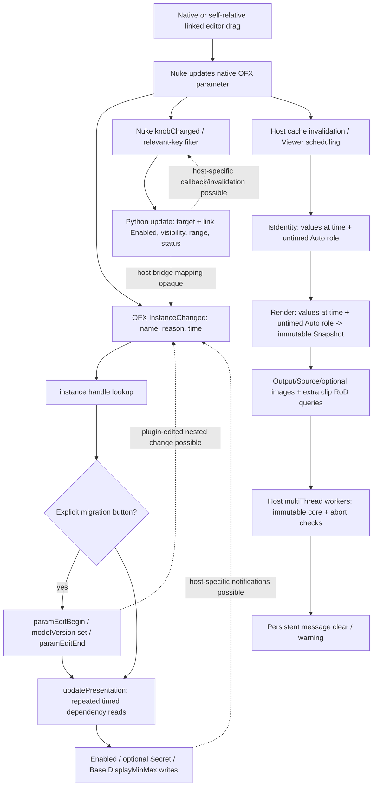

# P0 — OFX suite failure static audit

2026-10-04. Baseline commit `0e0830a865b1bd3041a087c4cfab5a768d46f148`. Static analysis completed **before diagnostic source changes or a runtime reproduction**. Status: ranked hypotheses; actual failing Nuke call not yet captured. This is not a fix or artist-readiness acceptance.

## Scope and evidence

The canonical [0.32 control contract](RENDITION_CONTROL_SYSTEM_0_32.md) governs rendered behavior, compact controls, deeper access, paired display ranges, and compatibility. [0.32 UX report](NUKE_UX_0.32.md) describes observed host presentation limits. No mathematics, mappings, IDs, descriptor defaults, models, UI design, presets or spectral research may change in this pass.

Primary implementation: `src/ofx/plugin.cpp`, `include/rendition/ui_layout.hpp`, `src/core/operators.cpp`, `src/core/artist_models.cpp`, `src/core/primaries.cpp`, `integrations/nuke/rendition_ui.py`, `rendition_host.py`, `rendition_legacy_ui.py`, `menu.py`, `init.py`, `artist-groups.json`, CMake and existing safety/bridge/native tests. The adapter/helper, image, factory, registration, error and callback implementation is in **one original C API translation unit**. There is no additional compiled OFX adapter or Support wrapper hidden beneath it.

Specification priority: vendored headers at ASWF pin **`e40728885390ec16276d11e00025de9b4282060c`**, as recorded in [THIRD_PARTY_REFERENCES.md](../THIRD_PARTY_REFERENCES.md). Consulted the same-pin ASWF Support implementation for comparison: [Core](https://github.com/AcademySoftwareFoundation/openfx/blob/e40728885390ec16276d11e00025de9b4282060c/Support/Library/ofxsCore.cpp), [Property](https://github.com/AcademySoftwareFoundation/openfx/blob/e40728885390ec16276d11e00025de9b4282060c/Support/Library/ofxsProperty.cpp), [Params](https://github.com/AcademySoftwareFoundation/openfx/blob/e40728885390ec16276d11e00025de9b4282060c/Support/Library/ofxsParams.cpp), [ImageEffect](https://github.com/AcademySoftwareFoundation/openfx/blob/e40728885390ec16276d11e00025de9b4282060c/Support/Library/ofxsImageEffect.cpp). CMake lines 24–28 compile `plugin.cpp` and link `rendition_core`; **none of these Support sources is linked**. Therefore the inventory has zero indirect calls through the ASWF C++ Support library.

Also consulted [OFX actions](https://openfx.readthedocs.io/en/main/Reference/ofxImageEffectActions.html), [parameters](https://openfx.readthedocs.io/en/main/Reference/ofxParameter.html), [parameter suite](https://openfx.readthedocs.io/en/main/Reference/suites/ofxParametersSuiteReference.html), [Foundry developer overview](https://www.foundry.com/products/nuke/developers), [Nuke 17 knob interaction guidance](https://learn.foundry.com/nuke/developers/17.0/ndkdevguide/knobs-and-handles/knobchanged.html), and [Foundry Python callback contract](https://learn.foundry.com/nuke/developers/13.2/pythonreference/_autosummary/nuke.addKnobChanged.html). Current web OFX docs are supplementary, not permission to override the pin. The developer landing page redirects to a downloads page; the 13.2 NDK introduction could not be retrieved in this pass. Accessible 17.0 NDK guidance is interaction reference only. No NDK migration is proposed.

## Ranked diagnosis

| Rank | Finding and exact baseline source | Evidence level | Why systemic / more frequent during dragging | Smallest proof |
|---|---|---|---|---|
| **High — first suspect** | `inputInterpretation`, `plugin.cpp:111`: checked `paramGetValue(hostSceneLinear)` in Render (`558`), IsIdentity (`659`), disconnected output-colour query (`683`) | **Definite call-context violation; actual failing status unproven.** `ofxParam.h:1128` limits untimed get to InstanceChanged/interacts. Nonanimated/nonpersistent does not exempt the role | Auto is shared by all nodes. Viewer render and identity queries run independently of which creative knob changed, including background evaluations. Dragging repeatedly invalidates/evaluates | Record exact suite expression, action, effect/instance, nesting/thread, parameter ID/time on non-OK. Failure here in Render/Identity confirms; successful reads do not prove legality |
| **High — independent alternative** | `Image::Image`, `plugin.cpp:125`: `checked(clipGetImage)`; output/source/reference/matte paths `561`, `564`, `585`, `587` | **Definite failure-policy mismatch for unavailable input.** Pin documents status 1 for absent time/region, treated as transparent black; Support `Clip::fetchImage` returns null on that status | All effects fetch images. Dragging can abort/restart competing evaluations; whether Nuke reports an unavailable fetch during that process is unproven | Record clip role/time, fetch status and enclosing Render; one captured failure. If needed, add one failure-only abort query to distinguish cancellation; do not equate status 1 with cancellation without evidence |
| **Medium** | `Image::Image:144`: extra checked `clipGetRegionOfDefinition` for **each** fetched clip, including Output; separate source RoD action `706` | API documents status 1 if RoD cannot be determined; no blanket prohibition on this render-time query established. Output query is an unnecessary dependency for ordinary colour nodes | Every render fetches Output before Source. A geometry query can fail even when the colour parameters are fine | Same failure-only trace with role/time; distinguishes fetch from RoD. If confirmed, determine where geometry is actually required before proposing removal |
| **Medium — indirect amplifier** | Native `updatePresentation:354–413`, invoked `441`, `719`; Python `update:28–91`, `changed:194–209`, `idle_update:177–191` | Repeated writes and independent guards are verified; host recursion/invalidation resulting from them remains unproven | Every native change writes all Enabled states; Python writes target plus link, display ranges/status. Dragging multiplies writes. Frame/panel/undo can do so without a deliberate grade edit | Action nesting in failure record first. Only if depth/action implicates this path, trace changed reason/name and actual changed property writes around the failing event |
| **Medium — unsafe optional handle use** | `updatePresentation:413`: unchecked `paramGetPropertySet` leaves uninitialized `q` if it fails; subsequent `propSetInt(q, …)` still runs | Definite error-path defect; not evidence that this path has failed | Shared migration button on all three artist nodes; presentation refresh need not involve migration | Targeted status logging at this lookup if primary trace points into presentation. Do not blanket-suppress bad-handle errors |
| **Low for reported symptom; high severity if exercised** | `create:436–441`: InstanceData published before remaining handles/refresh succeed | Definite dangling-publication path after a later exception | Could affect an incompletely created node, but does not naturally explain successful established nodes failing while dragging | Force a late Create failure in a mock host; inspect published InstanceData. Not first live test |
| **Low** | `render:610` checked host `multiThread`; returns status 1 on launch failure | Legal use; no evidence of launch failure | Shared render runner; many invalidations increase scheduling load, not proof of a failure | Existing checked-call trace identifies this distinctly |
| **Low** | Migration `713–717`, message set/clear `62–68`, `615–620`, `662–663`, `720–725` | Unchecked edit/status operations and message-state contention verified; no direct source of the checked error string | Old session/multiframe state could contribute; migration-specific path does not explain every ordinary knob | Only instrument transaction/message statuses if a captured failure implicates their timing |

**Most likely current hypothesis:** the untimed Auto interpretation read. It is a shared contract violation, not a confirmed Nuke diagnosis. The independent unavailable-image path is credible because status 1 is explicitly part of that API’s normal contract. Do not select a fix merely from ranking.

## A. Runtime architecture and callback graph



Dashed edges are possible host behavior, not a reconstructed private Nuke call stack. Nuke owns ordering, scheduling and invalidation; C++ and Python notification order is not guaranteed here. A Python knob method is not necessarily an OFX suite call. No separate Support `changedParam` function exists: the original adapter dispatches InstanceChanged itself.

| Entry/event | Actual path and mutation | Render dependency / limits |
|---|---|---|
| Create | Factory menu → Nuke native effect create → handles/InstanceData → native presentation; Python OnCreate host-role resolution and linked layout | Menu does not set current model; historical default remains. Create refresh is time 0, not necessarily loaded timeline time |
| Parameter drag | OFX InstanceChanged always recomputes all native dependencies; Python relevant subset refreshes targets/links; host evaluates | Render consumes native parameter values, not proxy values |
| Frame | Host time-change notifications can enter InstanceChanged; Python UpdateUI signature contains `nuke.frame()` and re-evaluates presentation | Render reads at requested render time, Python presentation uses current UI time |
| showPanel | Python dummy-knob event → `changed` → `update` | Not an OFX action and not required for processing; no grade values changed |
| Undo/redo | Host restores native values and emits change notifications; Python knob callback/idle signature update catches drivers | No explicit Python undo callback. Correct ordering depends on Nuke, not a plugin promise |
| Family selection | Native `editFamily` change → native dependency refresh; Python relinks selected-family editors if cached selection changed | `makeLink('this', nativeID)` references six independent stored families; no proxy numeric copy |
| Migration | UserEdited `enableFullControls` → unchecked begin/set index 2/end → presentation → possible PluginEdited notification | Deliberate grade-version change; no automatic migration added |
| Render | Instance lookup → action time → timed native values → role read → immutable Snapshot → image fetch/property/RoD → synchronous workers → message update | No Enabled/Secret/Display range writes occur explicitly in Render; role read is incomplete render-snapshot discipline |
| IsIdentity | Instance/time → timed values + role → Snapshot → persistent-message clear → identity output name/time | Generic suite exception escapes; only `invalid_argument` gets ReplyDefault |
| RoD | Instance → optional time read → Source connectivity and checked Source RoD → output RoD write | No creative snapshot/UI dependency; disconnected defaults to 1920×1080 |
| ROI | Unhandled → ReplyDefault | Host-provided default input ROI; pointwise core does not request spatial neighbourhood |
| Output colourspace | Instance → Source tag or disconnected interpretation at time 0 → output tag write | Disconnected Auto also uses forbidden untimed get outside allowed actions |
| Destroy | Lookup → clear InstanceData → delete immutable instance data | No destructor host calls on Instance; later Python caches have no native pointers |

There are no Begin/EndInstanceChanged, Begin/EndInstanceEdit, ROI, FramesNeeded, ClipPreferences, Begin/EndSequenceRender, SyncPrivateData or PurgeCaches handlers: they return ReplyDefault. These optional defaults are not themselves bugs. The host change-batch action pair is not the same as `paramEditBegin/End` and is not evidence that migration is an illegal nested undo transaction.

## B. Host-suite inventory

The appendix enumerates every explicit post-creation call site (plus Create), including optional reads, image release, exception-path messages and worker abort. Descriptor-only calls are separated below. There is no hidden ASWF Support indirection in this binary. No image memory suite, timeline suite, param keyframe API, custom interact, GPU suite invocation, or suite mutex API is used.

Legend: **U** = change/create action, generally host UI/control context; actual OS-thread affinity not imposed by this adapter. **R** = render/query context, may be concurrent. **W** = host worker. **X** = exception context may be any action, including descriptor/load failure. “Fatal” means a non-OK reaches `checked` and the action error path; optional means status ignored/tolerated, not blanket permission to ignore all failures.

| Runtime operation | Context/thread | Host mutation | Failure policy | Essential / optional |
|---|---|---|---|---|
| Effect property set / InstanceData read | Create, Destroy, changed, Render, Identity, RoD, output-colour; U/R | Read | checked → fatal | Essential instance integrity |
| Parameter get at time | values in Render/Identity/disconnected colour; dependencies Create/changed; U/R | Read | snapshot checked; dependency unchecked | Snapshot essential; presentation optional |
| Parameter untimed get | Auto in Render/Identity/colour; family selector Create/changed; U/R | Read | Auto checked; selector unchecked | Interpretation essential, **wrong context**; selector optional |
| Parameter property-set get | Create/changed U | Read | ordinary loop gated on OK; migration button not gated | Presentation optional; cannot use uninitialized result |
| Enabled / Secret | Create/changed U | Yes, presentation | ignored | Optional presentation; Enabled is explicitly optional in the pin; Nuke Secret writes skipped |
| DisplayMin/DisplayMax | Base Create/changed U | Yes, presentation | ignored | Optional paired slider headroom; not hard engine Min/Max |
| Parameter set + edit begin/end | migration InstanceChanged U | Yes, grading/undo | all ignored | Migration essential once deliberately requested; must validate status/balancing |
| Source Connected / Colourspace / host Name | Render/query/presentation U/R | Read | ignored, fallback | Connectivity/color interpretation meaningful; unsupported metadata must not invent gamut |
| clipGetImage | Render R | Allocates host image reference | checked → fatal, including documented unavailable status | Required writable output; input unavailable needs documented transparent-black semantics, not generic fatal |
| image data/bounds/stride/depth/components | Render R | Read | data/bounds/stride checked; strings fallback then explicit error | Processing-essential |
| clipGetRegionOfDefinition | Render and RoD R | Query; host may evaluate upstream | checked → fatal | RoD action essential; extra Output/other image queries deserve necessity review |
| image RenderScale / PixelAspectRatio / MetalEnabled | Render R | Read | ignored with initialized defaults | Scale/PAR needed for Inspector coordinates; unsupported Metal property tolerated |
| clipReleaseImage | Render exit / constructor failure R | Releases host image | ignored, never throws | Essential lifetime; failure requires diagnosis rather than throwing from destructor |
| abort | Render W | No | boolean | Cancellation; only checked after image/snapshot acquisition |
| CPU count / multiThread | Render R → W | Scheduling | count ignored; launch checked | Parallel launch failure fatal currently; suite absent uses serial fallback |
| identity, RoD, colour output property writes | corresponding query R | Yes, action output args | checked → fatal | Essential action result |
| persistent set/clear | Render, Identity, changed, exception U/R/X | Yes, effect error/display state | ignored | Presentation/error reporting; not directly the generic checked exception |
| transient V1 message fallback | exception X | Yes, host message | ignored | Optional reporting |
| fetchSuite | Load only | Suite acquisition | required suite null throws; optional suites nullable | Not post-create; no repeated runtime acquisition |

Runtime hints/labels/pages/groups are **not** changed via native OFX. They are descriptor writes during Describe/DescribeInContext only. Python changes labels/tooltips/visibility on Nuke objects as documented below. Native Enabled, Secret and display limits are the live parameter properties actually written.

### Nuke API inventory (host bridge is opaque)

| Source/function | Calls and state | Event context | Mutation / guard / risk |
|---|---|---|---|
| `rendition_ui.update` | `getValue`, `knobs`, `Class`, `fullName`; `setEnabled` native+link, `setVisible`, `makeLink`, `setRange`, Text_Knob `setValue` | relevant knob, panel/input, idle/frame, create/load | Mutates presentation, not grading. Link retarget cached; other setters largely unconditional. No equality cache. Underlying Nuke→OFX dispatch unknown |
| `rendition_ui.refresh` | `allNodes/allKnobs`; `removeKnob/addKnob`, `Tab_Knob/Link_Knob/Text_Knob`, `setLabel`, flags, visibility, links; update | create/load/import/manual refresh | `_busy` blocks this Python module’s recursive entry; native code is not guarded. No Double_Knob grading state |
| `rendition_ui.changed` | `thisNode/thisKnob`, relevant-name filters, update | addKnobChanged; showPanel/inputChange included | `_busy` covers same Python callback only; linked-family ID mapped to target name |
| `rendition_ui.idle_update` | all nodes, frame, driver reads, cached signature, update | addUpdateUI | Can run without deliberate knob action; frame invalidates signature. Signature stored before update; failed update may be skipped until driver changes |
| `rendition_host.refresh` | root/OCIO role reads; bridge `setValue` only if changed; interpretation `setTooltip` always | OnCreate, load, root/interpretation change, BeforeRender | Grade interpretation bridge is **actual OFX parameter state**, not creative math; own independent `_busy`. BeforeRender mutation deserves sequencing review |
| `rendition_legacy_ui.refresh` | linked tabs/editor construction, flags, group visibility | historical node create/load through shared refresh | Presentation-only historical fallback; does not explain fresh artist-node errors directly |
| menu/init | registration, `createNode`, startup imports | startup/user creation | No extra grade storage; ordinary factory still uses historical descriptor defaults |

Foundry’s callback documentation includes dummy panel/input events and UpdateUI for panel-independent updates. Its NDK example warns against unconditional enable/disable on every unrelated knob change. This supports narrower presentation invalidation; it does **not** prove OFX setters fail during a drag. [Foundry callback reference](https://learn.foundry.com/nuke/developers/13.2/pythonreference/_autosummary/nuke.addKnobChanged.html), [interaction reference](https://learn.foundry.com/nuke/developers/17.0/ndkdevguide/knobs-and-handles/knobchanged.html).

## C. Action-legality matrix

| Operation | Create | InstanceChanged | Render | IsIdentity / colour query | RoD / ROI | Decision |
|---|---|---|---|---|---|---|
| `paramGetValueAtTime` | used | used | used | used | not used | Valid timed read; missing required handles/statuses remain real errors |
| `paramGetValue` | family selector used | family selector used | **Auto used** | **Auto used** | none | Pin limits this API to InstanceChanged/interact. Selector’s Create use is also outside that stated allowance. Auto read is primary violation |
| `paramSetValue` | none | migration only | none | none | none | Allowed in changed/interact; no render-time parameter writes in native code |
| `paramEditBegin/End` | none | migration only | none | none | none | Nominally valid undo grouping; unchecked failures/unprotected re-entry need attention |
| Live Enabled/Secret | used | used | none | none | none | Mutable parameter-instance presentation properties. Create allows enable/disable. No evidence all repeated writes are forbidden; host tolerance/callback consequences require proof |
| Live DisplayMin/Max | Base used | Base used | none | none | none | Supported presentation-property mutation in control action; not output clipping. Constant rewriting during drag is suspicious, not automatically illegal |
| Image fetch/release | none | none | used | none | none | Correct lifetime/action placement; **status 1 interpretation wrong for absent input** |
| clip RoD query | none | none | each fetched clip | none | Source used in RoD | No pin-wide prohibition found on these current query locations. Output query may create avoidable host geometry evaluation |
| Effect/property reads | used | used | used | used | used | Valid only while object/action handles live; mandatory/optional status policy must differ |
| Action output property writes | none | none | none | used | RoD used; ROI defaults | Valid matching action arguments only |
| Persistent messages | exception only | clear | clear/set | Identity clear | exception only | Message header specifies handle/error effects but no blanket UI-only rule. Query/render clears mutate shared error status; host thread behavior not established. V2 set requires a non-null **instance**, catch also covers descriptor/load |
| Host threading / abort | none | none | used | none | none | Synchronous launch and worker abort valid; no recursive multiThread path in this plugin |
| Pages/parent/default/range min/max/animation descriptors | Describe/DescribeInContext only | none | none | none | none | Correct lifecycle; runtime parameter pages are not rebuilt through OFX |

`showPanel`, Python UpdateUI and undo are not OFX action names. Their Nuke calls cannot be assigned a fictional OFX legality guarantee. Any nested OFX callback must obey its **actual** action context. The ASWF Support wrappers do not grant extra permissions over C APIs.

## D. Concurrency, re-entrancy and lifetime

1. **Good processing boundary:** `values()` produces a per-call Values object; `Snapshot` constructs validated effective parameters, conversions and child operators; `Job` owns the snapshot through synchronous worker completion. Workers only process their image rows, consult `abort`, and protect shared failure state with mutex/atomic. Image RAII releases handles before the enclosing action exits. The host multithread API guarantees return only after its workers finish (`ofxMultiThread.h:44–48`). No worker mutates Enabled/Secret/display limits or creative knobs.
2. **Snapshot incompleteness:** the bridge role is not in `values`; `inputInterpretation` separately reads live untimed state. Nuke’s BeforeRender callback can refresh that same nonpersistent parameter. This is a sequencing/semantic consistency risk, not proof of an unsynchronized raw C++ memory race. Replace with an evaluated role in the immutable snapshot only if the trace confirms the proposed shared correction.
3. **No native re-entrancy guard:** `updatePresentation` repeats all setters on every InstanceChanged regardless of type, reason/name or changed value. The plugin does not batch Begin/EndInstanceChanged. Migration can cause PluginEdited notifications. Python’s `_busy` cannot protect this C++ path; `rendition_host._busy` is independent of `rendition_ui._busy`. Whether property changes trigger further OFX notifications is host-specific and must be traced.
4. **Two presentation writers:** C++ and Python both own native Enabled and Base display limits. The canonical visible dependency contract is useful, but two independent writers create unnecessary ordering and callback traffic. Python also synchronizes linked Enabled because Nuke requires it. This is not duplicated grading state, but it is duplicated host-property mutation.
5. **Read failure disguised as neutral:** native presentation reads initialize zero and ignore failure, then disable/enable other controls as if zero were authoritative. The final button-property lookup does not even guard an uninitialized output handle. No optional failure should cause a render failure, but no failed handle may be used either.
6. **Message contention:** Render clears messages after processing; IsIdentity clears after Snapshot validation even when nonidentity; every changed event clears again. FullySafe/frame-threaded declaration allows concurrent renders. A successful job/query can clear another job’s error. Warning/error ownership is not centralized. These calls ignore statuses, so they cannot directly generate the exact checked exception.
7. **Create publication:** publishing InstanceData before remaining handle acquisition and presentation completes permits a dangling pointer if construction later throws. `unique_ptr` deletes it but InstanceData is not rolled back. Re-entry could observe partially initialized extra handles. Destroy checks pointer-clear before delete; a failed clear leaks the object rather than deleting it. No Instance destructor itself calls a host suite.
8. **Globals:** suite pointers and host pointer shared across effects; acquisition guarded by `loadMutex`, initialization relies on OFX Load ordering. They are not mutated per knob. No static shared core grade/snapshot state found. Unload does not reset suites; normal OFX unload destroys all instances first. Multiple unexpected host contexts are not handled by this singleton architecture, but there is no evidence that Nuke supplies multiple hosts here.
9. **Python caches:** `_ui_signatures` and `_family_links` use fullName strings and are not cleaned on delete/rename. These are presentation caches, not stale C++ handles. Same-name reuse may skip a needed refresh until a driver changes; refresh explicitly resets family cache. No raw native pointer survives through Python callbacks. A cache entry is recorded before a successful update.
10. **Transactions:** migration never checks begin/set/end results. An ordinary C suite returns a status rather than throwing; the current code still attempts all three, so there is no demonstrated normal exception after Begin skipping End. There is nevertheless no RAII guard, no success-aware balancing and no nested-event guard. Host change-batch brackets are **not** automatically an already-open parameter edit transaction.

## E. Exception propagation and fatality

The exact text originates in **local `checked` at plugin.cpp:26–29**, not ASWF `OFX::Exception::Suite`. `kOfxStatFailed == 1` (`ofxCore.h:999`). Every non-OK passed to `checked` becomes `std::runtime_error` with that generic text. The top-level `action` catches it (`733–736`), posts a persistent error using the original handle, then returns `kOfxStatFailed`. Original suite identity/action/status class are lost. Memory statuses passed through this helper are also collapsed to runtime_error rather than `bad_alloc`; genuine C++ bad_alloc has its separate action catch.

The same-pin ASWF `throwSuiteStatusException` accepts OK/Yes/No/Default, throws bad_alloc for memory, otherwise Suite(status); `Suite::what()` reports the status name. Its Property wrapper distinguishes unknown/unsupported, illegal values and suite errors. `Param::setEnabled`, `setIsSecret`, hint/label and display-range setters call PropertySet wrappers; they **could** throw if that library were used. It is not. Support `Clip::fetchImage` explicitly returns null on `kOfxStatFailed`, matching the absent-image contract; this original adapter differs.

| Failure category | Current propagation | Required interpretation, not a patch in this pass |
|---|---|---|
| Instance retrieval, required timed grade parameter, valid input interpretation, required image metadata, action output result | checked → persistent error + failed action | Essential corruption/missing support must remain explicit; fix wrong-context calls, not suppress failures |
| Input image unavailable at requested time/region | checked → same fatal error | Not equivalent to invalid image handle. Implement the pin’s transparent-black semantics deliberately if confirmed; missing writable Output is a different condition |
| Redundant image RoD query | checked → same fatal error | Separate mandatory geometry from ancillary queries, preserving Inspector behavior |
| Optional presentation setters / read statuses | ignored or gated, except unsafe final q | **No direct escaping suite exception currently.** Introduce documented host fallback only after identifying supported behavior; never use failed handles |
| Message set/clear, image release, CPU-count query | ignored | Reporting/lifetime/optimization status needs its own policy; do not conflate with creative math validity |
| Core invalid_argument in IsIdentity | ReplyDefault | Render remains responsible for explaining invalid interpretation/math domain |
| Core invalid_argument in Render / changed exception / unknown exception | persistent error + failed action | Math validation stays unchanged |
| Error reporting with null/descriptor/stale handle | ignored status or host rejection | V2 persistent API needs instance; top catch lacks action/handle lifecycle discrimination |

There is no blanket catch inside presentation designed to turn Support exceptions into successful rendering; adding one would miss the actual adapter and conceal essential failures. Exception classification must be made at the operation boundary.

## F/G. Shared design choices and violation search

| Required focus | Finding |
|---|---|
| Dynamic Enabled | Native writes every definition on every change; Python writes both native and links. No comparison against last applied state. Not called explicitly by native Render |
| Paired DisplayMin/Max | Four Base endpoints written on every native changed action; Python `setRange` repeats on refresh. Visible contract must remain; implementation safety unproved |
| Nuke dependency refresh | Relevant-key filter exists in Python; C++ has none. Whole-table repeated host reads dominate each event |
| showPanel/frame/undo | Panel and frame can trigger property updates with no deliberate grade edit; no shared transaction/coalescing across C++/Python |
| Link retargeting | Family cache reduces redundant retarget; all selected family link Enabled states still rewritten. Uses real native IDs, no grade-copy callback |
| Target/link synchronization | Needed for demonstrated Nuke editor behavior; redundant native setter path may amplify callbacks |
| Compatibility/status | Text value and button visibility refreshed every update; button-property handle failure unguarded; migration param set unchecked |
| Persistent messages | Unconditional clear in three independent paths; errors can be cleared by an unrelated change/identity/job |
| Host-only UI calls from workers | None found other than legal abort; message calls occur after workers on Render action thread, not necessarily UI thread |
| Descriptor mutation at runtime | No runtime page/group/parent/hint/label API writes in OFX. Enabled/Secret/display limits are live properties, not descriptor-only writes |
| Presentation changing another grade knob | None in UI module; only deliberate migration changes model. Host bridge changes interpretation-only role separately |
| Destructors / stale handles | Image release legal inside action RAII; Create failure can leave dangling InstanceData; optional final property handle may be indeterminate |
| Nuke-specific behavior in generic layer | Host-name conditional suppresses Secret writes and changes descriptor layouts. Portability workaround is explicit, not creative math; host capability handling is name-based rather than capability-based |
| Optional capability assumptions | Message/thread suite availability checked, individual function slots assumed valid; dynamic property support and errors not recorded. No invented guarantee that Nuke accepts every setter |

## H. Proposed shared correction, only if confirmed

If the primary failure is confirmed, evaluate `hostSceneLinear` with `paramGetValueAtTime` at the action’s requested time and carry it into the immutable interpretation snapshot. It remains nonanimated/nonpersistent interpretation metadata; it must not change any creative model, manual override or historical grade. Apply the correction once in the shared adapter rather than patching knobs.

If unavailable-image/RoD is confirmed, classify fetch status by clip role and abort state. Distinguish absent input from required Output failure, honor input transparent-black semantics without repairing real signed/HDR pixels, and eliminate only demonstrably unnecessary geometry dependencies. Inspector’s coordinate geometry must remain correct.

If presentation re-entry is confirmed, compute one dependency state, apply only changed properties in allowed control actions, coalesce/re-entry-guard refresh, and designate one native presentation-property writer per host while retaining linked editor synchronization. Optional unsupported presentation has a documented fallback; required handles and processing errors remain fatal. The canonical UI/grade semantics do not change. These are proposals, **not implemented fixes**.

## I. Narrow proof and stop boundary

First diagnostic addition: opt-in **failure-only** context for existing checked calls, with a scoped action/effect/instance/thread/nesting record and parameter ID or clip role/time around the two highest-ranked paths. Do not add successful-call logging, extra suite reads, property writes, retry, error suppression or alternate parameter/fetch APIs. Preserve original exceptions, return statuses and rendering.

One failing call record can distinguish untimed role read, timed grade read, image fetch, image RoD and worker launch. If it instead implicates a change action, add only the relevant optional lookup/property/transaction statuses in a second targeted step. Capture one or a few live failures from the diagnostic bundle after a restart; log environment and deployed binary identity. Do not use an enormous drag matrix. If a failure cannot be reproduced, report the hypothesis as unconfirmed.

Stop after static report and minimal diagnostic readiness; broader shared fixes require the next instruction. No runtime diagnosis is accepted merely because the static violation is real.

## Appendix 1 — Complete post-create/create C suite call-site ledger

Line numbers below refer to the **baseline commit**, before instrumentation. Repeated calls in loops represent all parameters/families, not one entry per runtime repetition. Each indirect helper is included by its call-site function. `str` can also execute during descriptor work; its runtime uses are inventoried here. `error` may execute during any action.

| Baseline source/function | Suite / function / property | Action/thread | Mutates host? | Failure can throw? | Purpose |
|---|---|---|---|---|---|
| `plugin.cpp:33` str | Property V1 `propGetString` / `kOfxStatOK` | U/R/X | No | No, empty fallback | optional |
| `plugin.cpp:63` error | Message V2 `setPersistentMessage` / `kOfxMessageError` | X | Yes | No, status ignored | optional reporting/capability/optimization |
| `plugin.cpp:66` error | Message V1 `message` / `kOfxMessageError` | X | Yes | No, status ignored | optional reporting/capability/optimization |
| `plugin.cpp:81` instance | ImageEffect V1 `getPropertySet` | U/R | No | Yes, checked | essential |
| `plugin.cpp:83` instance | Property V1 `propGetPointer` / `kOfxPropInstanceData` | U/R | No | Yes, checked | essential |
| `plugin.cpp:93` values | Parameter V1 `paramGetValueAtTime` / every `defs` native parameter | R | No | Yes, checked | essential |
| `plugin.cpp:97` values | Parameter V1 `paramGetValueAtTime` / every `defs` native parameter | R | No | Yes, checked | essential |
| `plugin.cpp:111` inputInterpretation | Parameter V1 `paramGetValue` / `hostSceneLinear` | R | No | Yes, checked | essential |
| `plugin.cpp:125` Image ctor/dtor | ImageEffect V1 `clipGetImage` | R | Yes | Yes, checked | essential |
| `plugin.cpp:128` Image ctor/dtor | Property V1 `propGetPointer` / `kOfxImagePropData` | R | No | Yes, checked | essential |
| `plugin.cpp:138` Image ctor/dtor | Property V1 `propGetIntN` / `kOfxImagePropBounds` | R | No | Yes, checked | essential |
| `plugin.cpp:139` Image ctor/dtor | Property V1 `propGetInt` / `kOfxImagePropRowBytes` | R | No | Yes, checked | essential |
| `plugin.cpp:144` Image ctor/dtor | ImageEffect V1 `clipGetRegionOfDefinition` | R | No | Yes, checked | essential |
| `plugin.cpp:146` Image ctor/dtor | ImageEffect V1 `clipReleaseImage` | R | Yes | No, status ignored | essential |
| `plugin.cpp:153` Image ctor/dtor | ImageEffect V1 `clipReleaseImage` | R | Yes | No, status ignored | essential |
| `plugin.cpp:160` connected | Property V1 `propGetInt` / `kOfxImageClipPropConnected` | U/R | No | No, status ignored | essential-read/defaulted |
| `plugin.cpp:358` updatePresentation | Parameter V1 `paramGetValueAtTime` | U | No | No, status ignored | optional |
| `plugin.cpp:359` updatePresentation | Parameter V1 `paramGetValue` / `editFamily` | U | No | No, status ignored | optional |
| `plugin.cpp:360` updatePresentation | Parameter V1 `paramGetValueAtTime` | U | No | No, status ignored | optional |
| `plugin.cpp:401` updatePresentation | Parameter V1 `paramGetPropertySet` / `kOfxStatOK` | U | No | No, OK gate | optional |
| `plugin.cpp:402` updatePresentation | Property V1 `propSetInt` / `kOfxParamPropEnabled` | U | Yes | No, status ignored | optional |
| `plugin.cpp:404` updatePresentation | Property V1 `propSetInt` / `kOfxParamPropSecret` | U | Yes | No, status ignored | optional |
| `plugin.cpp:406` updatePresentation | Property V1 `propSetDouble` / `kOfxParamPropDisplayMax` | U | Yes | No, status ignored | optional |
| `plugin.cpp:407` updatePresentation | Property V1 `propSetDouble` / `kOfxParamPropDisplayMin` | U | Yes | No, status ignored | optional |
| `plugin.cpp:408` updatePresentation | Property V1 `propSetDouble` / `kOfxParamPropDisplayMax` | U | Yes | No, status ignored | optional |
| `plugin.cpp:409` updatePresentation | Property V1 `propSetDouble` / `kOfxParamPropDisplayMin` | U | Yes | No, status ignored | optional |
| `plugin.cpp:413` updatePresentation | Parameter V1 `paramGetPropertySet` / `kOfxParamPropEnabled` | U | No | No; property handle unguarded | optional |
| `plugin.cpp:413` updatePresentation | Property V1 `propSetInt` / `kOfxParamPropEnabled` | U | Yes | No; property handle unguarded | optional |
| `plugin.cpp:420` create | ImageEffect V1 `getPropertySet` | U | No | Yes, checked | essential |
| `plugin.cpp:423` create | ImageEffect V1 `getParamSet` | U | No | Yes, checked | essential |
| `plugin.cpp:424` create | Parameter V1 `paramGetHandle` | U | No | Yes, checked | essential |
| `plugin.cpp:427` create | Parameter V1 `paramGetHandle` | U | No | Yes, checked | essential |
| `plugin.cpp:430` create | ImageEffect V1 `clipGetHandle` / `kOfxImageEffectOutputClipName` | U | No | Yes, checked | essential |
| `plugin.cpp:432` create | ImageEffect V1 `clipGetHandle` / `kOfxImageEffectSimpleSourceClipName` | U | No | Yes, checked | essential |
| `plugin.cpp:434` create | ImageEffect V1 `clipGetHandle` | U | No | Yes, checked | essential |
| `plugin.cpp:436` create | Property V1 `propSetPointer` / `kOfxPropInstanceData` | U | Yes | Yes, checked | essential |
| `plugin.cpp:438` create | Parameter V1 `paramGetHandle` | U | No | Yes, checked | essential |
| `plugin.cpp:439` create | Parameter V1 `paramGetHandle` | U | No | Yes, checked | essential |
| `plugin.cpp:503` worker | ImageEffect V1 `abort` | W | No | No, boolean | essential |
| `plugin.cpp:552` render | Property V1 `propGetDouble` / `kOfxPropTime` | R | No | Yes, checked | essential |
| `plugin.cpp:554` render | Property V1 `propGetInt` / `kOfxImageEffectPropMetalEnabled` | R | No | No, status ignored | optional reporting/capability/optimization |
| `plugin.cpp:560` render | Property V1 `propGetIntN` / `kOfxImageEffectPropRenderWindow` | R | No | Yes, checked | essential |
| `plugin.cpp:576` render | Property V1 `propGetInt` / `kOfxImageClipPropConnected` | R | No | No, status ignored | essential |
| `plugin.cpp:589` render | Property V1 `propGetDoubleN` / `kOfxImageEffectPropRenderScale` | R | No | No, status ignored | optional reporting/capability/optimization |
| `plugin.cpp:590` render | Property V1 `propGetDouble` / `kOfxImagePropPixelAspectRatio` | R | No | No, status ignored | optional reporting/capability/optimization |
| `plugin.cpp:607` render | MultiThread V1 `multiThreadNumCPUs` | R | No | No, status ignored | optional reporting/capability/optimization |
| `plugin.cpp:610` render | MultiThread V1 `multiThread` | R | Yes | Yes, checked | essential |
| `plugin.cpp:616` render | Message V2 `clearPersistentMessage` | R | Yes | No, status ignored | optional reporting/capability/optimization |
| `plugin.cpp:620` render | Message V2 `setPersistentMessage` / `kOfxMessageWarning` | R | Yes | No, status ignored | optional reporting/capability/optimization |
| `plugin.cpp:646` action/Destroy | ImageEffect V1 `getPropertySet` | U | No | Yes, checked | essential |
| `plugin.cpp:647` action/Destroy | Property V1 `propSetPointer` / `kOfxPropInstanceData` | U | Yes | Yes, checked | essential |
| `plugin.cpp:656` action/Identity/Colour | Property V1 `propGetDouble` / `kOfxPropTime` | R | No | Yes, checked | essential |
| `plugin.cpp:663` action/Identity/Colour | Message V2 `clearPersistentMessage` | R | Yes | No, status ignored | optional reporting/capability/optimization |
| `plugin.cpp:665` action/Identity/Colour | Property V1 `propSetString` / `kOfxPropName` | R | Yes | Yes, checked | essential |
| `plugin.cpp:666` action/Identity/Colour | Property V1 `propSetDouble` / `kOfxPropTime` | R | Yes | Yes, checked | essential |
| `plugin.cpp:697` action/Identity/Colour | Property V1 `propSetString` / `kOfxImageClipPropColourspace` | R | Yes | Yes, checked | essential |
| `plugin.cpp:703` action/RoD | Property V1 `propGetDouble` / `kOfxPropTime` | R | No | No, status ignored | essential |
| `plugin.cpp:706` action/RoD | ImageEffect V1 `clipGetRegionOfDefinition` | R | No | Yes, checked | essential |
| `plugin.cpp:707` action/RoD | Property V1 `propSetDoubleN` / `kOfxImageEffectPropRegionOfDefinition` | R | Yes | Yes, checked | essential |
| `plugin.cpp:712` action/InstanceChanged | Property V1 `propGetDouble` / `kOfxPropTime` | U | No | No, status ignored | mixed |
| `plugin.cpp:714` action/InstanceChanged | ImageEffect V1 `getParamSet` | U | No | No, status ignored | mixed |
| `plugin.cpp:715` action/InstanceChanged | Parameter V1 `paramEditBegin` | U | Yes | No, status ignored | mixed |
| `plugin.cpp:716` action/InstanceChanged | Parameter V1 `paramSetValue` | U | Yes | No, status ignored | mixed |
| `plugin.cpp:717` action/InstanceChanged | Parameter V1 `paramEditEnd` | U | Yes | No, status ignored | mixed |
| `plugin.cpp:721` action/InstanceChanged | Message V2 `clearPersistentMessage` | U | Yes | No, status ignored | optional reporting/capability/optimization |

Ledger: **65 explicit runtime/Create suite-call occurrences** (one entry per occurrence, including two distinct calls on a single line). The tables above specify each helper’s possible actions. Function-pointer calls in descriptor-only lines 165–351 and Load 45–55 are excluded from this runtime count. Worker core calls are host-free.

## Appendix 2 — Descriptor and Support coverage

| Phase/function | APIs/properties | Status and lifetime |
|---|---|---|
| Load `suites:42–60` | host fetchSuite Effect V1, Property V1, Param V1; optional Message V2/V1, MultiThread V1 | Required suite availability checked; suites cached through binary lifetime |
| Describe `165–193` | getPropertySet; label/grouping/description; contexts/depths; tiles/multiresolution/temporal; render FullySafe/frame threading; colour management; Metal unsupported | Mostly checked; colour/Metal capability setters ignored. Descriptor-only |
| DescribeInContext `194–351` | clipDefine; supported components/optional/mask/tiles; getParamSet; paramDefine Double/Choice/Group/Page/PushButton/String; Default/Min/Max/DisplayMinMax; Parent/Hint/Label; choices; animates/persistent/evaluate/secret/enabled; group open; page ordering/children; semantic string | Mixed checked/ignored; descriptor defaults and API-version acceptance need capability review if discovery fails. No runtime label/hint/page changes |
| Registration `741–763` | C exported factory functions and 12 OfxPlugin entries | No host calls. Original shared action entry, not ASWF PluginFactory |
| `ui_layout.hpp` | uiPage/customCoordinate | Pure naming/category helpers, no host handles |
| Core Snapshot/artist composition | validation, historical/current equations and local immutable state | No OFX/Nuke API calls; native/Python colour tests cannot validate suite action legality |
| Same-pin Support `Param::setEnabled/setIsSecret/setLabel/setHint/setDisplayRange` | PropertySet propSetInt/String/Double → property-specific status exception mapper | Inspected for comparison only. **Not linked**, no indirect runtime calls to inventory |
| Same-pin Support parameter value/edit/image helpers | Param getValue/getValueAtTime and ParamSet edits → C Parameter suite; Clip fetch/RoD → Effect suite; errors via throwSuiteStatusException | **Not linked**. Unavailable fetch returns null; generic Suite exception has status-name text |

Existing tests substantiate core mappings, image arithmetic, OCIO bridge values and historical compatibility. They do not emulate all host-suite failures, action restrictions, callback nesting, dynamic UI property acceptance or Nuke cancellation. Their passing is not evidence against these systemic hypotheses.

## Documentation correction discovered

The canonical control contract describes **intended/current visible behavior** accurately; its references to time-evaluated snapshots should not be mistaken for proof that *every* native interpretation read is timed. The current role bridge is a concrete exception. Likewise, report phrases about cached refresh do not imply all native property writes are cached: only Python signatures/family retargeting are cached. Preserve the behavior contract while correcting these implementation assumptions. No accepted grading model is implicated by this audit.

## Diagnostic implementation and verification (after the static report)

Only `src/ofx/plugin.cpp` changed for diagnostics. `SuiteTraceAction` uses scoped thread-local action context with restoration during nesting/unwinding. `SuiteTraceSubject` labels evaluated parameters and the Auto bridge, plus Output/Source/Reference/Matte image acquisition. `checked` stringizes its existing expression and records source location **only on non-OK**, **only when `RENDITION_SUITE_TRACE` is set**. It still throws the same error and the action still returns its original failure status. No successful calls are logged; no additional OFX queries, setters, retries, catches or failure recovery were added. Native/Python presentation, migration, input interpretation policy and all colour code remain unchanged.

Build: `cmake --build build --target Rendition -j 4` passed. The built diagnostic binary is `build/Rendition.ofx.bundle/Contents/MacOS/Rendition.ofx`; this pass did not install it over the user's plugin or restart/modify the running Nuke session.

Focused [fault-injection harness](../tests/ofx_suite_trace.cpp) compiled with:

```sh
c++ -std=c++17 -I include -I third_party/openfx tests/ofx_suite_trace.cpp build/librendition_core.a -o build/ofx-static-audit/suite-trace-test
RENDITION_SUITE_TRACE=1 build/ofx-static-audit/suite-trace-test
```

Checks passed: a successful checked call stays silent; trace disabled produces no stderr; forced role-read status 1 and forced Source-fetch status 1 produce distinct records with exact call/action/parameter-or-clip/time/thread/depth; scoped nested state restores; original exception text remains `OFX suite operation failed: 1`. Evidence: `build/ofx-static-audit/fault-injection.json`. The existing `native_image_contract` CTest passed (1/1). This test scope verifies diagnostic transparency and image infrastructure, **not** live Nuke callback legality or root cause.

**Live Nuke failure capture remains pending.** No actual drag or idle failure was reproduced in this static-first pass; the mock failures do not confirm either hypothesis. Diagnostic binary readiness is not deployment evidence. Before a narrow next runtime capture, verify Nuke loaded this binary, launch that process with `RENDITION_SUITE_TRACE=1`, then capture one/few existing failures from stderr. Do not enable broad `RENDITION_TRACE` unless the failure context proves it necessary. The failure record distinguishes the primary suspects without rewriting controls or processing. Stop here before shared fixes or a larger runtime campaign.

Diagnostic binary SHA-256 at build completion: `f874763d7781511919a65ec174262ae74ddcc0544c011ec7ca09a78b9fbe200a`.
